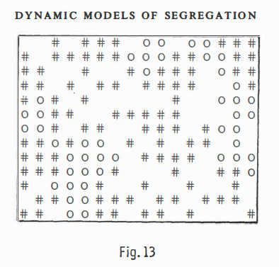
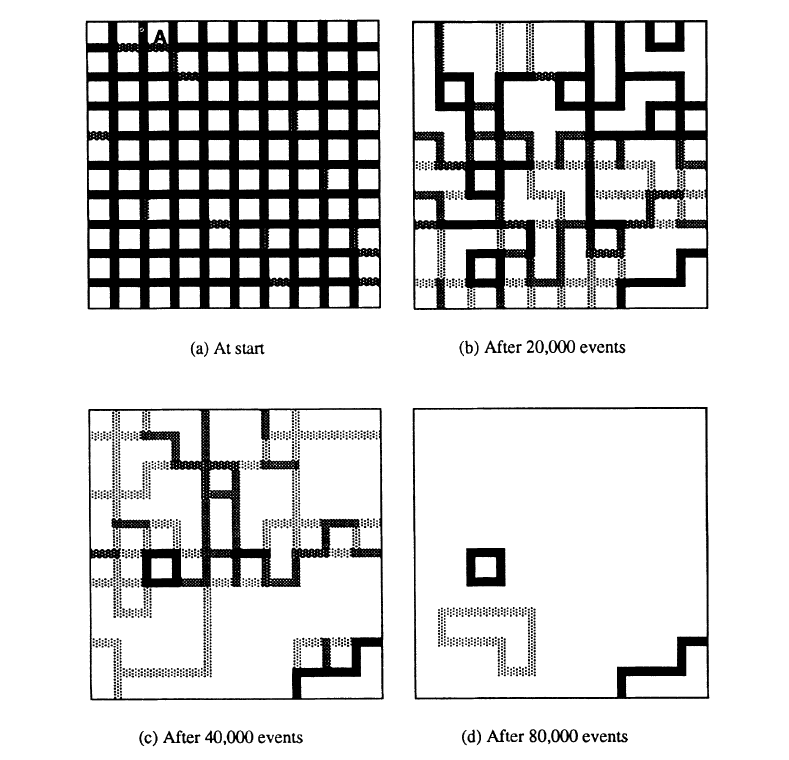
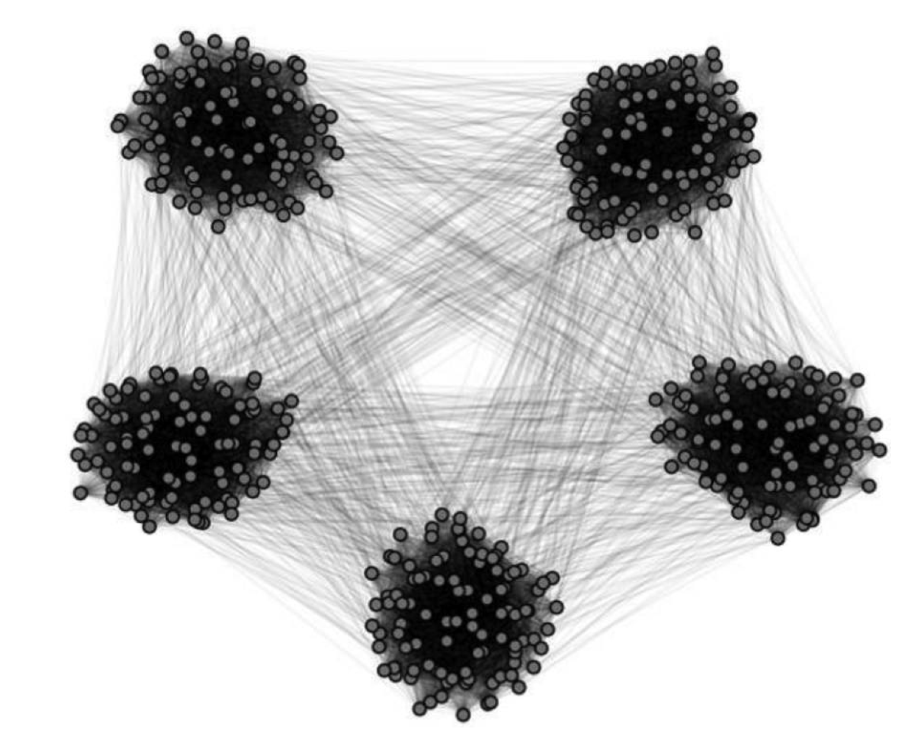
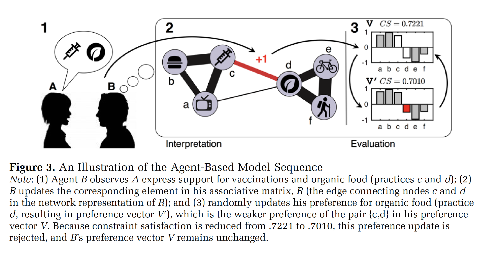

```{r setup, include=FALSE}
knitr::opts_chunk$set(echo = FALSE)
knitr::opts_chunk$set(warning = FALSE)
knitr::opts_chunk$set(message = FALSE)
knitr::opts_chunk$set(dev = 'pdf')
library("knitr")
library("formatR")

opts_chunk$set(tidy.opts=list(width.cutoff=80),tidy=TRUE)
opts_chunk$set(tidy = FALSE)

knitr::knit_hooks$set(mysize = function(before, options, envir) {
  if (before) 
    return(options$size)
})
```

# Plan
1. What is agent-based modeling?
3. NetLogo and NetLogo Web
4. How to construct a simple ABM using R

# What is agent-based modeling?
## Agent-based modeling and quantitative social science
- Most quantitative social science is variable-centered
  - e.g. We study the associations and interactions between variables in a linear regression
- As a consequence, many sociologists think about the world in terms of what Andrew Abbott calls "general linear reality"
  - A social world composed of fixed entities with fixed attributes
    
# What is agent-based modeling?
## Agent-based modeling and quantitative social science
- Agent-based modeling is the study of "social life as interactions among adaptive agents who influence one another in response to the influence they receive." (Macy and Willer 2002)
  - Rather than interactions between variables, we consider interactions between interdependent individuals
  
# What is agent-based modeling?
## Agent-based modeling and quantitative social science  
- Often we are interested in the *emergent* properties of local interactions between agents and how they aggregate into system-level processes such as diffusion, polarization, and segregation
  - These complex system-level patterns can emerge without any centralize coordination
- Like historical sociology and ethnography, agent-based modeling is a relational approach, focusing on the contextual and contingent nature of social interaction

# What is agent-based modeling?
## Key assumptions
- Macy and Willer 2002 outline four key assumptions that underpin many sociological agent-based models
  - Agents are *autonomous*
    - There is no system-wide coordination
  - Agents are *interdependent*
    - Agents respond to each other and to their environment
  - Agents follow *simple rules*
    - Simple local rules can generate global complexity
  - Agents are *adaptive* and *backwards looking*
    - Agents can alter their behavior through processes such as imitation and learning

# What is agent-based modeling?
## Advantages
- ABMs can be used as virtual experiments to test causal mechanisms
  - Particularly useful where real-world experimentation is impractical
- ABMs can be used for theory building and testing
- ABMs can bridge between micro and macro levels of analysis
- We can vary both the social structure *and* the agency of individuals

# What is agent-based modeling?
## Craig Reynolds *Flocking behavior* (1987)
```{r, out.width="70%",out.height="70%", fig.align="center"}
include_graphics('../images/boids.png')
```

# What is agent-based modeling?
## Thomas Schelling *Homophily and segregation* (1968/1971)
```{r, out.width="70%",out.height="70%", fig.align="center"}

```

# What is agent-based modeling?
## Robert Axelrod *Local convergence and global polarization* (1987)
```{r, out.width="70%",out.height="70%", fig.align="center"}

```
  
# What is agent-based modeling?
## Integrating real-world data
DiMaggio and Garip (2011) construct agent with attributes based on the General Social Survey
```{r, out.width="70%",out.height="70%", fig.align="center"}
include_graphics('../images/dimaggio_garip.png')
```

# What is agent-based modeling?
## Testing mechanisms
DellaPosta, Shi, and Macy (2015) suggest a mechanism to explain observed correlations between political attitudes and lifestyle choices
```{r, out.width="70%",out.height="70%", fig.align="center"}

```

# What is agent-based modeling?
## Evaluating competing explanations
Goldberg and Stein (2018) propose an alternative mechanism, arguing that culture does not spread like a virus, but depends on belief structures
```{r, out.width="70%",out.height="70%", fig.align="center"}

```

# What is agent-based modeling?
## Realism
- Bruch and Atwell (2015) distinguish between two types of realism in ABMs
  - *Low-dimensional realism*: simple, parsimonious models
  - *High-dimensional realism*: complex, complicated models
- Trade-offs:
  - The latter might be more realistic, but involve more parameters and may be less intelligible

# What is agent-based modeling?
## Parameters and sensitivity
- It can be difficult to decide which parameters and which to fix
- How do system-wide outcomes vary as we adjust parameters?
- Models can be extremely sensitive to small variations in parameters
  - Be careful to check for coding errors!
- Timing matters
  - Constant time vs. discrete-time
  - Asynchronous vs. synchronous updating

# NetLogo and NetLogoWeb
## Running agent-based models
- NetLogo is a widely used environment for constructing agent-based models, storing, and visualizing results
- NetLogoWeb is a browser version with many examples (https://www.netlogoweb.org/launch)
- There are various interfaces with R to run NetLogo, but I have not used them (e.g. https://cran.r-project.org/web/packages/RNetLogo/RNetLogo.pdf)

# NetLogo and NetLogoWeb
## Flocking behavior in NetLogo
http://www.netlogoweb.org/launch#http://ccl.northwestern.edu/netlogo/models/models/Sample%20Models/Biology/Flocking.nlogo

# NetLogo and NetLogoWeb
## Schelling's segregation model in NetLogo
http://www.netlogoweb.org/launch#http://ccl.northwestern.edu/netlogo/models/models/IABM%20Textbook/chapter%203/Segregation%20Extensions/Segregation%20Simple.nlogo

# NetLogo and NetLogoWeb
## A simple voting model
http://www.netlogoweb.org/launch#http://www.netlogoweb.org/assets/modelslib/Sample%20Models/Social%20Science/Voting.nlogo

# Building an agent-based model
## A simple contagion model in R
- Let's simulate a contagion among a population of agents
- Assumptions
  - Agents interact at random
  - Transmission probability is constant for all agents
  - Nobody is immune

# Building an agent-based model
## Generating agents
I use the ``setClass`` option to define a new class called ``agent`` with two different numeric properties, ``id`` and ``infected``. I then use ``new`` t create two different instances of the class.
```{r, echo=TRUE, tidy=FALSE, mysize=TRUE, size='\\footnotesize', tidy=FALSE}
setClass("agent", slots=list(
  id="numeric",
  infected="numeric"
))

a <- new("agent", id=100, infected=0)
b <- new("agent", id=101, infected=1)
```

# Building an agent-based model
## Generating agents
The agents are what are known as ``S4`` classes in R. This means that all slots must be of the correct type. e.g. We cannot set ``id`` to be characters.
```{r, echo=TRUE, tidy=FALSE, mysize=TRUE, size='\\footnotesize', tidy=FALSE}
print(a@id)
print(a@infected)
#a@id <- 'a' # uncomment and run to produce error
```

# Building an agent-based model
## Generating agents
We can use a function to generate a set of N agents and store them in a list.
```{r, echo=TRUE, tidy=FALSE, mysize=TRUE, size='\\footnotesize', tidy=FALSE}
agent.generator <- function(N){
  agents <- list()
  for (i in 1:N) {
    agents[[i]] <- new("agent", id=i,infected=0)
  }
  return(agents)
}
```

# Building an agent-based model
## Interaction protocols
Next we want to define how agents interact. This function takes a focal agent, indexed by ``i``, and randomly selects another agent ``j``, where ``i`` is not equal to ``j``.
```{r, echo=TRUE, tidy=FALSE, mysize=TRUE, size='\\footnotesize', tidy=FALSE}
select.partner <- function(i, N){ # i is the focal agent
    ids <- c(1:N) # define list of IDs
    ids <- ids[-i] # remove ith id
    j <- sample(ids, 1) # pick j at random
  return(j)
}
```

# Building an agent-based model
## Interaction protocols
The next function, ``interact``, defines how agents ``i`` and ``j`` interact, in this case, whether the virus spreads. Parameter ``P`` denotes the probability of transmission. Note the function takes and modifies the entire list of agents.
```{r, echo=TRUE, tidy=FALSE, mysize=TRUE, size='\\footnotesize', tidy=FALSE}
interact <- function(agents, i, j, P){
  if (agents[[i]]@infected == agents[[j]]@infected) {} # no action if same status
  else if (agents[[i]]@infected == 1) {
    # infect j with P
    agents[[j]]@infected <- rbinom(n=1, size=1, prob=P)
  } else {
    # infect i with P
    agents[[i]]@infected <- rbinom(n=1, size=1, prob=P)
  }
  return(agents)
}
```

# Building an agent-based model
## Putting together a simulation
```{r, echo=TRUE, tidy=FALSE, mysize=TRUE, size='\\footnotesize', tidy=FALSE}
simulator <- function(N, t, P, agents){
  results <- numeric(t) # 0 vector of length t
  agents[[sample(1:N, 1)]]@infected <- 1 # randomly infect 1 agent
  for (timestep in 1:t) { # for each timestep
    for (i in sample(1:N)) { # for reach agent
      j <- select.partner(i, N) # selected a partner
      agents <- interact(agents, i, j, P) # interact
    }
    statuses <- numeric(N) 
    for (i in 1:N) {statuses[[i]] <- agents[[i]]@infected}
    results[[timestep]] <- sum(statuses)/N # prop infected at timestep
    }
  return(list("results"=results, 
              "agents"=agents))
}
```


# Building an agent-based model
## Running a single simulation
Here we define the relevant parameters, generate a set of agents, and run ``simulator``.
```{r, echo=TRUE, tidy=FALSE, mysize=TRUE, size='\\footnotesize', tidy=FALSE}
N = 50 # agents
P = .1 # transmission probability
t= 10 # timesteps

set.seed(478437) # set randomization seed

agents <- agent.generator(N) # gen N agents
r <- simulator(N, t, P, agents) # run sim

print(r$results)
```
# Building an agent-based model
The graphic shows the proportion infected at each timestep.
```{r, echo=FALSE, tidy=FALSE, mysize=TRUE, size='\\footnotesize', tidy=FALSE}
plot(r$results)
```


# Building an agent-based model
## Running multiple simulations
```{r, echo=TRUE, tidy=FALSE, mysize=TRUE, size='\\footnotesize', tidy=FALSE}
K = 100 # trials
results.matrix <- matrix(nrow=K*t, ncol=3)

i <- 1 # iterator
for (k in 1:K) {
  agents <- agent.generator(N)
  results <- simulator(N, t, P, agents)
  timestep <- 1
  for (r in results$results) {
    results.matrix[i,] <- c(r,timestep,k)
    timestep <- timestep + 1
    i <- i + 1
  }
  
}
```

# Building an agent-based model
## Running multiple simulations
```{r, echo=TRUE, tidy=FALSE, mysize=TRUE, size='\\footnotesize', tidy=FALSE}
df <- data.frame(results.matrix)
colnames(df) <- c("prop", "time", "id")
print(head(df))
```

# Building an agent-based model
## Running multiple simulations
```{r, echo=TRUE, tidy=FALSE, mysize=TRUE, size='\\footnotesize', tidy=FALSE}
library(ggplot2)
library(viridis)
library(tidyverse)
```

# Building an agent-based model
```{r, echo=FALSE, tidy=FALSE, mysize=TRUE, size='\\footnotesize', tidy=FALSE}
p <- ggplot(data = df, mapping = aes(x=time, y=prop, group=id))
p + geom_line() + ylim(0,1) + labs(title="Results of 100 trials", y="Proportion infected", x="Time") + theme_bw()
```


# Building an agent-based model
## Varying P
Now we want to examine how the results vary across different transmission probabilities.
```{r, echo=TRUE, tidy=FALSE, mysize=TRUE, size='\\footnotesize', tidy=FALSE}
P.vals <- c(0.1,0.2,0.3) # added three different variations of P

results.matrix <- matrix(nrow=K*t*length(P.vals), ncol=4) # Define a new results matrix
```

# Building an agent-based model
## Varying P
```{r, echo=TRUE, tidy=FALSE, mysize=TRUE, size='\\footnotesize', tidy=FALSE}
i <- 1
for (P in P.vals) { 
for (k in 1:K) {
  agents <- agent.generator(N)
  results <- simulator(N, t, P, agents)
  timestep <- 1
  for (r in results$results) {
    results.matrix[i,] <- c(r,timestep,P,k)
    timestep <- timestep + 1
    i <- i + 1
  }
}
}
```

# Building an agent-based model
## Varying P
```{r, echo=FALSE, tidy=FALSE, mysize=TRUE, size='\\footnotesize', tidy=FALSE, out.width="90%",out.height="90%"}
df <- data.frame(results.matrix)
colnames(df) <- c("prop", "time", "P", "id")

stats <- df %>% filter(time == t) %>% group_by(P) %>% summarize(mean = mean(prop), sd = sd(prop), n = n(), se = sd/sqrt(n))
stats$upper <-stats$mean+stats$se*1.96# 95% confidence interval
stats$lower <-stats$mean-stats$se*1.96
  
ggplot(data = stats, aes(x= P, y  = mean, ymin = lower, ymax = upper)) + geom_pointrange()  + labs(title="Comparing different transmission probabilities", y="Mean proportion infected at end", x="P", caption="100 trials of each transmission probability.") + theme_bw()
```

# Building an agent-based model
## Varying P
```{r, echo=FALSE, tidy=FALSE, mysize=TRUE, size='\\footnotesize', tidy=FALSE, out.width="90%",out.height="90%"}
p <- ggplot(data = df, mapping = aes(x=time, y=prop, group=P, color=as.factor(P)))
p + geom_smooth() + ylim(0,1) + labs(title="Comparing different transmission probabilities", y="Proportion infected", x="Time", caption="100 trials of each transmission probability.") + scale_color_viridis_d() + theme_bw()
```

# Building an agent-based model
## Adding a parameter 
```{r, echo=TRUE, tidy=FALSE, mysize=TRUE, size='\\footnotesize', tidy=FALSE}
setClass("agent", slots=list(
  id="numeric",
  infected="numeric",
  shape="character" # Adding an extra attribute
))

agent.generator <- function(N){
  agents <- list()
  for (i in 1:N) {
    agents[[i]] <- new("agent", id=i,infected=0,shape=sample(c("square","circle"), size=1, prob=c(0.5,0.5)))
  }
  return(agents)
}
```

# Building an agent-based model
## Adding a parameter
```{r, echo=TRUE, tidy=FALSE, mysize=TRUE, size='\\footnotesize', tidy=FALSE}
# Defining a helper function to return a list of ids of agents with a given shape
ids.by.shape <- function(shape, agents){
  agent.ids <- c()
  for (i in 1:length(agents)) {
    if (agents[[i]]@shape == shape)
    {
      agent.ids <- append(agent.ids, c(agents[[i]]@id))}
    else {}
  }
  return(agent.ids)
}
```

# Building an agent-based model
## Updating ``select.partner`` to induce homophily
```{r, echo=TRUE, tidy=FALSE, mysize=TRUE, size='\\footnotesize', tidy=FALSE}
select.partner <- function(i, agents, H){
    i.shape <- agents[[i]]@shape # get i shape
    agents <- agents[-i] # remove ith id  
    if (i.shape == "circle") {
      alter.shape <- sample(c("square","circle"), size=1, prob=c(1-H,H))
    }
    else {
      alter.shape <- sample(c("square","circle"), size=1, prob=c(H,1-H))
    }
    ids <-  ids.by.shape(alter.shape, agents)
    j <- sample(ids, 1) # pick j at random
  return(j)
}
```

# Building an agent-based model
## Updating the simulator function
```{r, echo=TRUE, tidy=FALSE, mysize=TRUE, size='\\footnotesize', tidy=FALSE}
simulator.2 <- function(N, t, P, agents, H){
  results <- numeric(t) # 0 vector of length t
  agents[[sample(1:N, 1)]]@infected <- 1 # randomly infect 1 agent
  for (timestep in 1:t) { # for each timestep
    for (i in sample(1:N)) { # for reach agent
      j <- select.partner(i, agents, H) # selected a partner
      agents <- interact(agents, i, j, P) # interact
    }
    statuses <- numeric(N) # get prop infected at t
    for (i in 1:N) {statuses[[i]] <- agents[[i]]@infected}
    results[[timestep]] <- sum(statuses)/N
    }
  return(list("results"=results, 
              "agents"=agents))
}
```

# Building an agent-based model
## Defining new parameters
```{r, echo=TRUE, tidy=FALSE, mysize=TRUE, size='\\footnotesize', tidy=FALSE}
H.vals <- c(0.5, 0.6, 0.7, 0.8, 0.9, 1.0)
P.vals <- c(0.1,0.2,0.3,0.4,0.5,0.6)

results.matrix <- matrix(nrow=K*t*length(H.vals)*length(P.vals), ncol=5)
```

# Building an agent-based model
## Running the new simulations
```{r, echo=TRUE, tidy=FALSE, mysize=TRUE, size='\\footnotesize', tidy=FALSE}
i <- 1
for (H in H.vals) {
for (P in P.vals) {
for (k in 1:K) {
  agents <- agent.generator(N)
  results <- simulator.2(N, t, P, agents, H)
  timestep <- 1
  for (r in results$results) {
    results.matrix[i,] <- c(r,timestep,P,H,k)
    timestep <- timestep + 1
    i <- i + 1
  }}}}
```

# Building an agent-based model
```{r, echo=FALSE, tidy=FALSE, mysize=TRUE, size='\\footnotesize', tidy=FALSE}
df <- data.frame(results.matrix)
colnames(df) <- c("prop", "time", "P", "H", "id")

stats <- df %>% filter(time == t) %>% group_by(P,H) %>% summarize(mean = mean(prop), sd = sd(prop), n = n(), se = sd/sqrt(n))
stats$upper <-stats$mean+stats$se*1.96# 95% confidence interval
stats$lower <-stats$mean-stats$se*1.96
#print(stats$lower)
  
ggplot(data = stats, aes(x= P, y  = mean, ymin = lower, ymax = upper, color=as.factor(H))) + geom_pointrange()  + labs(title="Comparing different transmission probabilities by homophily strength", y="Mean proportion infected", x="P", caption="100 trials of each transmission probability. Two groups with equal sizes.") + scale_color_viridis_d() + theme_bw()
```

# Building an agent-based model
```{r, echo=FALSE, tidy=FALSE, mysize=TRUE, size='\\footnotesize', tidy=FALSE}
p <- ggplot(data = df %>% filter(P == 0.3), mapping = aes(x=time, y=prop, group=H, color=as.factor(H)))
p + geom_smooth() + ylim(0,1) + labs(title="Comparing different transmission probabilities", y="Proportion infected", x="Time", caption="100 trials of each transmission probability.") + scale_color_viridis_d() + theme_bw()
```

# Building an agent-based model
## Back to our assumptions
- So far this model is very simple. What are some of the assumptions I make?

# Building an agent-based model
## Back to our assumptions
- So far this model is very simple. What are some of the assumptions I make?
  - Only groups, square and circles
    - Each group has the same tendency towards homophily
    - Each group is the same size
  - Homophily and transmission probability are constant
  - Within-group, interactions are random
    - All relationships are possible, there are no structural holes
  - No agent is immune / non-compliant

# Building an agent-based model
## Back to our assumptions
- The main challenge when constructing an ABM is to determine which parameters are theoretically relevant and how to operationalize them
- For example, if we considered this as a model of cultural transmission it is important to recognize that culture does not spread like a virus (Goldberg and Stein 2018)
  - But how does culture diffuse? The onus is on the modeler to develop a parsimonious mechanism and implement it in code
- This is difficult, but it forces us to think carefully about our theories and our assumptions

# References
- Axelrod, Robert. 1997. “The Dissemination of Culture: A Model with Local Convergence and Global Polarization.” Journal of Conflict Resolution 41 (2): 203–26.
- Bruch, Elizabeth, and Jon Atwell. 2015. “Agent-Based Models in Empirical Social Research.” Sociological Methods & Research 44 (2): 186–221. https://doi.org/10.1177/0049124113506405.
- DiMaggio, Paul, and Filiz Garip. 2011. “How Network Externalities Can Exacerbate Intergroup Inequality.” American Journal of Sociology 116 (6): 1887–1933. https://doi.org/10.1086/659653.
- DellaPosta, Daniel, Yongren Shi, and Michael Macy. 2015. “Why Do Liberals Drink Lattes?” American Journal of Sociology 120 (5): 1473–1511. https://doi.org/10.1086/681254.

# References cont.
- Goldberg, Amir, and Sarah K. Stein. 2018. “Beyond Social Contagion: Associative Diffusion and the Emergence of Cultural Variation.” American Sociological Review 83 (5): 897–932. https://doi.org/10.31235/osf.io/uqvd3.
- Macy, Michael W., and Robert Willer. 2002. “From Factors to Factors: Computational Sociology and Agent-Based Modeling.” Annual Review of Sociology 28 (1): 143–66. https://doi.org/10.1146/annurev.soc.28.110601.141117.
- Reynolds, Craig W. 1987. “Flocks, Herds and Schools: A Distributed Behavioral Model.” In Proceedings of the 14th Annual Conference on Computer Graphics and Interactive Techniques, 25–34.
- Schelling, Thomas C. 1971. “Dynamic Models of Segregation.” Journal of Mathematical Sociology 1: 143–86.

# Questions?
Tom Davidson
thomasrdavidson.com
@thomasrdavidson


<!-- Next we want to paginate through the whole forum-->