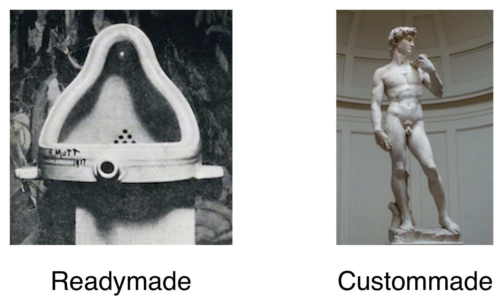
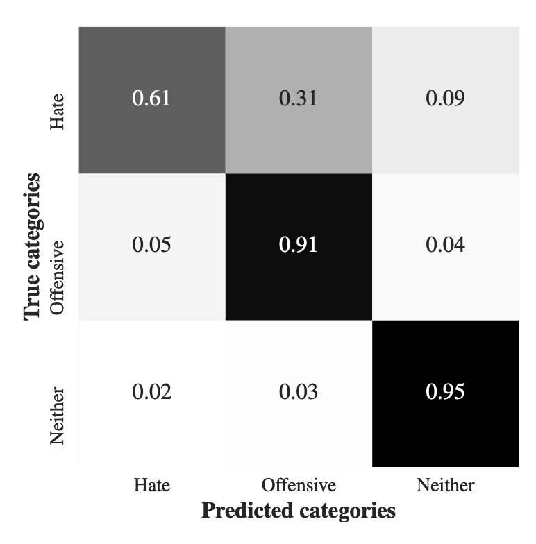
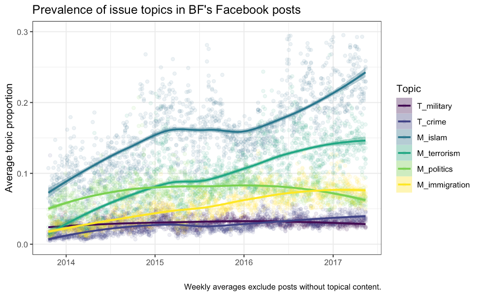
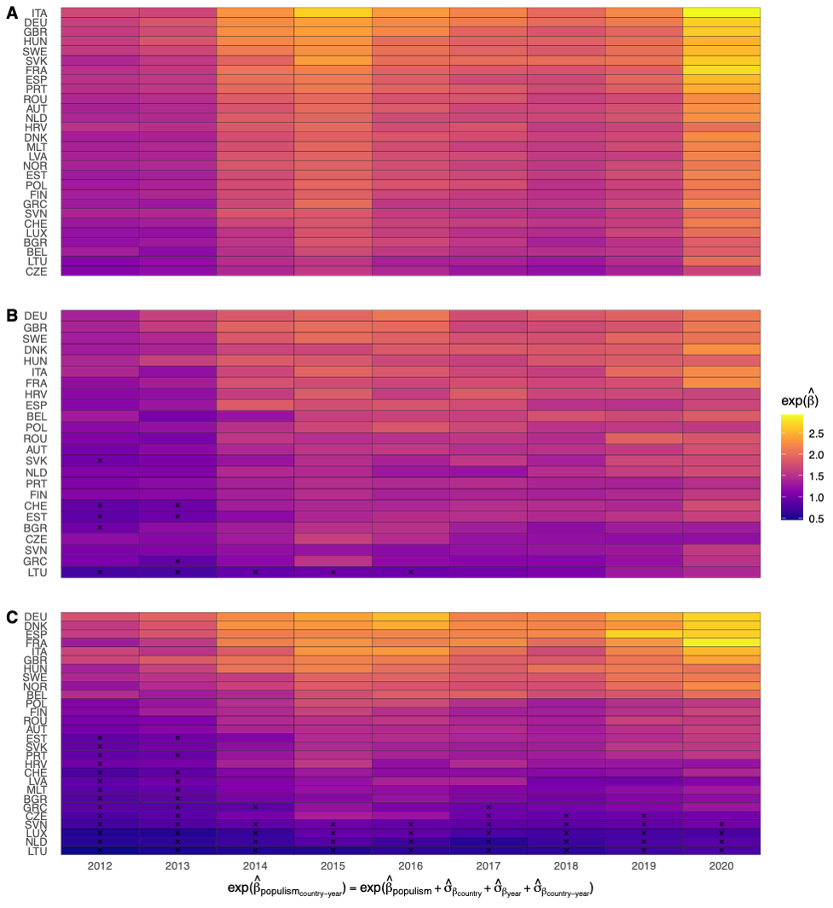
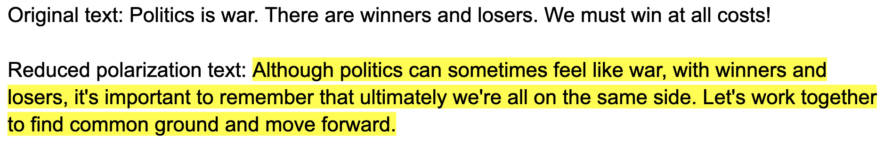

```{r setup, include=FALSE}
knitr::opts_chunk$set(echo = FALSE)
knitr::opts_chunk$set(warning = FALSE)
knitr::opts_chunk$set(message = FALSE)
knitr::opts_chunk$set(dev = 'pdf')
library("knitr")
library("formatR")

opts_chunk$set(tidy.opts=list(width.cutoff=80),tidy=TRUE)
opts_chunk$set(tidy = FALSE)

knitr::knit_hooks$set(mysize = function(before, options, envir) {
  if (before) 
    return(options$size)
})

knitr::opts_chunk$set(
 fig.width = 4,
 fig.asp = 0.8,
 out.width = "80%",
 fig.align = "center"
)

kable <- function(data) {
  knitr::kable(data, digits = 3) %>% 
    kable_styling(position = "center")
}
```


# Introduction to Computational Sociology
## Computational social science
```{r}
include_graphics('../images/lazer_quote.png')
```

\tiny Lazer, David, Alex Pentland, Lada Adamic, Sinan Aral, Albert Laszlo Barabasi, Devon Brewer, Nicholas Christakis, Noshir Contractor, James Fowler, Myron Gutmann, Tony Jebara, Gary King, Michael Macy, Deb Roy, and Marshall Van Alstyne. 2009. “Life in the Network: The Coming Age of Computational Social Science.” *Science* 323(5915):721–23. doi: 10.1126/science.1167742.


## Digital traces and big data
```{r}
include_graphics('../images/watts_telescope.png')
```
\tiny Watts, Duncan J. 2011. *Everything Is Obvious: Once You Know the Answer.* Currency.


## Readymade data
```{r}

```
\tiny Salganik, Matthew J. 2017. *Bit by Bit: Social Research in the Digital Age*. Princeton University Press.


## The emergence of a field
```{r}
include_graphics('../images/css_pubs.png')
```
\tiny Edelmann, Achim, Tom Wolff, Danielle Montagne, and Christopher A. Bail. 2020. “Computational Social Science and Sociology.” *Annual Review of Sociology* 46(1):annurev-soc-121919-054621. doi: 10.1146/annurev-soc-121919-054621.


## Some defining features
- Unstructured, multimodal data (text, image, video)
- New forms of data collection (web-scraping, online experiments, digitization)
- Sociological applications of methods developed by computer scientists (word embeddings, supervised machine learning, computer vision)

# My research

## Detecting hate speech on Twitter using machine learning
```{r, out.width = "60%"}

```

## Analyzing far-right discourse on Facebook using topic modeling
```{r}

```

## Quantifying populists' popularity on using digital traces
```{r, out.width = "50%"}

```

## Reducing polarization using large language models
```{r, out.width = "95%"}

```


