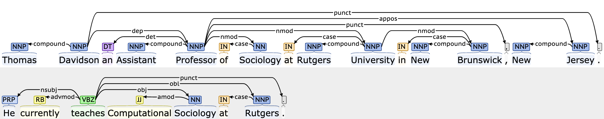
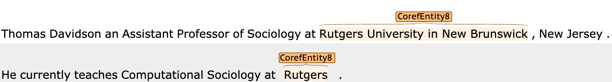
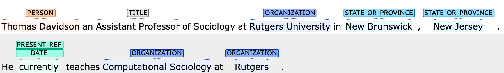
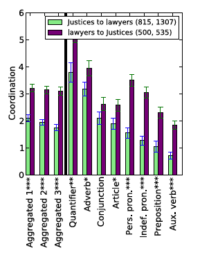
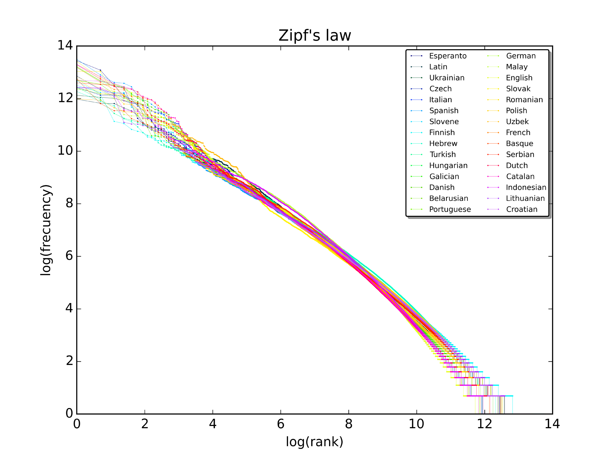
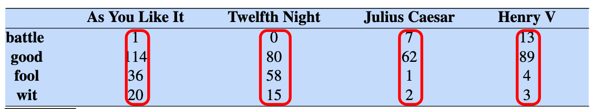
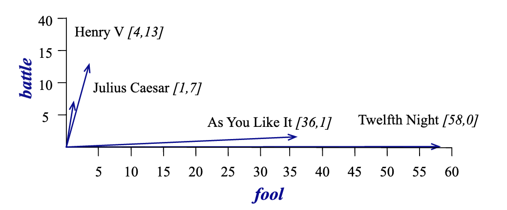
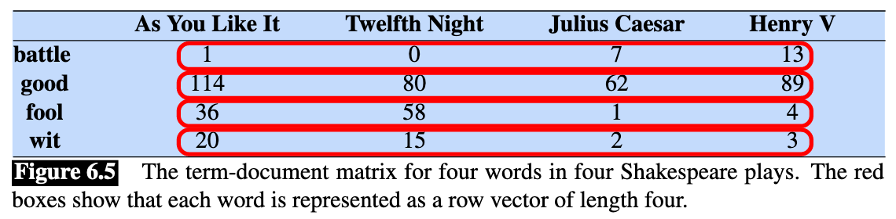
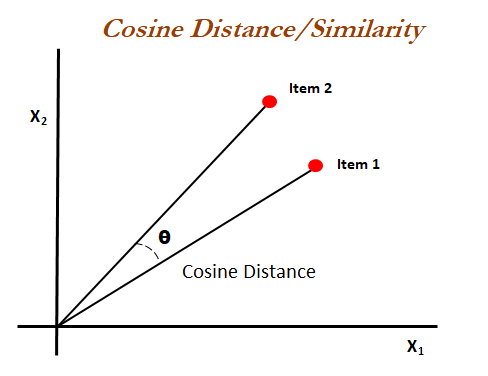

```{r setup, include=FALSE}
knitr::opts_chunk$set(echo = FALSE)
knitr::opts_chunk$set(warning = FALSE)
knitr::opts_chunk$set(message = FALSE)
knitr::opts_chunk$set(dev = 'pdf')
library("knitr")
library("formatR")

opts_chunk$set(tidy.opts=list(width.cutoff=80),tidy=TRUE)
opts_chunk$set(tidy = FALSE)

knitr::knit_hooks$set(mysize = function(before, options, envir) {
  if (before) 
    return(options$size)
})
```

# Plan
1. Course updates
2. What is NLP?
3. Working with texts
4. Vector representations of texts
5. Document-similarity measures


# Course updates
- Homework 2 and project proposal due Friday (3/5) at 5pm
  - Submit proposal using form (see #general on Slack)
  - Submit homework via Github

# Introduction to NLP
## What is natural language processing?
- Three components of NLP*:
  - Natural language / "text as data"
    - A corpus of text (e.g. books, reviews, tweets, e-mails)
  - (Computational) linguistics
    - Linguistic theory to guide analysis and computational approaches to handle data
  - Statistics
    - Statistical methods to make inferences
    
\tiny \*Not *that* NLP: https://en.wikipedia.org/wiki/Neuro-linguistic_programming

# Introduction to NLP
## NLP tasks: Part-of-speech tagging
```{r, out.width="100%",out.height="100%", fig.align="center"}
  include_graphics('../images/pos.png')
```

\tiny \centering Examples created using https://corenlp.run/

# Introduction to NLP
## NLP tasks: Dependency-parsing
```{r, out.width="100%",out.height="100%", fig.align="center"}
  
```

\tiny \centering Examples created using https://corenlp.run/

# Introduction to NLP
## NLP tasks: Co-reference resolution
```{r, out.width="100%",out.height="100%", fig.align="center"}
  
```

\tiny \centering Examples created using https://corenlp.run/

# Introduction to NLP
## NLP tasks: Named-entity recognition
```{r, out.width="100%",out.height="100%", fig.align="center"}
  
```
\tiny \centering Examples created using https://corenlp.run/

# Introduction to NLP
## Applications: Power dynamics
```{r, out.width="50%",out.height="50%", fig.align="center"}
  
```
\tiny Danescu-Niculescu-Mizil, Cristian, Lillian Lee, Bo Pang, and Jon Kleinberg. 2012. “Echoes of Power: Language Effects and Power Differences in Social Interaction.” In Proceedings of the 21st International Conference on World Wide Web, 699–708. ACM. http://dl.acm.org/citation.cfm?id=2187931.

# Introduction to NLP
## Applications: Identity and group membership
```{r, out.width="50%",out.height="50%", fig.align="center"}
  include_graphics('../images/no_country.png')
```
\tiny Danescu-Niculescu-Mizil, Cristian, Robert West, Dan Jurafsky, Jure Leskovec, and Christopher Potts. 2013. “No Country for Old Members: User Lifecycle and Linguistic Change in Online Communities.” In Proceedings of the 22nd International Conference on World Wide Web, 307–18. ACM. http://dl.acm.org/citation.cfm?id=2488416.

# Introduction to NLP
## Applications: Trust and betrayal
```{r, out.width="100%",out.height="100%", fig.align="center"}
  include_graphics('../images/betrayal.png')
```

\tiny Niculae, Vlad, Srijan Kumar, Jordan Boyd-Graber, and Cristian Danescu-Niculescu-Mizil. 2015. “Linguistic Harbingers of Betrayal: A Case Study on an Online Strategy Game.” In Proceedings of the 53rd Annual Meeting of the Association for Computational Linguistics and the 7th International Joint Conference on Natural Language Processing. Beijing, China: ACL. http://arxiv.org/abs/1506.04744.

# Introduction to NLP
## Text as data
```{r, out.width="100%",out.height="100%", fig.align="center"}
  include_graphics('../images/grimmer_stewart.png')
```
- Justin Grimmer and Brandon Stewart, 2013

# Introduction to NLP

"Computational approaches are sometimes less subtle and deep than the reading of a
skillful analyst, who interprets text in context. Nevertheless, ... recent advances in NLP
and ML are being used to enhance qualitative analysis in two ways. First, supervised ML prediction
tools can “learn” and reliably extend many sociologically interesting textual classifications to
massive text samples far beyond human capacity to read, curate, and code. Second, unsupervised
ML approaches can “discover” unnoticed, surprising regularities in these massive samples of text
that may merit sociological consideration and theorization." - James Evans and Pedro Aceves, 2016

# Introduction to NLP
## NLP class timeline
- Week 7 (today)
  - Pre-processing, bag-of-words, and the vector-space model
- Week 8
  - Word embeddings
- Week 9
  - Topic models
- Week 11
  - Supervised text classification

# Working with text
## Pre-processing
- There are several steps we need to take to "clean" or "pre-process" texts for analysis
  - Tokenization
  - Stemming/lemmatization
  - Stop-word removal
  - Handling punctuation and special characters

# Working with text
## Tokenization
- Tokenization is the process of splitting a document into words
  - e.g. "Cognito, ergo sum" $\Rightarrow$ ("Cognito,", "ergo", "sum")
- In English this is pretty trivial, we just split using white-space

<!--
#```{r, echo=FALSE, fig.width=6, fig.height=4,tidy=FALSE, mysize=TRUE, size='\\footnotesize'}
#print(str_split("Cognito ergo sum", pattern = " ", simplify = TRUE))
#```
-->

- Tokenization is more difficult in languages like Mandarin
  - It requires more complex parsing to understand grammatical structures

# Working with text
## Stemming/lemmatization
- We often want to reduce sparsity by reducing words to a common root
  - e.g. ("school", schools", "schooling", "schooled") $\Rightarrow$ "school"
- Stemming is a simple, heuristic-based approach
- Lemmatization is a more rigorous approach based on morhology, but is more computationally-intensive and often unnecessary

# Working with text
## Stop-word removal
- Stop-words are frequently occurring words that are often removed
- The intuition is that they add little meaning and do not help us to distinguish between documents
  - e.g. Virtually all texts in English will contain the words "and", "the", "of", etc.
- Most NLP packages have lists of stop-words to easily facilitate removal.

# Working with text
## Handling punctution and special characters
- In many cases we may want to remove punctuation and other special characters (e.g. HTML, unicode)
  - This is often done using regular expressions
  - Words are typically set to lowercase

# Working with text
## Pre-process with caution!
- Researchers often apply these techniques before starting an analysis, but it may affect our results*
  - There is no one-size-fits-all solution, so think carefully before removing anything
  - It's often useful to experiment to see if pre-processing steps affect results

# Working with text
## Pre-process with caution!
```{r, out.width="70%",out.height="70%", fig.align="center"}
  include_graphics('../images/denny_and_spirling.png')
```
\tiny Denny, Matthew J., and Arthur Spirling. 2018. “Text Preprocessing For Unsupervised Learning” Political Analysis 26 (02): 168–89. https://doi.org/10.1017/pan.2017.44.

# Working with text
## Word counts
- Now we have done some pre-processing, one of the most basic ways we can start to analyze tests is by counting the frequency of words.
  - e.g. "I think, therefore I am" $\Rightarrow$ 

\begin{table}[]
\begin{tabular}{ll}
Word & Count \\
I & 2 \\
think & 1 \\
therefore & 1 \\
am & 1
\end{tabular}
\end{table}


# Working with text
## Frequency distributions
- *Zipf's law*: A word's frequency is inversely proportional to its rank order in the frequency distribution.
  - "the" is the most common word in the English language, accounting for 7% of all words in the *Brown Corpus of American English*
  - "and" and "of" compete for second place, each accounting for ~3.5% of words in the corpus
  - The most frequent 135 words account for approximately half the 1 million words in the corpus
  - Around 50,000 words, representing half the total unique words in the corpus, are *hapax legomena*, words which only occur once
  
# Working with text: Zipf's law
```{r, out.width="70%",out.height="70%", fig.align="center"}

```
\tiny A plot of the rank versus frequency for the first 10 million words in 30 Wikipedias (dumps from October 2015) in a log-log scale (Source: Wikipedia).

# Working with text
## Bag-of-words
- Documents are often treated as "bags of words", i.e. we treat a document as a collection of words without retaining information about the order
  - e.g. "This is a document" $\Rightarrow$ ("document", "This", "a", "is")

# Working with text
## Example: Loading data
```{r, echo=TRUE, tidy=FALSE, mysize=TRUE, size='\\footnotesize'}
library(tidyverse)
library(tidytext)
library(gutenbergr) 

ef <- gutenberg_download(41360) # Download Elementary Forms
cm <- gutenberg_download(61) # Download Communist Manifesto

ef$title <- "Elementary Forms"
cm$title <- "Communist Manifesto"

texts <- bind_rows(ef, cm)
```

# Working with text
In this example, each text is represented as a table, where the first column is the ID in the Project Gutenberg database and the `text` field contains each sentence as a new row.
```{r, echo=TRUE, tidy=FALSE, mysize=TRUE, size='\\footnotesize'}
print(tail(texts$text))
```

# Working with text
## Tokenizing using `tidytext`
We are going to be using the `tidytext` package to conduct our analyses. The `unnest_tokens` function is used to tokenize the text, resulting in a table containing the original book ID and each token as a separate row.
```{r, echo=TRUE, tidy=FALSE, mysize=TRUE, size='\\footnotesize'}
tidy.text <- texts %>% unnest_tokens(word, text)
tail(tidy.text$word)
```


# Working with text
```{r, echo=FALSE, fig.width=6, fig.height=4,tidy=FALSE, mysize=TRUE, size='\\footnotesize'}
library(ggplot2)

tidy.text %>% filter(gutenberg_id == 61) %>%
  count(word, sort = TRUE) %>%
  slice(1:10) %>%
  mutate(word = reorder(word, n)) %>%
  ggplot(aes(n, word)) +
  geom_col(color='red') +
  labs(y = NULL, x='Term frequency', title="10 most frequent terms in The Communist Manifesto")
```

# Working with text
```{r, echo=FALSE, fig.width=6, fig.height=4,tidy=FALSE, mysize=TRUE, size='\\footnotesize'}
tidy.text %>% filter(gutenberg_id == 41360) %>%
  count(word, sort = TRUE) %>%
  slice(1:10) %>%
  mutate(word = reorder(word, n)) %>%
  ggplot(aes(n, word)) +
  geom_col(color='blue') +
  labs(y = NULL, x='Term frequency', title="10 most frequent terms in The Elementary Forms of Religious Life")
```

# Working with text
## Removing stopwords
We can load a corpus of stop words contained in `tidytext` and use `anti_join` to filter our texts. This retains all records without a match in stopwords.
```{r, echo=TRUE, tidy=FALSE, mysize=TRUE, size='\\footnotesize'}
data(stop_words)

tidy.text <- tidy.text %>%
  anti_join(stop_words)
```

# Working with text
```{r, echo=FALSE, fig.width=6, fig.height=4,fig.width=6, fig.height=4,tidy=FALSE, mysize=TRUE, size='\\footnotesize'}
tidy.text %>% filter(gutenberg_id == 61) %>%
  count(word, sort = TRUE) %>%
  slice(1:10) %>%
  mutate(word = reorder(word, n)) %>%
  ggplot(aes(n, word)) +
  geom_col(color='red') +
  labs(y = NULL, x='Term frequency', title="10 most frequent terms in The Communist Manifesto", caption="Stopwords removed")
```

# Working with text
```{r, echo=FALSE, fig.width=6, fig.height=4,fig.width=6, fig.height=4,tidy=FALSE, mysize=TRUE, size='\\footnotesize'}
tidy.text %>% filter(gutenberg_id == 41360) %>%
  count(word, sort = TRUE) %>%
  slice(1:10) %>%
  mutate(word = reorder(word, n)) %>%
  ggplot(aes(n, word)) +
  geom_col(color='blue') +
  labs(y = NULL, x='Term frequency', title="10 most frequent terms in The Elementary Forms of Religious Life", caption="Stopwords removed")
```

# Working with text
## Exercise: Removing other junk
The last example shows how there is still some "junk" in the Durkheim text.
```{r, echo=FALSE, tidy=FALSE, mysize=TRUE, size='\\footnotesize'}
to.remove <- tibble(text=c("pp", "tr")) %>% unnest_tokens(word, text)

tidy.text <- tidy.text %>%
  anti_join(to.remove)
```

# Working with text
```{r, echo=FALSE, fig.width=6, fig.height=4, tidy=FALSE, mysize=TRUE, size='\\footnotesize'}
tidy.text %>% filter(gutenberg_id == 41360) %>%
  count(word, sort = TRUE) %>%
  slice(1:10) %>%
  mutate(word = reorder(word, n)) %>%
  ggplot(aes(n, word)) +
  geom_col(color='blue') +
  labs(y = NULL, x='Term frequency', title="10 most frequent terms in The Elementary Forms of Religious Life", caption="Stopwords removed+")
```


# Working with text
## Stemming
We can stem the terms using a function from the package `SnowballC`, which is a wrapper for a commonly used stemmer called the Porter Stemmer, written in C.
```{r, echo=TRUE, tidy=FALSE, mysize=TRUE, size='\\footnotesize'}
library(SnowballC)

tidy.text <- tidy.text %>% mutate_at("word", funs(wordStem((.), language="en")))
```
\tiny Stemmer solution from https://cbail.github.io/SICSS_Basic_Text_Analysis.html. See \href{https://smltar.com/stemming}{for more info on stemming and lemmatizing in R.}

# Working with text
```{r, echo=FALSE, fig.width=6, fig.height=4, tidy=FALSE, mysize=TRUE, size='\\footnotesize'}
tidy.text %>% filter(gutenberg_id == 41360) %>%
  count(word, sort = TRUE) %>%
  slice(1:10) %>%
  mutate(word = reorder(word, n)) %>%
  ggplot(aes(n, word)) +
  geom_col(color='blue') +
  labs(y = NULL, x='Term frequency', title="10 most frequent terms in The Elementary Forms of Religious Life", caption="Stopwords removed+, stemmed")
```

# Working with text: Zipf's law
Let's get counts of words across both texts to analyze their distribution.
```{r, echo=TRUE,tidy=FALSE, mysize=TRUE, size='\\footnotesize'}
# Count words by text
text.words <- tidy.text %>% count(title, word, sort = TRUE)

# Get total number of words in each text
total.words <- text.words %>% group_by(title) %>% 
  summarize(total = sum(n))

# Merge
words <- left_join(text.words, total.words)
head(words)
```

# Working with text: Zipf's law
```{r, echo=FALSE, fig.width=6, fig.height=4,tidy=FALSE, mysize=TRUE, size='\\footnotesize'}
ggplot(words, aes(n/total, fill = title)) +
  geom_histogram(show.legend = FALSE) +
  facet_wrap(~title, ncol = 2, scales = "free_y") +
  labs(y="Count", x= "Proportion of total words used") + theme_minimal()
```

# Working with text: Zipf's law
Calculating rank and frequency for each word in each text.
```{r, echo=TRUE, tidy=FALSE, mysize=TRUE, size='\\footnotesize'}
freq_by_rank <- words %>% 
  group_by(title) %>% 
  mutate(rank = row_number(), 
         `term frequency` = n/total) %>%
  ungroup()
```

# Working with text: Zipf's law
```{r, echo=FALSE, fig.width=6, fig.height=4,tidy=FALSE, mysize=TRUE, size='\\footnotesize'}
freq_by_rank %>% 
  ggplot(aes(rank, `term frequency`, color =title)) + 
  geom_line(size = 1.1, alpha = 1, show.legend = F) + 
  scale_x_log10() +
  scale_y_log10() + theme_minimal() +
  labs(y='Term frequency', x="Rank", caption='Log-log axes')
```

# Working with text
## N-grams
- So far we have just considered treating a text as a "bag-of-words"
- One way to maintain some information about word order (and hence syntax) is to use N-grams
- An *N-gram*\* is a sequence of $N$ words
- We often split texts into N-grams to capture basic syntactic units like phrases
  - $N$ is usually small.
    - $N = 2$ is called a "bigram"; $N = 3$ is a "trigram"
  - e.g. "I like peanut butter" contains the following bigrams: "I like", "like peanut", & "peanut butter".
  
  \tiny *Nothing to do with Scientology https://en.wikipedia.org/wiki/Engram_(Dianetics)
  
# Working with text
## N-grams
- We can also use *character N-grams* to split documents into sequences of characters
  - e.g. "character" can be split into the following triplets ("cha", "har", "ara", "rac", "act", "cte", "ter")
- Some recent approaches like BERT combine both character and word N-grams into "word pieces".
  - This makes it easy to tokenize new documents since we can always represent them as characters if a word is not in our vocabulary


# Exercise: 
Modify `unnest_tokens` to construct trigrams. 
```{r, echo=FALSE, tidy=FALSE, mysize=TRUE, size='\\footnotesize'}
tidy.trigrams <- texts %>% unnest_tokens(word, text, token = "ngrams", n=3) %>% drop_na()### Modify this code
```

# Exercise
```{r, echo=FALSE, fig.width=6, fig.height=4,tidy=FALSE, mysize=TRUE, size='\\footnotesize'}
tidy.trigrams %>% filter(gutenberg_id == 61) %>%
  count(word, sort = TRUE) %>%
  slice(1:10) %>%
  mutate(word = reorder(word, n)) %>%
  ggplot(aes(n, word)) +
  geom_col(color='red') +
  labs(y = NULL, x='Term frequency', title="10 most frequent trigrams in The Communist Manifesto", caption="Stopwords removed+, stemmed")
```

# Exercise
```{r, echo=FALSE, fig.width=6, fig.height=4,tidy=FALSE, mysize=TRUE, size='\\footnotesize'}
tidy.trigrams %>% filter(gutenberg_id == 41360) %>%
  count(word, sort = TRUE) %>%
  slice(1:10) %>%
  mutate(word = reorder(word, n)) %>%
  ggplot(aes(n, word)) +
  geom_col(color='blue') +
  labs(y = NULL, x='Term frequency', title="10 most frequent trigrams in The Elementary Forms of Religious Life", caption="Stopwords removed+, stemmed")
```

# Working with text
## Term-frequency inverse document-frequency (TF-IDF)
- Term frequency alone is an imperfect measure for comparing across documents
  - Terms common to multiple documents provide us with little information (e.g. stop words)
  - Terms unique to few documents better allow us to distinguish between them
- TF-IDF is a way to weight term frequencies to give higher weights to terms which occur infrequently across documents

# Working with text
## Calculating term-frequency inverse document-frequency (TF-IDF)
- $N$ = number of documents in the corpus
- $tf_{t,d}$ = number of times term $t$ used in document $d$
- $df_{t}$ = number of documents containing term $t$
- $idf_{t} = log(\frac{N}{df_{t}})$ = log of fraction of all documents containing $t$
  - Note that $\frac{N}{df_{t}}$ is larger for less frequent terms
  - We take the log to penalize very high values
- We then use these values to calculate $TF\-IDF_{t,d} = tf_{t,d}*idf_{t}$

# Working with text: TF-IDF
## Computing TF-IDF in `tidytext`
We can easily compute TF-IDF weights using `tidy.text` by using the word-count object we created.
```{r, echo=TRUE, tidy=FALSE, mysize=TRUE, size='\\footnotesize'}
tidy.tfidf <- words %>% bind_tf_idf(word, title, n)
head(tidy.tfidf)
```
\footnotesize Note the two document example is quite trivial. Words occuring in both documents get idf weights ~ 0.

# Working with text: TF-IDF
```{r, echo=FALSE, fig.width=6, fig.height=4,tidy=FALSE, mysize=TRUE, size='\\footnotesize'}
tidy.tfidf %>% filter(title == "Communist Manifesto") %>%
  arrange(desc(tf_idf)) %>%
  mutate(word = reorder(word, tf_idf)) %>%
  head(10) %>%
  ggplot(aes(tf_idf, word)) +
  geom_col(color='red') +
  labs(y = NULL, x='TF-IDF weight', title="10 stems with highest TF-IDF weight in The Communist Manifesto", caption="Stopwords removed+, stemmed")
```

# Working with text: TF-IDF
```{r, echo=FALSE, fig.width=6, fig.height=4,tidy=FALSE, mysize=TRUE, size='\\footnotesize'}
tidy.tfidf %>% filter(title == "Elementary Forms") %>%
  arrange(desc(tf_idf)) %>%
  mutate(word = reorder(word, tf_idf)) %>%
  head(10) %>%
  ggplot(aes(tf_idf, word)) +
  geom_col(color='blue') +
  labs(y = NULL, x='TF-IDF weight', title="10 stems with highest TF-IDF weight in The Elementary Forms of Religious Life", caption="Stopwords removed+, stemmed")
```

# Vector representations of texts
## The document-term matrix (DTM)
- A frequently used bag-of-words representation of a text corpus is the *Document-Term Matrix*:
  - Each row* is a document (a unit of text)
  - Each column is a term (word)
  - For a given DTM $X$, each cell $X_{i,j}$ indicates the number of times a term $i$ occurs in document $j$, $tf_{i,j}$.
- Most cells are empty so it is usually stored as a sparse matrix.
  
\tiny \*Often the rows and columns reversed, resulting in a *Term-Document Matrix* or *TDM*

# Vector representations of texts
## Casting a `tidytext` object into a DTM
```{r, echo=TRUE,tidy=FALSE, mysize=TRUE, size='\\footnotesize'}
X <- tidy.text %>% count(title, word) %>% cast_dtm(title, word, n)
print(X)
```

# Vector representations of texts
## Geometric interpretation
- Each text is a vector in N-dimensional space, where N is the total number of unique words (column of the DTM)
- Each word is a vector in D-dimensional space, where D is the number of documents (rows of the DTM)

\tiny See https://web.stanford.edu/~jurafsky/slp3/6.pdf for more details on the vector-space model

# Vector representations of texts
```{r, out.width="70%",out.height="70%", fig.align="center"}
  
```
This example from Jurafsky and Martin shows a Term-Document Matrix (TDM) pertaining to four key words from four Shakespeare plays. The document vectors are highlighted in red.

# Vector representations of texts
```{r, out.width="70%",out.height="70%", fig.align="center"}
  
```
Here vectors for each play are plotted in two-dimensional space. The y- and x-axes indicate the number of times the words "battle" and "fool" appear in each play. Note how some vectors are closer than others and how they have different lengths.

# Vector representations of texts
```{r, out.width="70%",out.height="70%", fig.align="center"}
  
```
We could also treat the rows of this matrix as vector representations of each word. We will discuss this further next week when we study word embeddings.

# Vector representations of texts
## Cosine similarity
```{r, out.width="70%",out.height="70%", fig.align="center"}
  
```

# Vector representations of texts
```{r, out.width="70%",out.height="70%", fig.align="center"}
  include_graphics('../images/vector_vis_angles.png')
```

# Vector representations of texts
## Calculating cosine similarity

$\vec{u}$ and $\vec{v}$ are vectors representing texts (e.g. rows from a DTM matrix). We can compute the cosine of the angle between these two vectors using the following formula:


$$ cos(\theta) = \frac{\vec{u} \cdot \vec{v}}{\|\vec{u}\|\|\vec{v}\|} = \frac{\sum_{i}\vec{u_i} \vec{v_i}}{\sqrt{\sum_{i}\vec{u}_i^2} \sqrt{\sum_{i}\vec{v}_i^2}} $$

The value range from 0 (complete dissimilarity) to 1 (identical), since all values are non-negative.

# Vector representations of texts
## Calculating cosine similarity
```{r, echo=TRUE, tidy=FALSE, mysize=TRUE, size='\\footnotesize'}
cosine.sim <- function(u,v) {
  
  numerator <- u %*% v
  denominator <- sqrt(sum(u^2)) * sqrt(sum(v^2))
  
  return (numerator/denominator)
}

u <- c(1,2,3,4)
v <- c(0,1,0,1)

cosine.sim(u,v)

u %*% v / (sqrt(sum(u^2)) * sqrt(sum(v^2)))

```

# Vector representations of texts
## Cosine similarity between Marx and Durkheim
```{r, echo=TRUE, tidy=FALSE, mysize=TRUE, size='\\footnotesize'}
X.dense <- as.matrix(X)
print(cosine.sim(X.dense[1,], X.dense[2,]))
```

# Vector representations of texts
## Cosine similarity for a larger corpus
The similarity between Marx's *Communist Manifesto* and Durkheim's *Elementary Forms* is rather meaningless without more information. Let's consider another example with a (slightly) larger corpus of texts.
```{r, echo=TRUE, tidy=FALSE, mysize=TRUE, size='\\footnotesize'}
m <- gutenberg_metadata %>% filter(author == "Shakespeare, William" & language == "en")
rj <- gutenberg_download(1112)
mnd <- gutenberg_download(1113)
tn <- gutenberg_download(1123)
kl <- gutenberg_download(1128)
mb <- gutenberg_download(1129)
rj$play <- "Romeo & Juliet"
mnd$play <- "A Midsummer Night's Dream"
tn$play <- "Twelth Night"
kl$play <- "King Lear"
mb$play <- "Macbeth"

S <- bind_rows(rj, mnd, tn, kl, mb)

library(dplyr)
library(stringr)


# look for Shakespeare, excluding collections (containing "Works") and translations
shakespeare_metadata <- gutenberg_metadata %>%
  filter(author == "Shakespeare, William",
         language == "en",
         !str_detect(title, "Works"),
         has_text,
         !str_detect(rights, "Copyright")) %>%
         distinct(title, .keep_all=TRUE)

## Not run: 
S <- gutenberg_download(shakespeare_metadata$gutenberg_id)
```

# Vector representations of texts
## Exercise: From tidytext to DTM
Convert the plays into tidytext objects, using any preprocessing steps you want and filtering out any words which occur less than 10 times in the corpus. Calculate TF-IDF scores then convert to a DTM called `S.m`.
```{r, echo=FALSE, tidy=FALSE, mysize=TRUE, size='\\footnotesize'}
S.counts <- S %>% unnest_tokens(word, text) %>%
  anti_join(stop_words) %>%  # Remove stopwords
  #mutate_at("word", funs(wordStem((.), language="en"))) %>% # Stem
  count(gutenberg_id, word)

S.totals <- S.counts %>% group_by(word) %>%  # get totals of words over docs
  summarize(total = sum(n))

S.words <- left_join(S.counts, S.totals)

S.m <- S.words %>%  filter(total >= 10) %>% 
  bind_tf_idf(word, gutenberg_id, n) %>% # get TF-IDF
  cast_dtm(gutenberg_id, word, tf_idf) # convert to DTM, use TF only

print(S.m)
```

# Vector representations of texts
## Normalizing columns
```{r, echo=TRUE, tidy=FALSE, mysize=TRUE, size='\\footnotesize'}
S.dense <- as.matrix(S.m)

normalize <- function(v) {
  return (v/sqrt(sum(v^2)))
}


# Normalizing every column
for (i in 1:dim(S.dense)[1]) {
  S.dense[i,] <- normalize(S.dense[i,])
}

write.table(S.dense, "shakespeare.txt") # Store for later
```

# Vector representations of texts
## Calculating cosine similarity using matrix multiplication
```{r, echo=TRUE, tidy=FALSE, mysize=TRUE, size='\\footnotesize'}
sims <- S.dense %*% t(S.dense)
print(sims)
```

# Vector representations of texts
## Calculating cosine similarity using matrix multiplication
```{r, echo=TRUE, tidy=FALSE, mysize=TRUE, size='\\footnotesize'}
sims <- S.dense %*% t(S.dense)
print(sims)
```