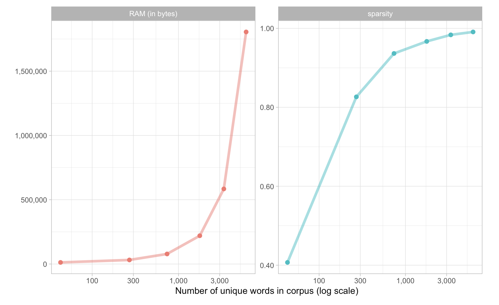
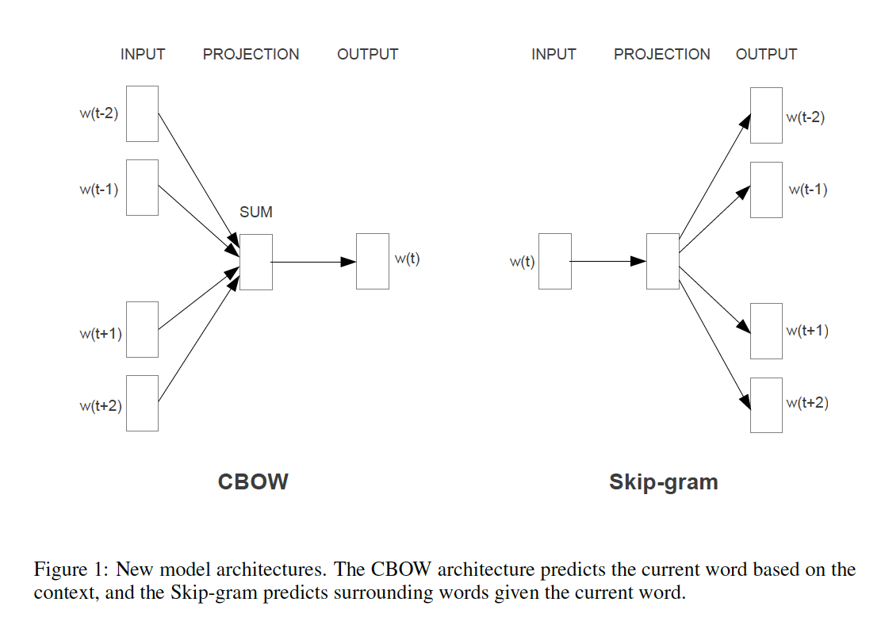
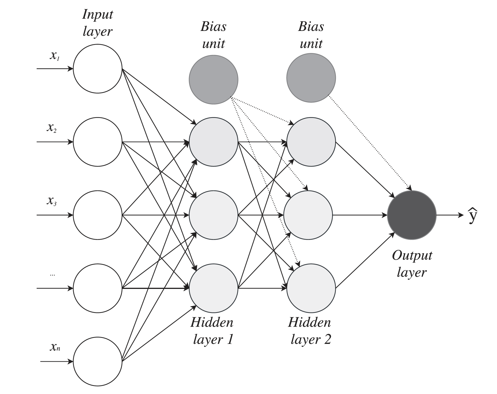
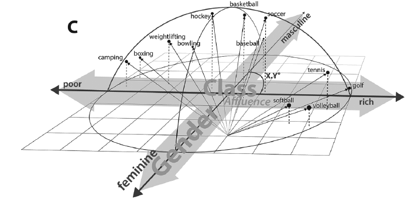
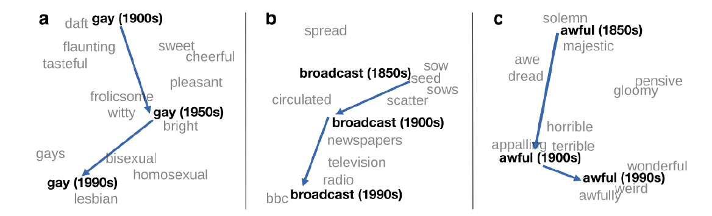
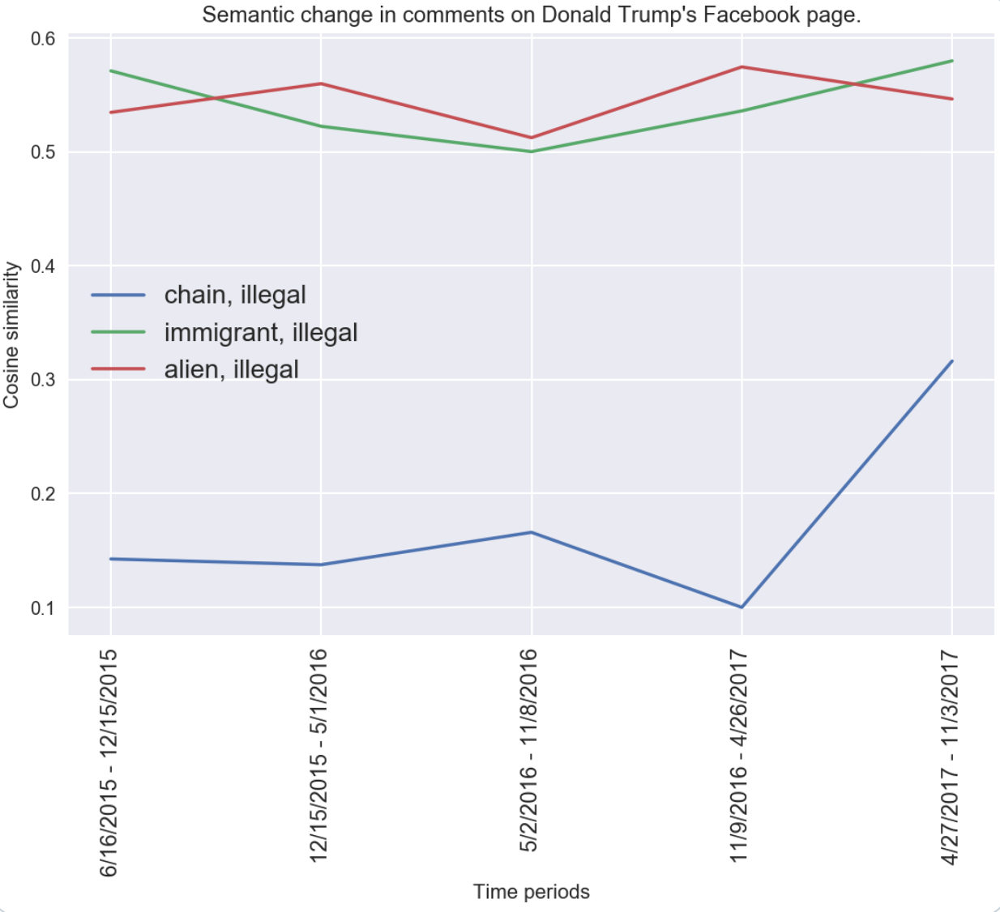
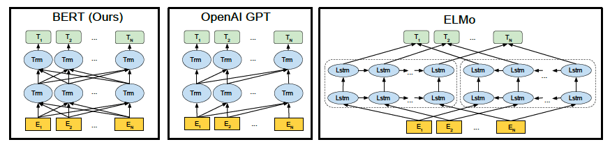
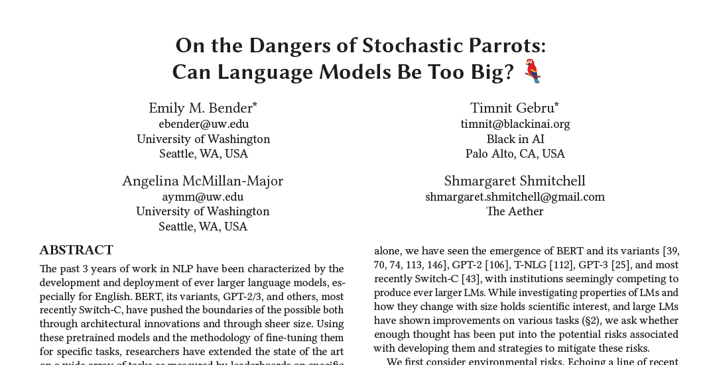

```{r setup, include=FALSE}
knitr::opts_chunk$set(echo = FALSE)
knitr::opts_chunk$set(warning = FALSE)
knitr::opts_chunk$set(message = FALSE)
knitr::opts_chunk$set(dev = 'pdf')
library("knitr")
library("formatR")

opts_chunk$set(tidy.opts=list(width.cutoff=80),tidy=TRUE)
opts_chunk$set(tidy = FALSE)

knitr::knit_hooks$set(mysize = function(before, options, envir) {
  if (before) 
    return(options$size)
})
```

# Plan
1. Course updates
2. Words and texts as vectors
3. The vector-space model review
4. Latent semantic analysis
5. Interlude: Language models
6. Word embeddings
7. Contextualized embeddings

# Course updates
- Spring break next week, no class

# The vector-space model review
## Vector representations
- Last week we looked at how we can represent texts as numeric vectors
  - Documents as vectors of words 
  - Words as vectors of documents
- A document-term matrix (*DTM*) is a matrix where documents are represented as rows and tokens as columns

# The vector-space model review
## Weighting schemes
- We can use different schemes to weight these vectors
  - Binary (Does word $w_i$ occur in document $d_j$?)
  - Counts (How many times does word $w_i$ occur in document $d_j$?)
  - TF-IDF (How many times does word $w_i$ occur in document $d_j$, accounting for how often $w_i$ occurs across all documents $d \in D$?)
    - Recall *Zipf's Law*: a handful of words account for most words used; such words do little to help us to distinguish between documents
    
# The vector-space model review
## Cosine similarity
$$ cos(\theta) = \frac{\vec{u} \cdot \vec{v}}{\|\vec{u}\|\|\vec{v}\|} = \frac{\sum_{i}\vec{u_i} \vec{v_i}}{\sqrt{\sum_{i}\vec{u}_i^2} \sqrt{\sum_{i}\vec{v}_i^2}} $$

# The vector-space model review
## Limitations
- These methods produce *sparse* vector representations
  - Given a vocabulary of unique tokens $V$, each vector contains $|V|$ elements.
  - Most values in a DTM are zero.
- This is computationally inefficient, since most entries in a DTM are equal to zero

# The vector-space model review
## Limitations
```{r, out.width="70%",out.height="70%", fig.align="center"}

```  
\tiny Source: https://smltar.com/embeddings.html
  
# Latent semantic analysis
## Latent Semantic Analysis
- One approach to reduce dimensionality and better capture semantics is called **Latent Semantic Analysis**  (*LSA*)
  - We can use a process called *singular value decomposition* to find a *low-rank approximation* of a DTM. 
    - In short, we can "squash" a big matrix into a much smaller matrix while retaining important information.
  
$$DTM = X = U \Sigma V^T$$
  
# Latent semantic analysis
## Singular Value Decomposition
```{r, out.width="70%",out.height="60%", fig.align="center"}
include_graphics('../images/SVD.png')
```  

\tiny See the \href{https://en.wikipedia.org/wiki/Latent_semantic_analysis}{Wikipedia page} for video of the latent dimensions in a sparse TDM.

# Latent semantic analysis
## Example: Shakespeare's writings
`X` is a TF-IDF weighted Document-Term Matrix of Shakespeare's writings from Project Gutenberg. There are 11,666 unique tokens (each of which occurs 10 or more times in the corpus) and 66 documents.
```{r, echo=TRUE, tidy=FALSE, mysize=TRUE, size='\\footnotesize'}
X <- as.matrix(read.table("shakespeare.txt"))
X <- X[, which(colSums(X) != 0)] # Drop zero columns

dim(X)
```

# Latent semantic analysis
## Creating a lookup dictionary
We can construct a list to allow us to easily find the index of a particular token.
```{r, echo=TRUE, tidy=FALSE, mysize=TRUE, size='\\footnotesize'}
lookup.index.from.token <- list()

for (i in 1:length(colnames(X))) {
  lookup.index.from.token[colnames(X)[i]] <- i
}
```

# Latent semantic analysis
## Using the lookup dictionary
This easily allows us to find the vector representation of a particular word. Note how most values are zero since the character Hamlet is only mentioned in a handful of documents.
```{r, echo=TRUE, tidy=FALSE, mysize=TRUE, size='\\footnotesize'}
lookup.index.from.token["hamlet"]
round(as.numeric(X[,unlist(lookup.index.from.token["hamlet"])]),3)
```


# Latent semantic analysis
## Calculating similarties
The following code normalizes each column and constructs a word-word cosine-similarity matrix.
```{r, echo=TRUE, tidy=FALSE, mysize=TRUE, size='\\footnotesize'}
normalize <- function(X) {
  for (i in 1:dim(X)[2]) {
    X[,i] <- (X[,i]/sqrt(sum(X[,i]^2)))
  }
  return(X)
}

X.n <- normalize(X)

sims <- t(X.n) %*% X.n
dim(sims)
```


# Latent semantic analysis
## Most similar function
For a given token, this function allows us to find the `n` most similar tokens in the similarity matrix, where `n` defaults to `10`.
```{r, echo=TRUE, tidy=FALSE, mysize=TRUE, size='\\footnotesize'}
get.top.n <- function(token, sims, n=10) {
  top <- sort(sims[unlist(lookup.index.from.token[token]),], 
                 decreasing=T)[1:n]
  return(top)
}
```

# Latent semantic analysis
## Finding similar words
```{r, echo=TRUE, tidy=FALSE, mysize=TRUE, size='\\footnotesize'}
get.top.n("love",sims)
get.top.n("hate", sims)
get.top.n("romeo", sims)
get.top.n("hamlet", sims)
```

# Latent semantic analysis
## Singular value decomposition
The `svd` function allows us to decompose the DTM. We can then easily reconstruct it using the formula shown above.
```{r, echo=TRUE, tidy=FALSE, mysize=TRUE, size='\\footnotesize'}
# Computing the singular value decomposition
lsa <- svd(X)

# We can easily recover the original matrix from this representation
X.2 <- lsa$u %*% diag(lsa$d) %*% t(lsa$v) # X = U \Sigma V^T

# Verifying that values are the same, example of first column
sum(round(X-X.2,5))
```

# Latent semantic analysis
## Singular value decomposition
This plot shows the magnitude of the singular values (the diagonal entries of $\Sigma$). \small Roughly speaking, the magnitude of the singular value corresponds to the amount of variance explained in the original matrix.
```{r, echo=FALSE, tidy=FALSE, mysize=TRUE, size='\\footnotesize', fig.width=4, fig.height=3}
lsa$d
plot(lsa$d)
```


# Latent semantic analysis
## Truncated singular value decomposition
In the example above retained the original matrix dimensions. The point of latent semantic analysis is to compute a *truncated* SVD such that we have a new matrix in a sub-space of X. In this case we only want to retain the first two dimensions of the matrix.
```{r, echo=TRUE, tidy=FALSE, mysize=TRUE, size='\\footnotesize'}
k <- 15 # Dimensions in truncated matrix

# We can take the SVD of X but only retain the first k singular values
lsa.2 <- svd(X, nu=k, nv=k)

# In this case we reconstruct X just using the first k singular values
X.trunc <- lsa.2$u %*% diag(lsa.2$d[1:k]) %*% t(lsa.2$v)

# But the values will be slightly different since it is an approximation
sum(round(X-X.trunc,5))
```

# Latent semantic analysis
## Recalculating similarties using the LSA matrix
```{r, echo=TRUE, tidy=FALSE, mysize=TRUE, size='\\footnotesize'}
words.lsa <- t(lsa.2$v)
colnames(words.lsa) <- colnames(X)

round(as.numeric(words.lsa[,unlist(lookup.index.from.token["hamlet"])]),5)
```


# Latent semantic analysis
## Recalculating similarties using the LSA matrix
```{r, echo=TRUE, tidy=FALSE, mysize=TRUE, size='\\footnotesize'}
words.lsa.n <- normalize(words.lsa)
sims.lsa <- t(words.lsa.n) %*% words.lsa.n
```


# Latent semantic analysis
## Comparing similarities
```{r, echo=TRUE, tidy=FALSE, mysize=TRUE, size='\\footnotesize'}
get.top.n("love",sims)
get.top.n("love",sims.lsa)
```


# Latent semantic analysis
## Comparing similarities
```{r, echo=TRUE, tidy=FALSE, mysize=TRUE, size='\\footnotesize'}
get.top.n("hate", sims)
get.top.n("hate", sims.lsa)
```

# Latent semantic analysis
## Comparing similarities
```{r, echo=TRUE, tidy=FALSE, mysize=TRUE, size='\\footnotesize'}
get.top.n("romeo", sims)
get.top.n("romeo", sims.lsa)
```

# Latent semantic analysis
## Comparing similarities
```{r, echo=TRUE, tidy=FALSE, mysize=TRUE, size='\\footnotesize'}
get.top.n("hamlet", sims)
get.top.n("hamlet", sims.lsa)
```

# Latent semantic analysis
## Execise
Re-run the code above with a different value of `k` on line 188. Compare some terms in the original similarity matrix and the new matrix. How does changing `k` affect the results?
```{r, echo=TRUE, tidy=FALSE, mysize=TRUE, size='\\footnotesize'}
get.top.n("", sims)
get.top.n("", sims.lsa)
```


# Latent semantic analysis
## Inspecting the latent dimensions
We can analyze the meaning of the latent dimensions by looking at the terms with the highest weights in each row. In this case I use the raw LSA matrix without normalizing it. In this case the latent dimensions seem to correspond to different plays. This isn't too surprising since the each document was a separate play. These dimensions will be more interesting with larger corpora.
```{r, echo=TRUE, tidy=FALSE, mysize=TRUE, size='\\footnotesize'}
for (i in 1:dim(words.lsa)[1]) {
  top.words <- sort(words.lsa[i,], decreasing=T)[1:5]
  print(paste(c("Dimension: ",i), collapse=" "))
  print(top.words)
}
```

# Latent semantic analysis
## Limitations of Latent Semantic Analysis
- Bag-of-words assumptions and document-level word associations
  - We still treat words as belonging to documents and lack finer context about their relationships
    - Although we could theoretically treat smaller units like sentences as documents
- Matrix computations become intractable with large corpora
- A neat linear algebra trick, but no underlying language model

<!--TODO: Show words with highest scores in each dimension. Consider presenting this in topic models week-->

# Interlude: Language models
## Intuition
- A language model is a probabilistic model of language use
- Given some string of tokens, what is the most likely token?
  - Examples
    - Auto-complete
    - Google search completion

# Interlude: Language models
## Bigram models
- $P(w_i|w_{i-1})$ = What is the probability of some word $w_i$ given the last word, $w_{i-1}$?
   - $P(Jersey|New)$
   - $P(Brunswick|New)$
   - $P(York|New)$
   - $P(Sociology|New)$

# Interlude: Language models
## Bigram models
- We use a corpus of text to calculate these probabilities by studying word co-occurrence.
    - $P(Jersey|New) = \frac{C(New\ Jersey)}{C(New)}$, e.g. proportion of times "New" is followed by "Jersey", where $C()$ is the count operator.
- More frequently occurring pairs will have a higher probability.
  - We might expect that $P(York|New) > P(Jersey|New) > P(Brunswick|New) >> P(Sociology|New)$

# Interlude: Language models
## Incorporating more information
- We can also model the probability of a word, given a sequence of words
- $P(x|S)$ = What is the probability of some word $x$ given a partial sentence $S$?
 - $A = P(Jersey|Rutgers\ University\ is\ in\ New)$
 - $B = P(Brunswick|Rutgers\ University\ is\ in\ New)$
 - $C = P(York|Rutgers\ University\ is\ in\ New)$
- In this case we have more information, so "York" is less likely to be the next word. Hence,
  - $A \approx B > C$ 
  
# Interlude: Language models
## Estimation
We can compute the probability of an entire sequence of words by using considering the joint conditional probabilities of each pair of words in the sequence. For a sequence of $n$ words, we want to know the joint probability of $P(w_1, w_2,w_3,...,w_n)$. We can simplify this using the chain rule of probability:

$$P(w_{1:n}) = P(w_1)P(w_2|w_1)P(w_3|w_{1:2})...P(w_n|w_{1:n−1}) $$

$$= \prod_{k=1}^n P(w_k|w_{1:k-1})$$

# Interlude: Language models
## Estimation
The bigram model simplifies this by assuming it is a first-order Markov process, such that the probability $w_k$ only depends on the previous word, $w_{k-1}$.

$$P(w_{1:n}) \approx \prod_{k=1}^n P(w_k|w_{k-1})$$

These probabilities can be estimated by using Maximum Likelihood Estimation on a corpus.

\tiny See https://web.stanford.edu/~jurafsky/slp3/3.pdf for an excellent review of language models

# Language models
## Empirical applications
- Danescu-Niculescu-Mizil et al. 2013 construct a bigram language model for each month on *BeerAdvocate* and *RateBeer* to capture the language of the community
  - For any given comment or user, they can then use a measure called *cross-entropy* to calculate how "surprising" the text is given the language model
- The theory is that new users will take time to assimilate into the linguistic norms of the community
  
\tiny https://en.wikipedia.org/wiki/Cross_entropy
  
<!--Intuition: When you start your PhD you will not have been socialized into disciplinary norms. Over time you wil assimilate into a way of thinking, talking, and writing. If we were to construct a language model of the field we should see that your language use becomes *less* surprising over the course of your graduate studies-->
  
# Language models
## Empirical applications
```{r, out.width="70%",out.height="70%", fig.align="center"}
include_graphics('../images/language_model_example.png') # cross-entropy figure
```  
\tiny Danescu-Niculescu-Mizil, Cristian, Robert West, Dan Jurafsky, Jure Leskovec, and Christopher Potts. 2013. “No Country for Old Members: User Lifecycle and Linguistic Change in Online Communities.” In Proceedings of the 22nd International Conference on World Wide Web, 307–18. ACM. http://dl.acm.org/citation.cfm?id=2488416.

# Language models
## Neural language models
- Recent advances in both the availability of large corpora of text *and* the development of neural network models have resulted in new ways of computing language models.
- By using machine-learning techniques, particularly neural networks, to train a language model, we can construct better vector representations.

# Word embeddings
## Intuition
- We use the context in which a word occurs to train a language model
  - The model learns by viewing millions of short snippets of text (e.g 5-grams)
- This model outputs a vector representation of each word in $k$-dimensional space, where $k << |V|$.
  - Like LSA, these vectors are *dense*
    - Each element contains a real number and can be positive or negative

# Word embeddings
## Word2vec: Skip-gram and continuous bag-of-words (CBOW)
```{r, out.width="70%",out.height="70%", fig.align="center"}

```

# Word embeddings
## Word2vec: CBOW intuition
- We start with a string where the focal word is known, but hidden from the model, but we know the context within a window, in this case two words on either side of the focal word
  - e.g. "The cat $?$ on the", where $? =$ "sat" 
- The model is trained using a process called *negative sampling*, where it must distinguish between the true sentence and "fake" sentences where $?$ is replaced with another token.
  - Each "guess" allows the model to begin to learn the correct answer
- By repeating this for millions of text snippets the model is able to "learn" which words go with which contexts

# Word embeddings
## Word2vec:  Skip-gram intuition
- We start with a string where the focal is known, but the context within the window is hidden
  - e.g. "$?_1\ ?_2$ sat $?_3\ ?_4$"
- The model tests different words in the vocabulary to predict the missing context words
  - Each "guess" allows the model to begin to learn the correct answer
- By repeating this for millions of text snippets the model is able to "learn" which contexts go with which words

# Word embeddings
## Word2vec: Model
- Word2vec uses a shallow neural-network to predict a word given a context (CBOW) or a context given a word (skip-gram)
  - But we do not care about the prediction itself, only the *weights* the model learns
- It is a self-supervised method since the model is able to update using the correct answers
  - e.g. In CBOW the model knows when the prediction is wrong and updates the weights accordingly

# Word embeddings
## Word2vec: Feed-forward neural network
```{r, out.width="70%",out.height="70%", fig.align="center"}

```   
\tiny This example shows a two-layer feed-forward neural network.
 
# Word embeddings
## Word2vec: Estimation procedure   
- Batches of strings are passed through the network
  - After each batch, weights are updated using *back-propagation*
    - The model updates its weights in the direction of the correct answer (the objective is to improve predictive accuracy)
    - Optimization via *stochastic gradient descent*
    
# Word embeddings
## Vector representations of words
- Each word is represented as a vector of weights learned by the neural network
  - Each element of this vector represents how strongly the word activates a neuron in the hidden layer of the network
  - This represents the association between the word and a given dimension in semantic space

# Word embeddings
## Distributional semantics
- The word vectors in the embedding space capture information about the context in which words are used
  - Words with similar meanings are situated close together in the embedding space
- This is consistent with Ludwig Wittgenstein's *use theory of meaning*
  - "the meaning of a word is its use in the language", *Philosophical Investigations* (1953)
- *Distributional semantics* is the theory that the meaning of a word is derived from its context in language use
  - "You shall know a word by the company it keeps", J.R. Firth (1957)

# Word embeddings
## Analogies
- The most famous result from the initial word embedding paper is the ability of these vectors to capture analogies:
  - $king - man + woman \approx queen$
  - $Madrid - Spain + France \approx Paris$

# Word embeddings
## Applications: Understanding social class
```{r, out.width="70%",out.height="70%", fig.align="center"}

```
\tiny Kozlowski, Austin C., Matt Taddy, and James A. Evans. 2019. “The Geometry of Culture: Analyzing the Meanings of Class through Word Embeddings.” American Sociological Review, September, 000312241987713. https://doi.org/10.1177/0003122419877135.

# Word embeddings
## Applications: Understanding social class
```{r, out.width="70%",out.height="70%", fig.align="center"}
include_graphics('../images/survey_embeddings.png')
```

# Word embeddings
## Applications: Understanding cultural schematas
```{r, out.width="70%",out.height="70%", fig.align="center"}
include_graphics('../images/obesity_gender.png')
```
\tiny Arseniev-Koehler, Alina, and Jacob G. Foster. 2020. “Machine Learning as a Model for Cultural Learning: Teaching an Algorithm What It Means to Be Fat.” Preprint. *SocArXiv*. https://doi.org/10.31235/osf.io/c9yj3.


# Word embeddings
## Applications: Semantic change
```{r, out.width="70%",out.height="70%", fig.align="center"}

```
\tiny Hamilton, William L., Jure Leskovec, and Dan Jurafsky. 2016. “Diachronic Word Embeddings Reveal Statistical Laws of Semantic Change.” In *Proceedings of the 54th Annual Meeting of the Association for Computational Linguistics*, 1489–1501.

# Word embeddings
## Applications: Semantic change
```{r, out.width="70%",out.height="70%", fig.align="center"}

```
\tiny Davidson ~2017, unpublished.

# Word embeddings
## Pre-trained word embeddings
- In addition to `word2vec` there are several other popular variants including `GloVe` and `Fasttext`
  - Pre-trained embeddings are available to download so you don't necessarily need to train your own
- When to train your own embeddings?
  - You have a large corpus of text (> tens of thousands of documents)
  - You think the underlying language model / data generating process may differ from that represented by existing corpora
    - e.g. A word embedding trained on newspapers may not be very useful for studying Twitter since online language use differs substantially from written news media
    
# Word embeddings
## Loading a corpus
```{r, echo=TRUE, tidy=FALSE, mysize=TRUE, size='\\footnotesize'}
library(janeaustenr)
library(dplyr)
library(stringr)

original_books <- austen_books() %>%
  group_by(book) %>%
  mutate(linenumber = row_number(),
         chapter = cumsum(str_detect(text, 
                                     regex("^chapter [\\divxlc]",
                                           ignore_case = TRUE)))) %>%
  ungroup()
```
\tiny Code from https://www.tidytextmining.com/tidytext.html

# Word embeddings
## Word embeddings in R
We're going to use the library `word2vec` to load a pre-trained word embedding model into R. The library is a R wrapper around a `C++11` library. The \href{https://github.com/maxoodf/word2vec}{the original library can be found here} and the R version wrapper \href{https://github.com/bnosac/word2vec}{here}.
```{r, echo=TRUE, tidy=FALSE, mysize=TRUE, size='\\footnotesize'}
#install.packages("word2vec")
library(word2vec)
set.seed(987654321) # random seed

model <- word2vec::word2vec(x = original_books$text, 
                  type="cbow", 
                  dim=100,
                  window = 3L,
                  iter = 100L,
                  negative= 10L)
```

# Word embeddings
## Getting embeddings for words
We can use the `predict` function to find the nearest words to a given term.
```{r, echo=TRUE, tidy=FALSE, mysize=TRUE, size='\\footnotesize'}
predict(model, c("love"), type = "nearest", top_n = 10)
```

# Word embeddings
## Getting embeddings for words
We can also get the embedding matrix and try to do reasoning by analogy. We can see the model doesn't perform very well. This is because it has only been trained on a small corpus of text.
```{r, echo=TRUE, tidy=FALSE, mysize=TRUE, size='\\footnotesize'}
emb <- as.matrix(model)
vector <- emb["King", ] - emb["man", ] + emb["woman", ]
predict(model, vector, type = "nearest", top_n = 10)
```

# Word embeddings
## Getting embeddings for words
Let's try another example. 
```{r, echo=TRUE, tidy=FALSE, mysize=TRUE, size='\\footnotesize'}
emb <- as.matrix(model)
vector <- emb["queen", ] - emb["woman", ] + emb["man", ]
predict(model, vector, type = "nearest", top_n = 10)
```

# Word embeddings
## Exercise
Modify the parameters of the word embedding algorithm and see if the results improve.
```{r, echo=TRUE, eval=FALSE, tidy=FALSE, mysize=TRUE, size='\\footnotesize'}
### Code here or modify examples above
```

# Word embeddings
## Loading a pre-trained embedding
Let's try another example. I downloaded a \href{https://github.com/maxoodf/word2vec#basic-usage}{pre-trained} word embedding model trained on a much larger corpus of English texts. The file is 833MB in size. Following the \href{https://github.com/bnosac/word2vec}{documentation} we can load this model into R.
```{r, echo=TRUE, tidy=FALSE, mysize=TRUE, size='\\footnotesize'}
model.pt <- read.word2vec(file = "../data/sg_ns_500_10.w2v", normalize = TRUE)
```


# Word embeddings
## Similarities
Find the top 10 most similar terms to "love" in the embedding space.
```{r, echo=TRUE, tidy=FALSE, mysize=TRUE, size='\\footnotesize'}
predict(model.pt, c("love"), type = "nearest", top_n = 20)
```

# Word embeddings
## Similarities
Find the top 10 most similar terms to "hamlet" in the embedding space.
```{r, echo=TRUE, tidy=FALSE, mysize=TRUE, size='\\footnotesize'}
predict(model.pt, c("hamlet"), type = "nearest", top_n = 10)
```

# Word embeddings
## Re-trying the analogy test
Let's re-try the analogy test. We still don't go great but now `queen` is in the top 5 results.
```{r, echo=TRUE, tidy=FALSE, mysize=TRUE, size='\\footnotesize'}
emb <- as.matrix(model.pt)
vector <- emb["king", ] - emb["man", ] + emb["woman", ]
predict(model.pt, vector, type = "nearest", top_n = 10)
```

# Word embeddings
## Re-trying the analogy test
Let's try another analogy. The "correct' answer is second. Not bad.
```{r, echo=TRUE, tidy=FALSE, mysize=TRUE, size='\\footnotesize'}
vector <- emb["madrid", ] - emb["spain", ] + emb["france", ]
predict(model.pt, vector, type = "nearest", top_n = 10)
```

# Word embeddings
## Re-trying the analogy test
Let's try another slightly more complex analogy. Not bad overall.
```{r, echo=TRUE, tidy=FALSE, mysize=TRUE, size='\\footnotesize'}
vector <- (emb["new", ] + emb["jersey", ])/2 - emb["trenton", ] + emb["albany", ]
predict(model.pt, vector, type = "nearest", top_n = 10)
```

# Word embeddings
## Representing documents
Last week we focused on how we could represent documents using the rows in the DTM. So far we have just considered how words are represented in the embedding space. We can represent a document by summing over the vectors and taking the average vector:
```{r, echo=TRUE, tidy=FALSE, mysize=TRUE, size='\\footnotesize'}
descartes <- (emb["i", ] + 
                emb["think", ] + 
                emb["therefore", ] + 
                emb["i", ] + 
                emb["am", ])/5
predict(model.pt, descartes, type = "nearest", top_n = 10)
```

# Word embeddings
## Representing documents
The package has a function called `doc2vec` to do this automatically. This function includes an additional scaling factor (see documentation) so the results are slightly different.
```{r, echo=TRUE, tidy=FALSE, mysize=TRUE, size='\\footnotesize'}
descartes <- doc2vec(model.pt, "i think therefore i am")
predict(model.pt, descartes, type = "nearest", top_n = 10)
```

# Word embeddings
## Visualizing high-dimensional embeddings in low-dimensional space
- There are various algorithms available for visualizing word-embeddings in low-dimensional space
  - `PCA`, `t-SNE`, `UMAP`
- There are also browser-based interactive embedding explorers
  - See \href{https://projector.tensorflow.org/}{this example on the Tensorflow website}

# Contextualized embeddings
## Limitations of existing approaches
- Word2vec and other embedding methods run into issues when dealing with *polysemy*
  - e.g. The vector for "crane" will be learned by averaging across different uses of the term
    - A bird
    - A type of construction equipment
    - Moving one's neck
  - "She had to crane her neck to see the crane perched on top of the crane".
- New methods have been developed to allow the vector for "crane" to vary according to different contexts
- The intuition here is that we want to take more context into account when constructing vectors

# Contextualized embeddings
## Architectures
```{r, out.width="70%",out.height="70%", fig.align="center"}
 # cross-entropy figure
```  

\tiny Source: Devlin, Jacob, Ming-Wei Chang, Kenton Lee, and Kristina Toutanova. 2019. “BERT: Pre-Training of Deep Bidirectional Transformers for Language Understanding.” In Proceedings of NAACL-HLT 2019, 4171–86. ACL.

# Contextualized embeddings
## Methodological innovations
- More complex, deeper neural networks
  - *Attention* mechanisms, *LSTM* architecture, *bidirectional transformers*
- Optimization over multiple tasks (not just a simple prediction problem like Word2vec)
- Character-level tokenization and embeddings
- Much more data and enormous compute power required
  - e.g. BERT trained on a 3.3 billion word corpus over 40 epochs, taking over 4 days to train on 64 TPU chips (each chip costs ~$10k).
  
# Contextualized embeddings
```{r, out.width="70%",out.height="70%", fig.align="center"}
 # parrots
```  

\tiny Bender, Emily M, Timnit Gebru, Angelina McMillan-Major, and Shmargaret Shmitchell. 2021. “On the Dangers of Stochastic Parrots: Can Language Models Be Too Big?” In Conference on Fairness, Accountability, and Transparency (*FAccT ’21*).

<!--We will read this in a few weeks. Note how training a basic BERT model can require as much energy as a transatlantic flight-->

# Contextualized embeddings
## Fine-tuning
- One of the major advantages of BERT and other approaches is the ability to "fine-tune" a model
  - We can train the model to accomplish a new task or learn the intricacies of a new corpus without retraining the mode
    - Although this can still take time and require quite a lot of compute power
- This means we could take an off-the-shelf, pre-trained BERT model and fine-tune it to an existing corpus
  - See this \href{https://colab.research.google.com/github/tensorflow/tpu/blob/master/tools/colab/bert_finetuning_with_cloud_tpus.ipynb}{notebook for a Python example of fine-tuning BERT}

# Contextualized embeddings
## Using contextualized embeddings in R
- Most contextualized embeddings require specialized programming languages optimized for large matrix computations like `PyTorch` and `Tensorflow`
- Once installed, I recommend using `keras`, a high-level package that can be used to implement various neural network methods without directly writing `Tensorflow` code.
- It is possible to work with these models in R, but you might be better off learning Python!


# Summary
- Limitations of sparse representations of text
  - LSA allows us to project sparse matrix into a dense, low-dimensional representation
- Probabilistic language models allow us to directly model language use
- Word embeddings use a neural language model to better represent texts as dense vectors
  - Distributional semantics
  - Analogical reasoning
  - Sociological analysis of meaning and representations
- Recent methodological advances better incorporate context
  - Better semantic representations but huge financial and environmental costs
  
<!--TODO: Consider replicating the Koslowski et al. paper to look at underlying dimensions.-->