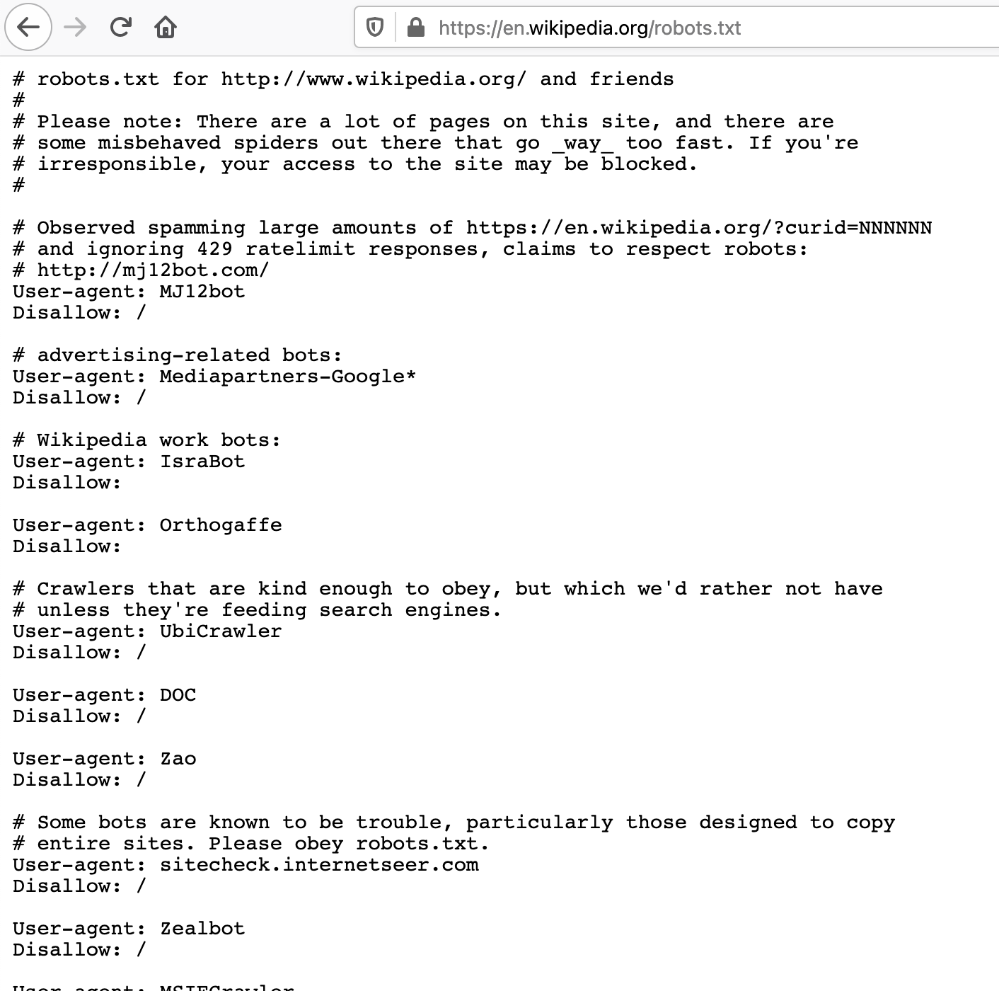
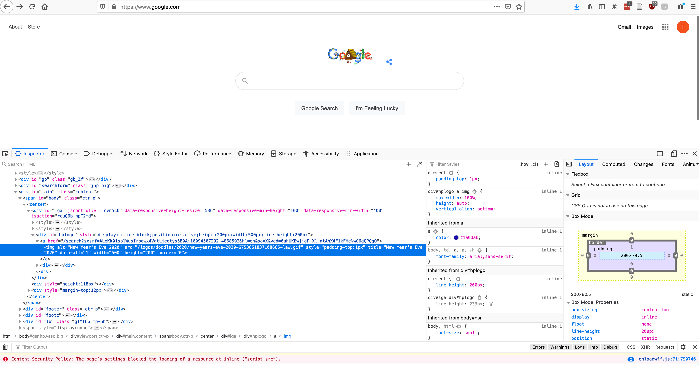
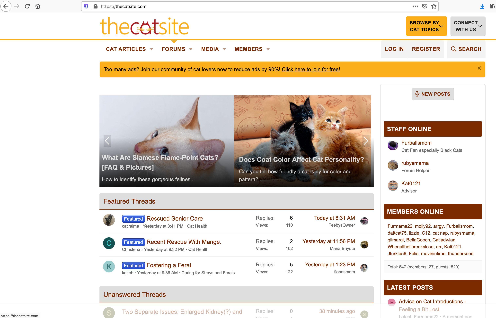
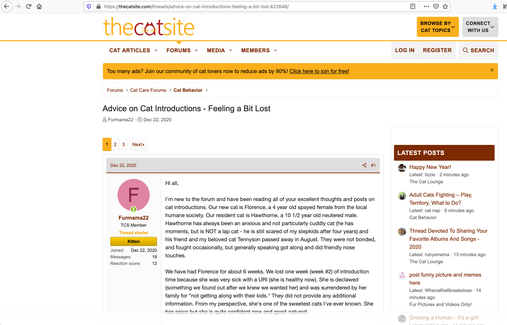

```{r setup, include=FALSE}
knitr::opts_chunk$set(echo = FALSE)
knitr::opts_chunk$set(warning = FALSE)
knitr::opts_chunk$set(message = FALSE)
knitr::opts_chunk$set(dev = 'pdf')
library("knitr")
library("formatR")

opts_chunk$set(tidy.opts=list(width.cutoff=80),tidy=TRUE)
opts_chunk$set(tidy = FALSE)

knitr::knit_hooks$set(mysize = function(before, options, envir) {
  if (before) 
    return(options$size)
})
```

# Plan
1. What is web-scraping?
2. When should I use it?
3. How to scrape a web page
4. Crawling websites
5. ``selenium`` and browser automation

# What is web-scraping?
## Terminology
- Web-scraping is a method to collect data from websites
  - We use the code underlying a webpage to collect data (**scraping**)
  - The process is then repeated for other pages on the same website in an automated fashion (**crawling**)

# What is web-scraping?
## Challenges
- Different websites have different structures, so a script used to scrape one website will likely have to be changed to scrape another
- Websites can be internally inconsistent, making them difficult to scrape
- Some websites are easier to crawl than others
- Some websites limit or prohibit scraping

# When should I use it?
## Commercial use cases
- Search engines
  - Google scrapes websites to create a searchable index of the internet
- Price comparison
  - Kayak scrape airlines to compare flight prices, other websites do the same for hotels and rental cars
- Recruitment
  - Recruitment companies scrape LinkedIn to get data on workers
  
# When should I use it?
## Social scientific use cases
- Web-scraping is a useful tool to collect data from websites without APIs
  - Large social media platforms and other sites have APIs but smaller websites do not
    - Local newspapers, forums, small businesses, educational institutions, etc.
- Often we want to collect data from a single website
  - e.g. All posts written on a forum
- Sometimes we might want to collect data from many websites
  - e.g. All schools in a school district
  
# When should I use it?
## Ethical and legal considerations
```{r, out.width="70%",out.height="70%", fig.align="center"}
include_graphics('../images/fielser_et_al.png')
```

# When should I use it?
## Ethical and legal considerations
- Fiesler, Beard, and Keegan (2020) review the legal cases related to web-scraping and analyze website terms of service
  - "In short, it is an unsettled question as to whether it is explicitly illegal (or even a criminal act) to violate TOS."
  - No academic or journalist has ever been prosecuted for violating a website terms of service to collect data for research
- They analyze terms of service of over 100 social media websites
  - Terms of service are ambiguous, inconsistent, and lack context


# When should I use it?
## Best-practices
- Only scrape publicly available data
  - i.e. You can access the page on the web without logging in
- Do not scrape copyright protected data
- Try not to violate website terms of service
- Do not burden the website
  - Limit the number of calls you make (similar to rate-limiting in APIs)
- Avoid using the data in a way that may interfere with business
  - i.e. Don't copy valuable data from a small business and share it on Github

# How to scrape a web page
## Start by looking up ``robots.txt''
```{r, out.width="70%",out.height="70%", fig.align="center"}

```

# How to scrape a web page
## Decoding ``robots.txt``
- **``User-agent``** = the name of the scraper
  - **``*``** = All scrapers
- **``Allow: /path/``** = OK to scrape
- **``Disallow: /path/``** = Not OK to scrape
  - **``Disallow: /``** = Not OK to scrape any pages
- **``Crawl-Delay: N``** = Wait ``N`` miliseconds between each call to the website 

# How to scrape a web page
## Terminology
- A web-page is loaded using a **URL** (Uniform Resource Locator)
- The underlying code we are interested in is usually **HTML** (Hypertext Markup Language)
- Many websites use **CSS** (Cascading Style Sheets) to structure HTML
  - This will help us to find what we are interested in
    - See https://flukeout.github.io/ for an interactive tutorial on using CSS selectors
    - Chrome Plugin to help find CSS elements: https://selectorgadget.com/

# How to scrape a web page
## Inspecting HTML
- Open up a website and right click on any text or image on the screen
  - You should see an option ``Inspect Element``
  - This will allow you to see the code used to generate the page
  
# How to scrape a web page
```{r, out.width="70%",out.height="70%", fig.align="center"}

```

# How to scrape a web page
## Using ``rvest`` to scrape HTML
```{r, echo=TRUE, mysize=TRUE, size='\\footnotesize', tidy=FALSE}
library(rvest)
library(dplyr)
library(stringr)
```

# How to scrape a web page
```{r, out.width="70%",out.height="70%", fig.align="center"}

```

# How to scrape a web page
```{r, out.width="70%",out.height="70%", fig.align="center"}

```

# How to scrape a web page
## Using ``rvest`` to scrape HTML
```{r, echo=TRUE, mysize=TRUE, size='\\footnotesize', tidy=FALSE}
url <- "https://thecatsite.com/threads/advice-on-cat-introductions-feeling-a-bit-lost.422848/"
thread <- read_html(url)
```


# How to scrape a web page
## Collecting messages
First, we parse the HTML to obtain the text of each message on the page. Here we use the CSS selector ``.message-body``, which selects all elements with class ``message-body``.
```{r, echo=TRUE, tidy=FALSE, mysize=TRUE, size='\\footnotesize', tidy=FALSE}
messages <- thread %>% html_nodes(".message-body") %>% 
  html_text() %>% str_trim() 
print(length(messages))
print(substr(messages[[1]], 1, 50))
```


# How to scrape a web page
## Getting user names
Next we collect the name of each user. User information is found by parsing the ``.message-userDetails`` node. 
```{r, echo=TRUE, mysize=TRUE, size='\\footnotesize', tidy=FALSE}
users <- thread %>% html_nodes(".message-userDetails") %>%
  html_text() %>% str_trim()
print(length(users))
users[[1]]
users <- thread %>% html_nodes(".message-userDetails") %>%
  html_text() %>% str_trim() %>% str_split('\n') %>% pluck(1)
users[[1]]
```
We do some string manipulation to get the user names.

# How to scrape a web page
## Collecting timestamps
Finally, we also want to get the time-stamp of each message. While the forum only displays dates, we can actually get the full timestamp.
```{r, echo=TRUE, mysize=TRUE, size='\\footnotesize', tidy=FALSE}
dates <- thread %>% html_nodes("time.u-dt")
length(dates)
dates <- thread %>% html_nodes(".u-concealed .u-dt")
length(dates)
#dates <- date[-1]
dates <- dates %>% html_attr("datetime")
dates[[1]]
```
Note how ``time.u-dt`` returns too much information, so ``.u-concealed .u-dt`` is selected instead.

# How to scrape a web page
## Putting it all together
```{r, echo=TRUE, mysize=TRUE, size='\\footnotesize', tidy=FALSE}
get.posts <- function(thread) {
  messages <- thread %>% html_nodes(".message-body") %>% 
    html_text() %>% str_trim()  %>%
    str_trunc(15, "right") # only get 1st 15 chars
  users <- thread %>% html_nodes(".message-userDetails") %>%
    html_text() %>% str_trim() %>%
    str_split('\n') %>% pluck(1)
  timestamps <- thread %>% html_nodes(".u-concealed .u-dt") %>%
    html_attr("datetime")
  timestamps <- timestamps[-1]
  df <- data.frame(messages, unlist(users), timestamps)
  colnames(df) <- c("message","user", "timestamp")
  return(df)
}
```

# How to scrape a web page
## Putting it all together
```{r, echo=TRUE, mysize=TRUE, size='\\footnotesize', tidy=FALSE}
results <- get.posts(thread)
results[1:5,]
```

# How to scrape a web page
## Pagination
```{r, echo=TRUE, mysize=TRUE, size='\\footnotesize', tidy=FALSE}
links <- thread %>% html_nodes(".pageNav-jump") %>%
  html_attr("href")
desc <- thread %>% html_nodes(".pageNav-jump") %>%
  html_text()
pagination.info <- data.frame(links, desc) %>% 
  filter(str_detect(desc, "Next")) %>% distinct()
base <- "https://thecatsite.com"
next.page <- paste(base, pagination.info$links, sep = '')
```

# How to scrape a web page
## Pagination
```{r, echo=TRUE, mysize=TRUE, size='\\footnotesize', tidy=FALSE}
results <- get.posts(read_html(next.page))
results[1:5,]
```

# How to scrape a web page
## Pagination function
```{r, echo=TRUE, mysize=TRUE, size='\\footnotesize', tidy=FALSE}
get.next.page <- function(thread){
  links <- thread %>% html_nodes(".pageNav-jump") %>% 
    html_attr("href")
  desc <- thread %>% html_nodes(".pageNav-jump") %>% 
    html_text()
  pagination.info <- data.frame(links, desc) %>% 
    filter(str_detect(desc, "Next")) %>% distinct()
  base <- "https://thecatsite.com"
  next.page <- paste(base, pagination.info$links, sep = '')
  return(next.page)
}
get.next.page(thread)
```
<!--Note the website is pretty simply organized. We just need to find the max number of pages then increment-->

# How to scrape a web page
## Testing the pagination function
```{r, echo=TRUE, mysize=TRUE, size='\\footnotesize', tidy=FALSE}
thread.2 <- read_html(get.next.page(thread))
pagination.2 <- get.next.page(thread.2)
pagination.2
```

# How to scrape a web page
## Testing the pagination function
```{r, echo=TRUE, mysize=TRUE, size='\\footnotesize', tidy=FALSE}
thread.3 <- read_html(get.next.page(thread.2))
pagination.3 <- get.next.page(thread.3)
pagination.3
```

# How to scrape a web page
## ## Improving the function
```{r, echo=TRUE, mysize=TRUE, size='\\footnotesize', tidy=FALSE}
get.next.page <- function(thread){
  links <- thread %>% html_nodes(".pageNav-jump") %>% 
    html_attr("href")
  desc <- thread %>% html_nodes(".pageNav-jump") %>% 
    html_text()
  pagination.info <- data.frame(links, desc) %>% 
    filter(str_detect(desc, "Next")) %>% distinct()
  if (dim(pagination.info)[1] == 1) {
  base <- "https://thecatsite.com"
  next.page <- paste(base, pagination.info$links, sep = '')
  return(next.page)} else {
    return("Final page")
  }
}
```
<!--Note: The results do not show properly when using knitr to render the slides. I will need to fix this. -->

# How to scrape a web page
## Testing the pagination function
```{r, echo=TRUE, mysize=TRUE, size='\\footnotesize', tidy=FALSE}
pagination.3 <- get.next.page(thread.3)
pagination.3

pagination.2 <- get.next.page(thread.2)
pagination.2
```

# How to scrape a web page
## Paginate and scrape
```{r, echo=TRUE, mysize=TRUE, size='\\footnotesize', tidy=FALSE}
paginate.and.scrape <- function(url){
  thread <- read_html(url)
  posts <- get.posts(thread)
  next.page <- get.next.page(thread)
  while (!str_detect(next.page, "Final page"))
  {
    thread <- read_html(next.page)
    posts <- rbind(posts, get.posts(thread))
    next.page <- get.next.page(thread)
    Sys.sleep(1) # wait 1 second
  }
  return(posts)
}
```

# How to scrape a web page
## Paginate and scrape
```{r, echo=TRUE, mysize=TRUE, size='\\footnotesize', tidy=FALSE}
full.thread <- paginate.and.scrape(url)
length(full.thread)
print(full.thread)
```

# How to scrape a web page
## Crawling a website
```{r, echo=TRUE, mysize=TRUE, size='\\footnotesize', tidy=FALSE}
get.threads <- function(url) {
  f <- read_html(url)
  title <- f %>% html_nodes(".structItem-title") %>% 
    html_text() %>% str_trim()
  link <- f %>% html_nodes(".structItem-title a") %>% 
    html_attr("href")  %>% str_trim()
  link <- data.frame(link)
  link <- link %>% filter(str_detect(link, "/threads/"))
  threads <- data.frame(title, link)
  return(threads)
}
```

# How to scrape a web page
## Crawling a website
```{r, echo=TRUE, mysize=TRUE, size='\\footnotesize', tidy=FALSE}
forum.url <- "https://thecatsite.com/forums/cat-behavior.5/"

threads <- get.threads(forum.url)
```

# How to scrape a web page
## Crawling a website
```{r, echo=TRUE, mysize=TRUE, size='\\footnotesize', tidy=FALSE}
print(threads$title)
```

# How to scrape a web page
## Crawling a website
```{r, echo=TRUE, mysize=TRUE, size='\\footnotesize', tidy=FALSE}
print(threads$link)
```

# How to scrape a web page
## Crawling a website
**Exercise**: Write a function to iterate through the 10 pages of threads, each time calling ``get.threads`` to collect all threads and then ``paginate.and.scrape`` for each thread. Store the results in a single dataframe.
```{r, echo=TRUE, mysize=TRUE, size='\\footnotesize', tidy=FALSE}
# Complete function here
```

# How to scrape a web page
## Javascript and browser automation
- Many websites use Javascript
  - This can cause problems for web-scrapers as it cannot directly be parsed to HTML
- Rather than loading HTML directly into R, we can use R to automate a browser
  - Selenium WebDriver and the package ``RSelenium`` (https://github.com/ropensci/RSelenium) is the most popular approach

# How to scrape a web page
## What can RSelenium do?
- Extract HTML from Javascript-based websites
- Interact with web-based content
  - e.g., Click "OK" to a warning, complete a search box
- **However**, ``RSelenium`` does not currently work directly in RMarkdown and requires a more complicated set up using a *Docker container* so I will not demo it today

# How to scrape a web page
## Data storage and logging
- If collecting a lot of data, use a server to run a scrape and store scraped data
- Write output to a database
  - This helps to organize the data and makes it easier to query and manage
- Keep a log file with a record of which pages you have scraped
  - You could also use Slack to send progress updates

# References
- Fiesler, Casey, Nate Beard, and Brian C Keegan. 2020. “No Robots, Spiders, or Scrapers: Legal and Ethical Regulation of Data Collection Methods in Social Media Terms of Service.” In Proceedings of the Fourteenth International AAAI Conference on Web and Social Media, 187–96. AAAI.

# Questions


  

<!-- Next we want to paginate through the whole forum-->