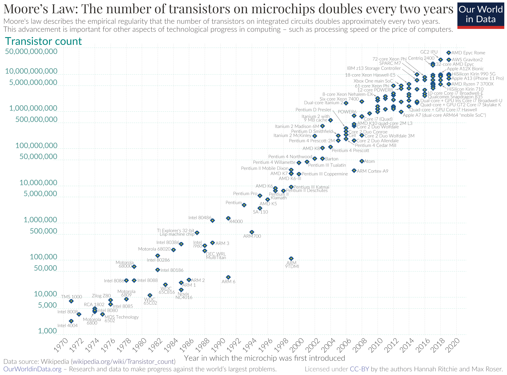
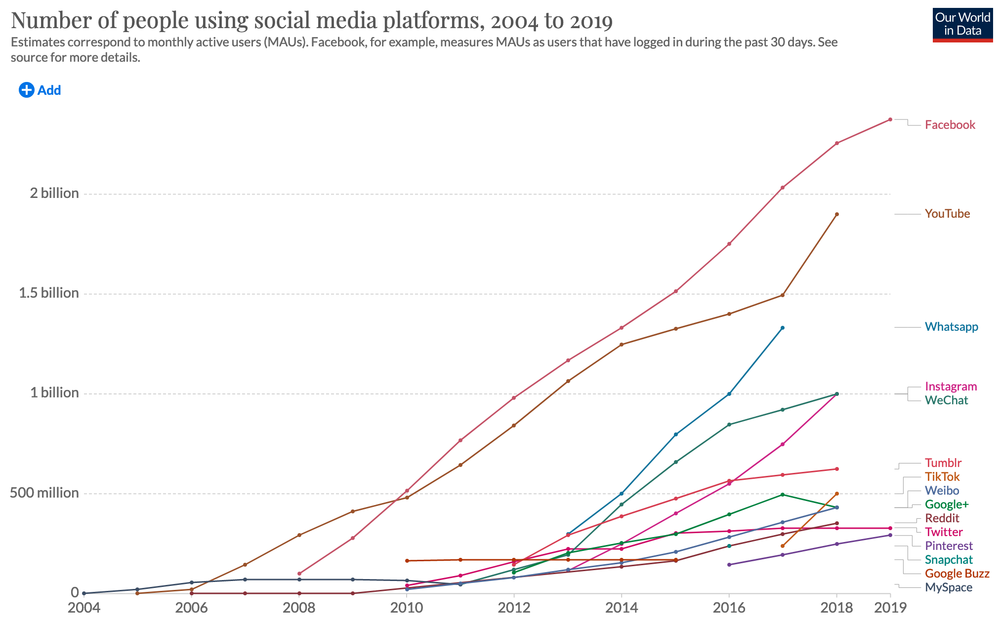
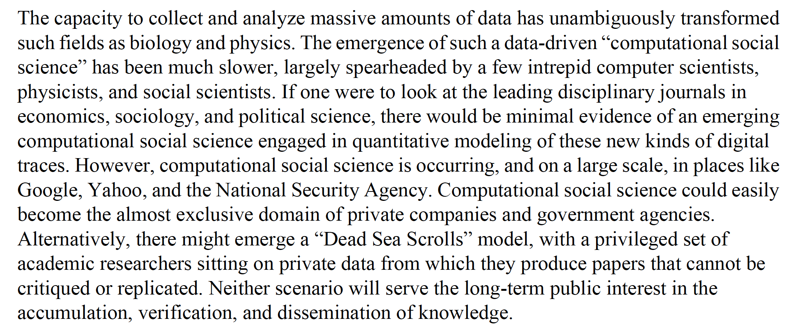
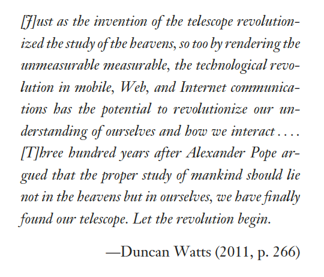
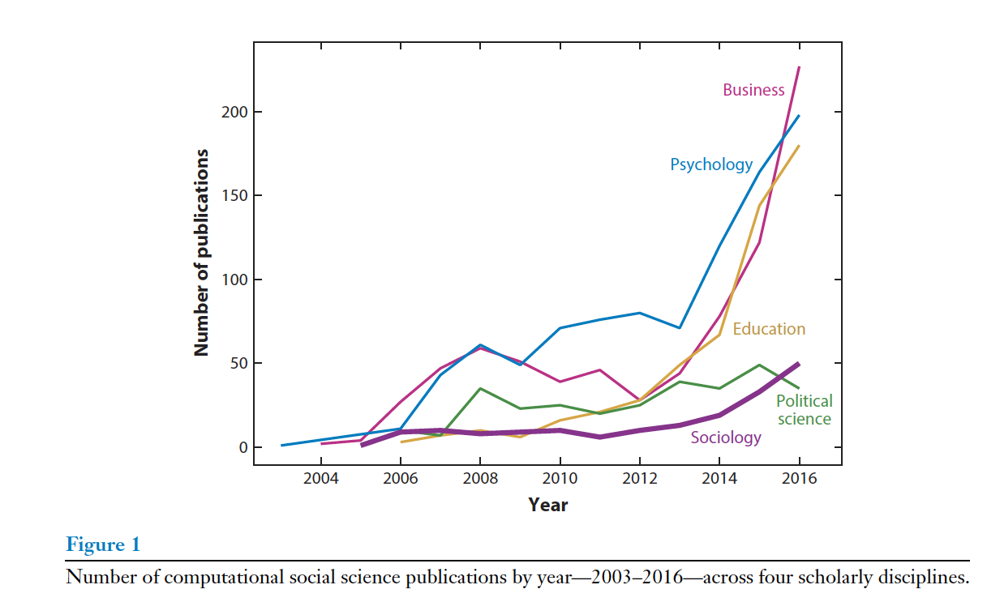

```{r setup, include=FALSE}
knitr::opts_chunk$set(echo = FALSE)
knitr::opts_chunk$set(dev = 'pdf')
library("knitr")
```

# Plan

- Introductions
- A brief introduction to computational sociology
- Course outline
- R, Github, Slack
- Other resources

# Introductions

-   University, program and year
-   What are your main research interests?
-   Any aspects of this course you are particularly excited about?
- Did you pick up any new hobbies during the pandemic?

# Introduction to Computational Sociology
```{r, out.width="70%",out.height="60%", fig.align="center"}

```
\centering \tiny    https://en.wikipedia.org/wiki/Moore%27s_law#/media/File:Moore's_Law_Transistor_Count_1970-2020.png

# Introduction to Computational Sociology
```{r, out.width="70%",out.height="60%", fig.align="center"}

```
\centering \tiny    https://ourworldindata.org/grapher/users-by-social-media-platform

# Introduction to Computational Sociology
## Computational Social Science
```{r, out.width="70%",out.height="60%", fig.align="center"}

```

\centering \tiny Lazer et al. 2009 make the case for computational social science (CSS)

# Introduction to Computational Sociology
## Digital traces and big data
```{r, out.width="70%",out.height="60%", fig.align="center"}

```
\centering \tiny Quoted in Golder and Macy 2014.

# Introduction to Computational Sociology
## Readymade data (Salganik 2017)
```{r, out.width="70%",out.height="60%", fig.align="center"}
include_graphics('../images/bitbybit1-2_readymade-custommade.png')
```
\centering \tiny https://www.bitbybitbook.com/figures/chapter1/bitbybit1-2_readymade-custommade.png

# Introduction to Computational Sociology
## Multi-modal data and cultural sociology
- Bail (2014) writes that "[S]ocial scientists—and cultural sociologists in particular—have largely ignored the promise of so-called “big data.” Instead, cultural sociologists have left this wellspring of information about the arguments, worldviews, or values of hundreds of millions of people from Internet sites and other digitized texts to computer scientists who possess the technological expertise to extract and manage such data but lack the theoretical direction to interpret their meaning."

# Introduction to Computational Sociology
## The emergence of a field
```{r, out.width="70%",out.height="60%", fig.align="center"}

```
\centering \tiny Edelmann et al. 2020

# Introduction to Computational Sociology
## The emergence of a field
```{r, out.width="70%",out.height="60%", fig.align="center"}
include_graphics('../images/citation_network.png')
```
\centering \tiny Edelmann et al. 2020

# Introduction to Computational Sociology
## Some attempts at a definition
1. Use of non-numeric and multimodal data (image, text, video)
2. New digital modes of data collection (web-scraping, APIs, online experiments)
3. Application of computational methods developed by computer scientists (topic modeling, word embeddings, deep learning)

# Course outline
## Goals
- By the end of this course you should be able to
    - Understand the field of computational sociology and computational social science more broadly
    - Code using R at an intermediate level
    - Understand and implement various computational methodologies for data collection and analysis
    - Apply computational methods in your own research
    - Think critically about the use of new data sources and methods

    
# Course outline
## Structure
1. Programming in R (Weeks 1-3)
2. Data collection (4-6)
3. Natural language processing (7-9, 11)
4. Machine learning (10-13)
5. Agent-based modeling (14)

# Course outline
## Topics NOT covered
- Social network analysis
- Bayesian statistics
- Remote-sensing and spatial methods

# Course outline
## Assessment
- Homework assignments (50%)
    - Programming fundamentals
    - Data collection and storage
    - Natural language processing
    - Machine learning
    - Agent-based modeling
    
# Course outline
## Assessment
- Final paper (50%)
    - Phase 0: Develop project ideas
    - Phase 1: Submit paper proposal (W6)
    - Phase 2: Data collection due (W10)
    - Phase 3: Paper due (Exam period, date TBA)

# Course outline
## Policies
- Read the syllabus!
    - Diversity and inclusion
    - Academic integrity
    - Accommodations
    - COVID-19
- A note on incompletes:
    - **Please avoid taking an incomplete for this class. It is a bad outcome for everyone involved.**

# Why R?

```{r, out.width="70%",out.height="70%", fig.align="center"}
include_graphics('../images/package_wars.png')
```

\centering \tiny <https://kieranhealy.org/blog/archives/2019/02/07/statswars/>

# Why R?

-   Free and open-source
-   A statistical programming language
    -  Many cutting-edge approaches now implemented in R before Stata
    - Rutgers Sociology will transition to R for the grad stats sequence
-   Alongside Python, it is one of the main programming languages used by data scientists
-   A very active developer community
-   RStudio

# RStudio
## Overview
-   RStudio is an Integrated Development Environment for programming in R
    -   Run code in the console or in scripts
    -   Easy to view data, objects in memory, plots
    -   Easy to create output such as papers or slides
    -   Terminal interface
    -   Integrations including Github and Python

# RMarkdown
## Overview
-   RMarkdown is an interactive coding environment
    -   RMarkdown documents can combine text, LaTeX code, R code, and any output.
    - Write in Markdown or Visual Editor
    -   These slides are rendered using RMarkdown
    -   You will be using RMarkdown for your homework assignments and hopefully your papers
    
# Github
## Overview
- Github is a version-control system
    - This allows you to easily control and manage changes to your code (similar to Track Changes in Word)
    - It can facilitate collaboration
    - Version-control helps to ensure reproducibility
    - It makes it easy to share code
- Github is *not* designed as a place to store large datasets (100Mb file size limit)

# Github
## Usage
- A Github *repository* (or *repo* for short) contains all files and associated history
    - A repository can be public or private
    - Files should be organized into folders
    - Github can render Markdown files (suffix ``.md`` in Markdown), useful for documentation
- You can interact with Github either through the website, the command line, the desktop app, or via RStudio
- Github repositories exist online and you can *clone* them to your local computer


# Github
## Basic commands

- Let's say you want to make changes to a repository, in this case adding a single file called ``myfile.R``:
1. Make changes to ``myfile.R`` and save the file.
2. ``git status`` will show information about the status of your repo.
3. ``git add myfile.R`` will stage the file to be added to the online repo.
    - Avoid using ``git add *`` 
4. ``git commit -m "Adding a new file"`` commits the file to the repo, along with an informative message.

# Github
## Basic commands
5. ``git push origin main`` then tells Github to push the local changes to the main branch of the online repository
    - Conversely, ``git pull origin main`` will pull the latest updates from your main branch to your local machine
6. Now visit the web page for your repository and you should see the changes.


# Github
## Viewing commit histories
- You can view the history of a given file by looking at the commits
    - e.g. Let's look at the syllabus for this course https://github.com/t-davidson/computational-sociology/commits/main/syllabus/syllabus.Rmd

# Github
## Branches
- A *branch* consists of a particular version of the repo
    - All repos start with a single branch called *main* (formerly *master*)
    - You can create separate branches for particular tasks
        - This is particularly useful for collaboration
    - You can then *merge* the branch back into main
        - But be careful of *merge conflicts*
- A *pull request* is a mechanism for merging content into a repository
    - This can enable the code to be reviewed before it is integrated
- The *issue* function can be used to note any issues with the code and to bring them to the repo owner's attention (e.g. https://github.com/tidyverse/ggplot2)
        
# Github
## Forks
- A *fork* is a copy of another repository (usually from another user)
    - This allows you to easily copy the repository and modify it without changing the original content

# Slack
## Why Slack?
- Quick and easy communicate
    - Reduces need to email
    - Shared problem solving
- Code formatting
    - Use "```" to start a code snippet (Slack should auto-complete) 
- Emojis!

# Other resources
- StackOverflow
    - An online community for coding questions
        - Search for error messages or snippets. In most cases you should be able to find answers to your issues. 
        - Sometimes it can take a while to figure out the appropriate query to use to find an answer.
        - If you can't find an answer, you can make your own question - but the formatting requirements are quite strict and users can be unforgiving.
    - A useful thread for posting an R question and example: https://stackoverflow.com/questions/5963269/how-to-make-a-great-r-reproducible-example

# Other resources
- R4DS Community
    - An online community associated with the R4DS book, including a Slack channel https://www.rfordatasci.com/
- R Reddit
    - https://www.reddit.com/r/rstats/
- R Twitter
    - Follow #rstats
- An Introduction to R
    - Free online R textbook https://intro2r.com/index.html
    
# Questions?
    

    
    


