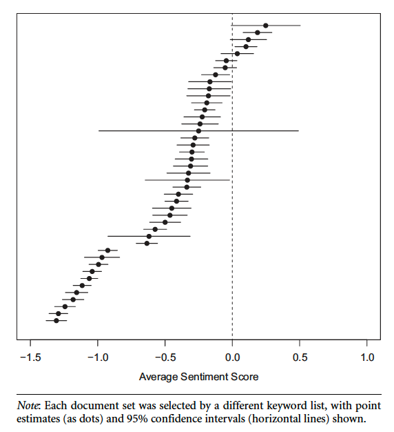
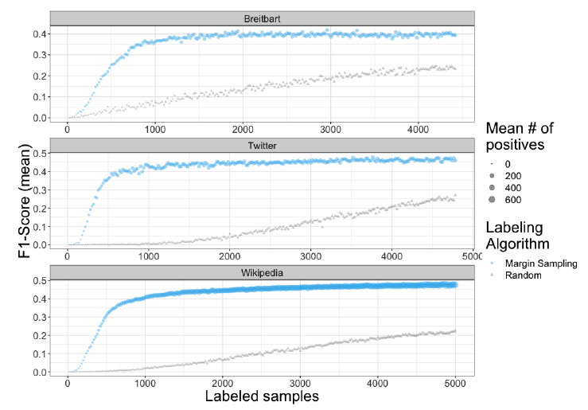

```{r setup, include=FALSE}
knitr::opts_chunk$set(
	echo = FALSE,
	message = FALSE,
	warning = FALSE,
	dev = "pdf",
	tidy = FALSE,
	tidy.opts = list(width.cutoff = 80)
)
knitr::opts_chunk$set(warning = FALSE)
knitr::opts_chunk$set(message = FALSE)
knitr::opts_chunk$set(dev = 'pdf')
library("knitr")
library("formatR")

opts_chunk$set(tidy.opts=list(width.cutoff=80),tidy=TRUE)
opts_chunk$set(tidy = FALSE)

knitr::knit_hooks$set(mysize = function(before, options, envir) {
  if (before) 
    return(options$size)
})
```

# Plan
1. Course updates
2. Introduction to supervised text classification
3. Supervised text classification in R
4. Data sampling and annotation


# Course updates
## Homework
- Homework 2 (APIs and web-scraping) comments have been released
  - Please contact me if I have not given feedback HW1 or HW2
- Homework 3 (NLP) was due today at 4pm
- Homework 4 (Machine learning) will be released at the end of next week
  - Tentative due date is 4/22

# Course updates
## Project timeline
- Initial data collection
  - Deadline extended until 4/13 (next Monday) at 4pm
  - Submission instructions will be sent via Slack
- Preliminary analyses
  - Due 4/30 at 5pm

# Introduction to supervised text classification
## What is it?
- Supervised text classification involves using machine-learning to automatically label documents
  - Phase 1: Select a corpus of documents
  - Phase 2: Annotate a small sample of documents with "ground truth" labels
  - Phase 3: Train a model to predict the labels of the annotated documents
  - Phase 4: Use the trained model to predict the labels for the entire corpus
- We generally use this in cases where it is impractical to categorize all documents by hands
  
# Introduction to supervised text classification
## Supervised versus unsupervised approaches
- Both supervised text classification and topic modeling can be used as a replacement for conventional content analysis
  - Topic modeling is an *inductive* approach, useful for summarizing an entire corpus and deriving categories
  - Supervised machine learning is a *deductive* approach, designed to classify documents into discrete (or probabilistic) classes based on pre-defined categoriess
    - Unlike topic modeling, the categories are known in advance to the analyst
    
# Introduction to supervised text classification
## Sociological applications
```{r, out.width="45%",out.height="40%", fig.align="center"}
include_graphics('../images/hanna_schema.png')
```
\footnotesize Hanna, Alex. 2013.

# Introduction to supervised text classification
## Sociological applications
```{r, out.width="45%",out.height="40%", fig.align="center"}
include_graphics('../images/hanna_results.png')
```

# Introduction to supervised text classification
## Sociological applications
- Laura Nelson (2017) proposes an approach called *computational grounded theory*
  - Start with an unsupervised approach to inductively summarize a corpus
  - Identify patterns and return to close reading of a corpus
  - Use supervised learning (and appropriate statistical texts) to confirm identified patterns
    - *Note: Assigned article does not actually used supervised machine learning but instead compares documents according to dictionary measures*

# Supervised text classification in R
## Case study
- Data
  - A subsample of the IMBD reviews dataset*
    - 5000 IMBD reviews
    - half positive ($\geq 7/10$), half negative ($\leq 4/10$), neutral excluded.
- Classification task
  - Predict which reviews are positive and which are negative (binary)
  - The assumption that the classifier learns the sentiment of the reviews
- All code is based on examples from \href{https://smltar.com/mlclassification.html}{Emil Hvitfeldt and Julia Silge, *Supervised Machine Learning for Text Analysis in R*, *forthcoming*, Chapter 7.}
  
\tiny Maas, Andrew L, Raymond E Daly, Peter T Pham, Dan Huang, Andrew Y Ng, and Christopher Potts. 2011. “Learning Word Vectors for Sentiment Analysis.” In *Proceedings of the 49th Annual Meeting of the Association for Computational Linguistics*, 142–50.


# Supervised text classification in R
## Loading data
In this case, we take a random sample of the training data to make the process more tractable. I have commented out the sampling code and provided the sampled dataset.
```{r, echo=TRUE, tidy=FALSE, mysize=TRUE, size='\\footnotesize'}
library(tidyverse)
#library(textdata)
#d <- dataset_imdb(split="train")
#d.sample <- d %>% sample_n(5000)
path <- '../data/imbd_reviews_sample.tsv'
#write_tsv(d.sample, file=path)
d <- read_tsv(path)
d %>% filter(sentiment == "pos") %>% count()
```

# Supervised text classification in R
## Train-test split
The first step is to divide our dataset into training and testing data.
```{r, echo=TRUE, tidy=FALSE, mysize=TRUE, size='\\footnotesize'}
library(tidymodels)
set.seed(8954)

review_split <- initial_split(d, strata="sentiment", prop = 0.8)
train <- training(review_split)
test <- testing(review_split)
```

# Supervised text classification in R
## Creating a `recipe`
We begin by creating a `recipe` by specifying the equatin and the dataset.
```{r, echo=TRUE, tidy=FALSE, mysize=TRUE, size='\\footnotesize'}
review_recipe <- recipe(sentiment ~ text, data  = train)
```

# Supervised text classification in R
## Adding preprocessing steps
Next, we can use the `textrecipes` library to add preprocessing steps to our recipe. Note that we could also do our preferred preprocessing first using `tidytext` or another package then pass the resulting data directly to our recipe.
```{r, echo=TRUE, tidy=FALSE, mysize=TRUE, size='\\footnotesize'}
library(textrecipes)
review_recipe <- review_recipe %>% step_tokenize(text) %>%
  step_tokenfilter(text, max_tokens = 1000) %>%
  step_tfidf(text)
```

# Supervised text classification in R
## Creating a `workflow`
Once we have a recipe, we're going to be using something called a `workflow` to chain together a sequence of modeling operations.
```{r, echo=TRUE, tidy=FALSE, mysize=TRUE, size='\\footnotesize'}
review_wf <- workflow() %>% add_recipe(review_recipe)
```

# Supervised text classification in R
## Adding a model
We can then add more operations to our workflow to train a model. In this case we will use a logistic regression with a LASSO penalty.
```{r, echo=TRUE, tidy=FALSE, mysize=TRUE, size='\\footnotesize'}
lasso <- logistic_reg(penalty = 0.01, mixture = 1) %>%
  set_mode("classification") %>%
  set_engine("glmnet")

review_wf <- review_wf %>% add_model(lasso)
```

# Supervised text classification in R
## Reviewing the `workflow`
We can print the workflow to review the sequence of operations to be performed.
```{r, echo=TRUE, tidy=FALSE, mysize=TRUE, size='\\footnotesize'}
print(review_wf)
```
# Supervised text classification in R
## Cross-validation
We can then incorporate cross-validation into our model to get a better estimate of out-of-sample performance. In this case we use k-fold/v-fold cross-validation, where k/v is set to 10.
```{r, echo=TRUE, tidy=FALSE, mysize=TRUE, size='\\footnotesize'}
review_folds <- vfold_cv(train, v = 10)
```

# Supervised text classification in R
## Fitting a cross-validated model
We can then use the `fit_resamples` function from the `tune` package to fit our workflow to each of the 10 subsets of data. The `control` parameter specifies information we want to store for further analysis.
```{r, echo=TRUE, tidy=FALSE, mysize=TRUE, size='\\footnotesize'}
fitted <- fit_resamples(
  review_wf,
  review_folds,
  control = control_resamples(save_pred = TRUE),
  metrics = metric_set(precision, recall, f_meas, roc_auc)
)
```

# Supervised text classification in R
## Evaluating overall performance
The `collect_` functions from the `tune` package then allow us to evaluate each model. 
```{r, echo=TRUE, tidy=FALSE, mysize=TRUE, size='\\footnotesize'}
lasso_pred_probs <- collect_predictions(fitted, type = "prob")

collect_metrics(fitted)
```

# Supervised text classification in R
## Evaluating performance by fold
By grouping on `id` we can view the estimate for each cross-validation sub-group.
```{r, echo=TRUE, tidy=FALSE, mysize=TRUE, size='\\footnotesize'}
lasso_pred_probs %>% group_by(id) %>%
  f_meas(sentiment, .pred_class) %>%
  select(id, .estimate)
```

# Supervised text classification in R
## Computing an ROC curve
We can view the performance of each classifier using the ROC curve. In general they all appear to perform quite well.
```{r, echo=FALSE, tidy=FALSE, mysize=TRUE, size='\\footnotesize'}
library(viridis)
lasso_pred_probs %>%
  group_by(id) %>%
  roc_curve(truth = sentiment, .pred_neg) %>%
  autoplot() +
  labs(
    color = NULL,
    title = "ROC curve for IMBD review sentiment predictions",
    y = "True positive rate",
    x = "False positive rate"
  ) + scale_color_viridis_d(option="magma")
```

# Supervised text classification in R
## Selecting tuning parameters
Now we have code we can use to fit a model using cross-validation. The next step is to find the optimal set of parameters. In this case there are two things we might want to vary: the size of the feature matrix and the regularization strength. To do this we need to modify the recipe and model object to specify that we want to `tune` these parameters.
```{r, echo=TRUE, tidy=FALSE, mysize=TRUE, size='\\footnotesize'}

review_recipe_2 <- recipe(sentiment ~ text, data  = train) %>% step_tokenize(text) %>%
  step_tokenfilter(text, max_tokens = tune()) %>%
  step_tfidf(text)

review_wf <- review_wf %>% update_recipe(review_recipe_2)

lasso_2 <- logistic_reg(penalty = tune(), mixture = 1) %>%
  set_mode("classification") %>%
  set_engine("glmnet")

review_wf <- review_wf %>% update_model(lasso_2)
```

# Supervised text classification in R
## Specifying a parameter grid
Next, we specify a parameter grid using `grid_regular` this defines the parameter space and how it should be broken down. We specify a range of values for each parameter and how many cut-points in this range we are interested in.
```{r, echo=TRUE, tidy=FALSE, mysize=TRUE, size='\\footnotesize'}
param_grid <- grid_regular(
  penalty(range = c(-4, 0)),
  max_tokens(range = c(1000, 5000)),
  levels = c(penalty = 5, max_tokens = 5)
)

print(param_grid)
```

# Supervised text classification in R
## Fitting the model to the parameter grid
Finally, we use `tune_grid` to fit the workflow to these different tuning parameters, using the same cross-validation splits as above. This will take a while since we have 5x5x10 model fits accounting for the combinations of tuning parameters and number of folds. This is similar in logic to the `fit_resamples` but it returns the model with the best-fitting parameters.
```{r, echo=TRUE, tidy=FALSE, mysize=TRUE, size='\\footnotesize'}
tune_params <- tune_grid(
  review_wf,
  review_folds,
  grid = param_grid,
  metrics = metric_set(precision, recall, f_meas, roc_auc),
  control = control_resamples(save_pred = TRUE)
)
```

# Supervised text classification in R
## Evaluating performance by parameter
Let's take a look at the results. We have 100 observations (5 x 5 x 4 metrics).
```{r, echo=TRUE, tidy=FALSE, mysize=TRUE, size='\\footnotesize'}
tuned_metrics <- collect_metrics(tune_params)

tuned_metrics %>% group_by(penalty, .metric) %>%
  summarize(mean_score= mean(mean)) %>%
  filter(.metric == "f_meas")

tuned_metrics %>% group_by(max_tokens, .metric) %>%
  summarize(mean_score= mean(mean)) %>%
  filter(.metric == "f_meas")
```

# Supervised text classification in R
## Plotting the results
Even better, we can directly plot the relationship between the variables. In this case it seems like the regularization makes a much bigger difference than the size of the feature matrix.
```{r, echo=FALSE, tidy=FALSE, mysize=TRUE, size='\\footnotesize'}
autoplot(tune_params) + 
  labs(title = "Lasso model performance across regularization penalties and feature spaces",
       color = "Number of tokens") + scale_color_viridis_d()
```

# Supervised text classification in R
## Selecting the best model and updating the workflow
Let's take the model with the best F1 score and fit it to our data.
```{r, echo=TRUE, tidy=FALSE, mysize=TRUE, size='\\footnotesize'}
best_f1 <- tune_params %>% select_best(metric = "f_meas")
print(best_f1)

final_wf <- finalize_workflow(review_wf, best_f1)

print(final_wf)
```

# Supervised text classification in R
## Fitting the model to the training data
Now we can fit the model to our entire training dataset *and* assess its performance on the test set, which has not been used so far. Note how we are not using cross-validation now, we are re-training the best model using all of the training data.
```{r, echo=TRUE, tidy=FALSE, mysize=TRUE, size='\\footnotesize'}
final_fitted <- last_fit(final_wf, review_split)
```

# Supervised text classification in R
## Evaluating out-of-sample performance
```{r, echo=TRUE, tidy=FALSE, mysize=TRUE, size='\\footnotesize'}
collect_metrics(final_fitted)
```

# Supervised text classification in R
## Evaluating out-of-sample performance
```{r, echo=TRUE, tidy=FALSE, mysize=TRUE, size='\\footnotesize'}
final.precision <- collect_predictions(final_fitted) %>% precision(truth=sentiment, estimate = .pred_class)
final.recall <- collect_predictions(final_fitted) %>% recall(truth=sentiment, estimate = .pred_class)
final.f1 <- collect_predictions(final_fitted) %>% f_meas(truth=sentiment, estimate = .pred_class)
print(bind_rows(final.precision, final.recall, final.f1))
```

# Supervised text classification in R
## Evaluating out-of-sample performance
```{r, echo=FALSE, tidy=FALSE, mysize=TRUE, size='\\footnotesize'}
collect_predictions(final_fitted) %>%
  conf_mat(truth = sentiment, estimate = .pred_class) %>%
  autoplot(type = "heatmap") #+ scale_fill_viridis_c()
```

# Supervised text classification in R
## Evaluating out-of-sample performance
We can similarly view the ROC curve for the held-out data. This shows that our model performs well out-of-sample.
```{r, echo=TRUE, tidy=FALSE, mysize=TRUE, size='\\footnotesize'}
collect_predictions(final_fitted, type="prob")  %>%
  roc_curve(truth = sentiment, estimate = .pred_neg) %>%
  autoplot() +
  labs(
  color = NULL,
  title = "ROC curve for IMBD review sentiment predictions",
  y = "True positive rate",
  x = "False positive rate"
  ) + scale_color_viridis_d(option="magma")
```

# Supervised text classification in R
## Error analysis
The final step we can take is to conduct some analysis of the predictions. In particular, its often most insightful to look at the errors.
```{r, echo=TRUE, tidy=FALSE, mysize=TRUE, size='\\footnotesize'}
reviews_bind <- collect_predictions(final_fitted) %>%
  bind_cols(test %>% select(-sentiment))

pos_errors <- reviews_bind %>%
  filter(sentiment == "pos", .pred_pos < 0.3) %>%
  select(text) %>%
  slice_sample(n = 5) %>% print()

neg_errors <- reviews_bind %>%
  filter(sentiment == "neg", .pred_neg < 0.3) %>%
  select(text) %>%
  slice_sample(n = 5) %>% print()
```

# Supervised text classification in R
## Calculating feature importance
We can also find out which features are most important to gain some insight into how the model is working. The `vip` package allows us to calculate feature importance scores and to see which are most strongly associated with each class.
```{r, echo=TRUE, tidy=FALSE, mysize=TRUE, size='\\footnotesize'}
library(vip)

reviews_imp <- pull_workflow_fit(final_fitted$.workflow[[1]]) %>%
  vi(lambda = best_f1$penalty)

imp <- reviews_imp %>%
  mutate(
    Sign = case_when(Sign == "POS" ~ "More positive",
                     Sign == "NEG" ~ "More negative"),
    Importance = abs(Importance),
    Variable = str_remove_all(Variable, "tfidf_text_"),
  ) %>%
  group_by(Sign) %>%
  top_n(15, Importance) %>%
  ungroup
```

# Supervised text classification in R
## Visualizing feature importance
```{r, echo=FALSE, tidy=FALSE, mysize=TRUE, size='\\footnotesize'}
imp %>%
  ggplot(aes(x = Importance,
             y = fct_reorder(Variable, Importance),
             fill = Sign)) +
  geom_col(show.legend = FALSE) +
  scale_x_continuous(expand = c(0, 0)) +
  facet_wrap(~Sign, scales = "free") +
  labs(
    y = NULL,
    title = "Variable importance for predicting the valence of an IMBD review"
  ) + scale_fill_viridis_d(option="plasma")
```
# Supervised text classification in R
## Next steps
- We only considered a single model. In a real-world application it would be worth repeating these steps for a variety of different classifiers, including parameter tuning.
  - SVM and neural networks both work well for text classification problems
- We also only tested a single type of feature (TF-IDF weighted unigrams)
  - Consider other representations
    - N-grams
    - LSA
    - Document embeddings (Word2vec, GLoVE, BERT)
  - Evaluate the impact of different pre-processing techniques
  - Additional non-textual features if available
  
# Data sampling and annotation
## Overview
- The previous example used a dataset with "ground truth" labels, derived from the numeric scores given to movies by IMDB users.
- In practice, we often have to produce this annotated dataset before we can train a model. This involves several decisions including:
  - What data do we want to classify and into what categories?
  - Which specific examples should we annotated?
  - How many cases do we need?
  - How should the annotation be conducted?
  
# Data sampling and annotation
## What data and categories?
- The choice of data and categories is usually driven by a combination of substantive and theoretical concerns.
- Consider the following example based on my research. The research focuses on political discourse about Brexit.
  - Sampling frame: Comments written on set of political pages on Facebook.
  - Categories: Is the comment relevant to the topic? If so, what is the stance of the comment?
    - Relevance is defined as binary (Relevant / Not relevant), although coders were also given a "Not sure" option.
    - Stance is defined as ternary (Pro-Leave / Pro-Remain / Neither), since we know from the public opinion literature that people do not always express views that have a clear stance. I also gave a "Not sure" option.

# Data sampling and annotation
## What data and categories?
- Important to consider *generalizability*
  - How well will the model perform on other datasets?
- Factors that might impact generalizability:
  - Context (e.g. publication, platform)
  - Time
  - Language / dialect
  - Medium (e.g. text, image, video)
  
# Data sampling and annotation
## The unit of analysis
- Select an appropriate unit of analysis
  - A book, a chapter, a paragraph, a sentence?
- This is usually guided by theory
  - e.g. If we want to classify the political leaning of a tweet then the unit is the tweet but if we want to classify users then we might consider aggregating their tweets.
- Barberá et al. 2020 find limited benefits to classifying sentences rather than chunks of newspaper articles, but this may not generalize to other cases
  
# Data sampling and annotation
## Keywords and categories
- In my case I used the context as a sampling frame, but we often have to select data based on the presence of keywords
  - e.g. Tweets containing particular hashtags
  - e.g. Newspaper articles containing keywords
- Sometimes we might find existing categorizations we can use to sample
  - e.g. the Twitter Academic API provides category labels for Tweets (e.g. politics, sports) based on Twitter's internal system
  - But Barberá et al. 2020 show how keywords are generally preferable to using proprietary 
  
# Data sampling and annotation
## Keywords and categories
```{r, out.width="45%",out.height="40%", fig.align="center"}
include_graphics('../images/klr_1.png')
```
\footnotesize King, Gary, Patrick Lam, and Margaret E. Roberts. 2017. “Computer-Assisted Keyword and Document Set Discovery from Unstructured Text.” American Journal of Political Science 61 (4): 971–88.

# Data sampling and annotation
## Keywords and categories
```{r, out.width="45%",out.height="40%", fig.align="center"}

```

# Data sampling and annotation
## Keywords and categories
- Recommendations
  - Start with a small set of keywords
  - Use an automated discovery approach* and/or domain expertise to expand the keyword set
  - Increase the size of the keyword set as long as returned documents increase but relevant proportion does not decline Barberá et al. 2020: 8).

\footnotesize \href{https://github.com/t-davidson/automated-keyword-discovery-demo}{Python code} to implement King, Lam, and Roberts' approach.

# Data sampling and annotation
## Which specific examples should be annotated?
- Once we have our sample we need a way to select examples for annotation
  - The goal is to annotate a representative sample of documents such that we can train a classifier that generalizes well beyond the training data
- Generally we use some form of random sampling or stratified random sampling
  - For example, I began by sampling comments from Facebook pages, where the fraction from each page was proportional to the overall fraction of comments written on the page
  
# Data sampling and annotation
## Which specific examples should be annotated?
- However, random sampling can be inefficient
  - Duplicate or highly similar documents are redundant
  - Many documents do not provide any new information
- We can do better by using an approach called *active learning*

# Data sampling and annotation
## Active learning in practice
```{r, out.width="45%",out.height="40%", fig.align="center"}

```
\small Miller, Blake, Fridolin Linder, and Walter R. Mebane, Jr. 2019. “Active Learning Approaches for Labeling Text: Review and Assessment of the Performance of Active Learning Approaches.” *Political Analysis*.

# Data sampling and annotation
## How many cases do we need?
- It depends a lot on the problem
  - How balanced are the class distributions? 
    - e.g. Evenly split like IMBD or are some classes rare?
  - How difficult is the classification task?
- Barberá et al. 2020 show evidence of diminishing returns in a newspaper content classification task after ~1000 examples
- Mebane et al. 2019 demonstrate how active learning can reduce the necessary sample size compared to random sampling

# Data sampling and annotation
## How should annotation be conducted?
- Who should do the coding?
  - Expert coders vs. undergrads vs. crowdworkers
- How many coders per data point?
  - Barberá et al. 2020 find that it is preferable to have more examples coded by fewer people than fewer examples coded by more people
    - Although there should be some overlap for calculating intercoder-reliability
    
# Data sampling and annotation
## Final thoughts
- Data sampling and annotation is an overlooked area of research but has a huge impact on downstream applications
  - *Garbage in, garbage out*
- There are many different decisions involved that require careful consideration
  - Unlike the machine learning phase, we typically don't have the budget to do a grid-search over the parameter space!
  
# Summary
- Supervised text classification combines NLP and ML to classify documents into classes
- In contrast with topic modeling, it is a deductive approach
- Training data must be carefully sampled and annotated
- Model features and parameters are selected to maximize predictive accuracy
- Error analysis and feature importance provide insight into model performance and limitations
- Once a model performs well and has been validated out-of-sample, we use it to predict the remainder of the corpus


