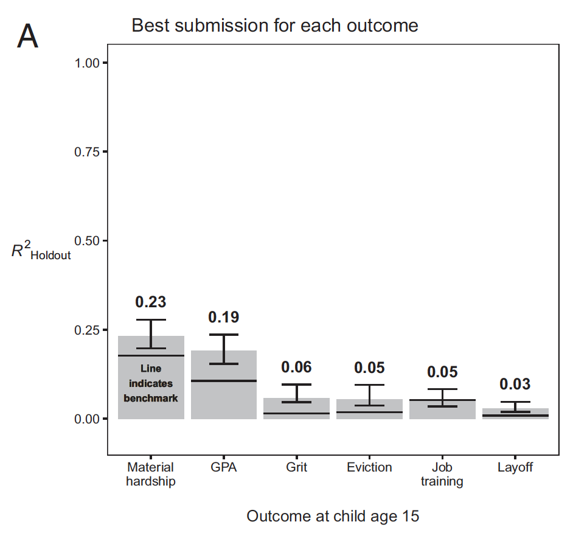
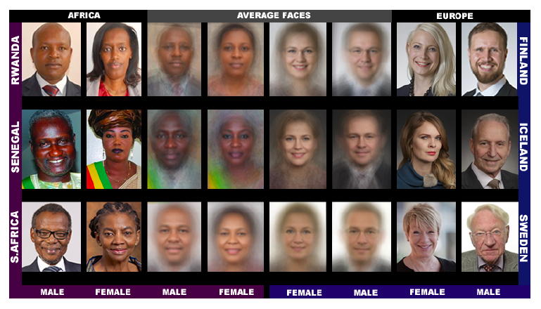
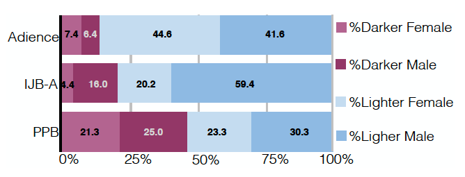
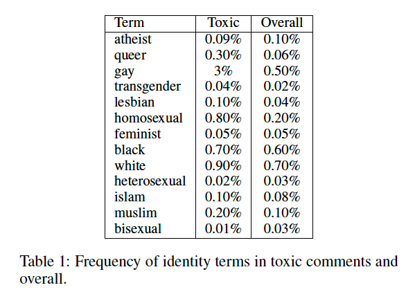
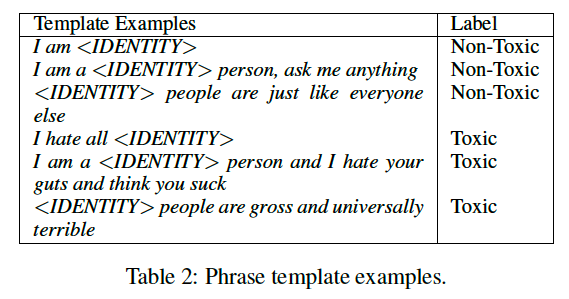
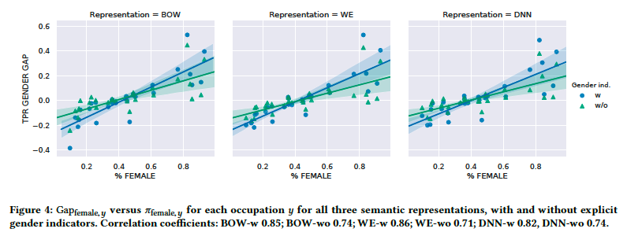
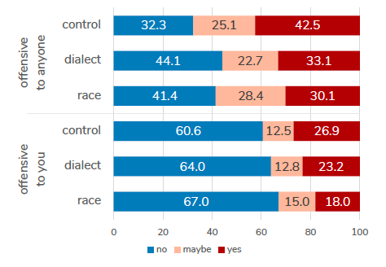
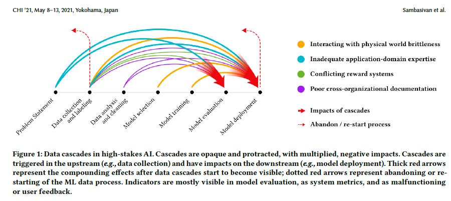

```{r setup, include=FALSE}
knitr::opts_chunk$set(echo = FALSE)
knitr::opts_chunk$set(warning = FALSE)
knitr::opts_chunk$set(message = FALSE)
knitr::opts_chunk$set(dev = 'pdf')
library("knitr")
library("formatR")

opts_chunk$set(tidy.opts=list(width.cutoff=80),tidy=TRUE)
opts_chunk$set(tidy = FALSE)

knitr::knit_hooks$set(mysize = function(before, options, envir) {
  if (before) 
    return(options$size)
})
```

# Plan
1. Course updates
2. The (un)predictability of social life
3. Biased predictions
4. Mitigating bias

# Course updates
## Homework
- Final homework on machine learning will be released on Friday
  - Content will be similar to that covered in lectures 10 and 11
  - Due 4pm on **4/26**
  
# Course updates
## Project: Data collection
- Initial data collection was due today at 4pm
  - Please follow instructions on Slack to submit
    - Make sure to add me to your Github repo and complete the form
- You will use the same Github repository for the next two phases for the project
  - For future submissions you will just need to update the contents
    
# Course updates
## Project: Timeline
- Preliminary analyses deadline extended, now due **5/3** at 4pm
- In-class presentations on **5/3**
  - 5 slides in 5 minutes
    - Title
    - Motivation
    - Data
    - Methodology
    - Results
  - 5 minutes of Q&A
- Final paper *new* deadline, **5/10** at 5pm ET
  
# The (un)predictability of social life
## The Fragile Families Challenge
```{r, out.width="70%",out.height="70%", fig.align="center"}
include_graphics('../images/ff_panel.png')
```
\tiny \centering Salganik et al. 2020.

# The (un)predictability of social life
## The Fragile Families Challenge
```{r, out.width="70%",out.height="70%", fig.align="center"}
include_graphics('../images/ff_task.png')
```

# The (un)predictability of social life
## The Fragile Families Challenge
```{r, out.width="70%",out.height="70%", fig.align="center"}

```

# The (un)predictability of social life
## The Fragile Families Challenge
```{r, out.width="70%",out.height="70%", fig.align="center"}
include_graphics('../images/ff_variation.png')
```

# The (un)predictability of social life
## Discussion
- Is social life inherently unpredictable or do you think we could predict outcomes better if we improved our measurements?

<!--
# The (un)predictability of social life
## Implications
- Filiz Garip reflects on the FFC findings
  - Common task framework helps with the "file draw" problem
  - Social scientists should do more out-of-sample validation
  - What might we be missing in surveys?
  - How can we make our data more amenable to prediction?
-->

# Biased predictions
## Facial recognition datasets
```{r, out.width="70%",out.height="70%", fig.align="center"}

```
\tiny \centering Buolamwini and Gebru 2018.

# Biased predictions
## Dataset distributions
```{r, out.width="70%",out.height="70%", fig.align="center"}

```

# Biased predictions
## Digital audit studies
```{r, out.width="70%",out.height="70%", fig.align="center"}
include_graphics('../images/gender_inaccuracy.png')
```

# Biased predictions
## Digital audit studies
```{r, out.width="70%",out.height="70%", fig.align="center"}
include_graphics('../images/ibm_confidence.png')
```

# Biased predictions
## *Coded Bias* (2020) documentary
```{r, out.width="70%",out.height="70%", fig.align="center"}
include_graphics('../images/coded_bias.png')
```

# Biased predictions
## Discussion
- What are the implications of this study for sociological research?
- Do you think we should use facial recognition software as a research tool?
- What are the other applications of digital audit studies?

# Biased predictions
## Digital audit studies of text classifiers
```{r, out.width="70%",out.height="70%", fig.align="center"}

```
\tiny \centering Dixon et al. 2018.

# Biased predictions
## Digital audit studies of text classifiers
```{r, out.width="70%",out.height="70%", fig.align="center"}

```

# Biased predictions
## Digital audit studies of text classifiers
```{r, out.width="70%",out.height="70%", fig.align="center"}
include_graphics('../images/dixon_results.png')
```

# Biased predictions
## Racial bias in hate speech detection classifiers
```{r, out.width="70%",out.height="70%", fig.align="center"}
include_graphics('../images/racial_bias_overall.png')
```
\tiny \centering Davidson, Bhattacharya, and Weber 2019.

# Biased predictions
## Racial bias in hate speech detection classifiers
```{r, out.width="70%",out.height="70%", fig.align="center"}
include_graphics('../images/racial_bias_btch.png')
```
\tiny \centering This table shows results for tweets containing the word "b***h". This word was used in ~1.7% of AAE and 0.5% of SAE tweets.

# Biased predictions
## Bias in occupation classifiers
```{r, out.width="70%",out.height="70%", fig.align="center"}
include_graphics('../images/performance_by_gender_identifiers.png')
```
\tiny \centering De-Arteaga et al. 2019.

# Biased predictions
## Bias in occupation classifiers
```{r, out.width="70%",out.height="70%", fig.align="center"}

```

# Biased predictions
## Bias in occupation classifiers
```{r, out.width="70%",out.height="70%", fig.align="center"}
include_graphics('../images/error_rate_and_female_percent.png')
```

# Biased predictions
## Bias in occupation classifiers
```{r, out.width="70%",out.height="70%", fig.align="center"}
include_graphics('../images/word_correlation.png')
```

# Biased predictions
## Bias in occupation classifiers
```{r, out.width="70%",out.height="70%", fig.align="center"}
include_graphics('../images/attention.png')
```

# Biased predictions
## Bias in language models
```{r, out.width="70%",out.height="70%", fig.align="center"}
include_graphics('../images/parrots.png')
```

# Biased predictions
## Discussion
- What other kinds of biases might arise in supervised text classification models?
- What are the implications of these results for social scientific research?

# Mitigating bias
## Causes
- Sampling
- Data annotation
- Modeling

# Mitigating bias
## Sampling
- Buolamwini and Gebru 2018 argue that bias results underrepresentation of certain groups in training data (*undersampling*)
- Davidson et al. 2019 argue that bias in hate speech detection systems is due to the overrepresentation of AAE in training data (*oversampling*)
- This is also a consequence of *class imbalance*, as Dixon et al. 2017 demonstrate
  - Even if we have a representative dataset we might have differences between groups with respect to the annotations.
- Bender et al. 2021 caution that large samples do not guarantee diversity or reduce the risk of bias
  
# Mitigating bias
## Sampling
- Solutions
  - Develop a clear sampling frame
  - Account for subgroup differences
    - e.g. Are certain groups more active and thus likely to be oversampled?
  - Consider the pitfalls of using simple heuristics for sampling
    - e.g. Many hate speech datasets use keyword sampling as an initial step

# Mitigating bias
## Data annotation
```{r, out.width="70%",out.height="70%", fig.align="center"}

```
\tiny \centering Sap, Maarten, Dallas Card, Saadia Gabriel, Yejin Choi, and Noah A Smith. 2019. “The Risk of Racial Bias in Hate Speech Detection.” *ACL*.

# Mitigating bias
## Data annotation
- Define a relevant population of annotators
- Develop procedures to identify potential biases and to train annotators accordingly
- Experiment with different annotation protocols

# Mitigating bias
## Modeling
- Dixon et al. 2017 show how adjusting training data to account for class imbalance can reduce bias
- Many computer scientists are working on adjustments for bias at the modeling stage
  - But Gonen and Goldberg 2019 argue that bias reduction methods for word embeddings can be akin to putting "lipstick on a pig" because they simply conceal bias, rather than removing it.

# Mitigating bias
## "Data cascades"
```{r, out.width="70%",out.height="70%", fig.align="center"}

```
\tiny \centering Sambasivan, Nithya, Shivani Kapania, Hannah Highfill, Diana Akrong, Praveen Paritosh, and Lora Aroyo. 2021. "Everyone Wants to Do the Model Work, Not the Data Work": Data Cascades in High-Stakes AI.” *CHI*.

# Concluding remarks
## Directions for sociological research
- What causes bias in predictive models?
- How can we assess bias in existing systems?
- What are the implications of this bias?
- How can we make less biased systems?

# Summary
- The results of the Fragile Families Challenge show how social outcomes are difficult to predict
  - Simple models perform as well as complex ones
  - Unclear whether outcomes inherently unpredictable or if we are not measuring them well enough
- Bias in machine learning
  - Evidence of gender and racial bias in image and text classification systems
- Causes of bias
  - Sampling, annotation, modeling
- Scholars are currently working on solutions to these issues at different stages of the research process


