```{r setup, include=FALSE}
knitr::opts_chunk$set(echo = FALSE)
knitr::opts_chunk$set(warning = FALSE)
knitr::opts_chunk$set(message = FALSE)
knitr::opts_chunk$set(dev = 'pdf')
library("knitr")
library("formatR")

opts_chunk$set(tidy.opts=list(width.cutoff=80),tidy=TRUE)
opts_chunk$set(tidy = FALSE)

knitr::knit_hooks$set(mysize = function(before, options, envir) {
  if (before) 
    return(options$size)
})
```

# Plan
1. Course updates
2. Introduction to computer vision
3. Sociological applications
4. Using pre-trained image classifiers and object detection models

# Course updates
## Homework
- Final homework on machine learning was released on Friday
  - Due 4pm next Monday, **4/26**
    
# Course updates
## Project: Timeline
- Please submit initial data collection ASAP
  - Feedback by the end of the week
- Preliminary analyses deadline extended, now due **5/3** at 4pm
- In-class presentations on **5/3**
- Final paper *new* deadline, **5/10** at 5pm ET
  
# Introduction to computer vision
## What is computer vision?
- Computer vision encompasses a range of different machine-learning techniques designed specifically for image-data
- The general principle is the same as other machine-learning approaches
  - Given some image $X$, predict an outcome associated with the image $Y$
- The main difference is that the model architecture is adapted to work for image data

# Introduction to computer vision
## Digital representations of images
```{r, out.width="70%",out.height="70%", fig.align="center"}
include_graphics('../images/image_array.png')
```
\tiny \centering \href{https://e2eml.school/images/image_processing/three_d_array.png}{Source}
  
# Introduction to computer vision
## Digital representations of images
- Just like text analysis, images must be normalized for use in machine learning models
- Images can be stored as 3 x 2-D matrices or as a 2-D matrix with normalized RGB values
- Generally, we also reduce the dimensionality of these arrays to aggregate information across pixels to store a lower-dimensional representation of an image (compression)

# Introduction to computer vision
## Image classification
- The goal is to predict the class of image $Y$, given the 2-D image matrix $X$. 
- In this case, we have an image composed of 9 pixels, which is input into our classifier $f()$.
- Thus, we want to estimate $Y_{class} = f(X)$, where
$$
X = \begin{bmatrix}
x_{11} & x_{21} & x_{31}\\
x_{12} & x_{22} & x_{32}\\
x_{13} & x_{23} & x_{33}\\
\end{bmatrix}
$$
- Each element $X_{ij}$ corresponds to the normalized RGB value of a pixel.

# Introduction to computer vision
## Image classification
```{r, out.width="70%",out.height="70%", fig.align="center"}
include_graphics('../images/image_classification.png')
```
\tiny \centering  Krizhevsky, Sutskever, and Hinton 2012.

# Introduction to computer vision
## Object detection
```{r, out.width="70%",out.height="70%", fig.align="center"}
include_graphics('../images/object_detection.png')
```
\tiny \centering  Redmon, Joseph, Santosh Divvala, Ross Girshick, and Ali Farhadi. 2016. “You Only Look Once: Unified, Real-Time Object Detection.” *CVPR*, 779–88.


# Introduction to computer vision
## Image generation
```{r, out.width="70%",out.height="70%", fig.align="center"}
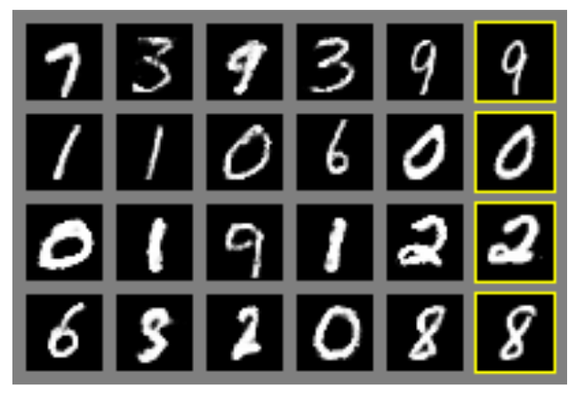
```
\tiny \centering  Goodfellow, Ian J., Jean Pouget-Abadie, Mehdi Mirza, Bing Xu, David Warde-Farley, Sherjil Ozair, Aaron Courville, and Yoshua Bengio. 2014. “Generative Adversarial Networks.” http://arxiv.org/abs/1406.2661.

# Introduction to computer vision
## Style transfer
```{r, out.width="70%",out.height="70%", fig.align="center"}
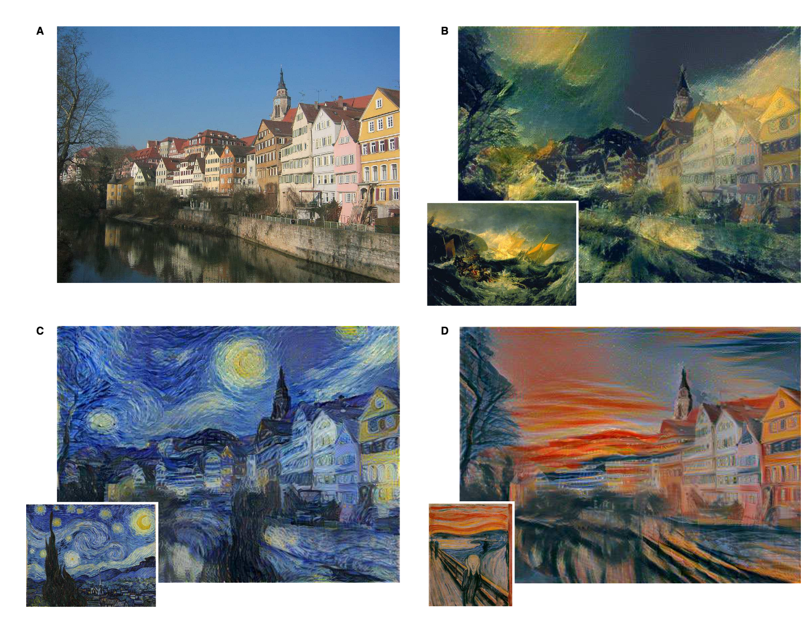
```
\tiny \centering  Gatys, Leon A, Alexander S Ecker, and Matthias Bethge. 2016. “Image Style Transfer Using Convolutional Neural Networks.” *CVPR*, 2414–23.


# Introduction to computer vision
## How does it work?
- Computer vision has made major breakthroughs in the past decade due to the advances in neural network methods
  - These methods have been around for a long time (the *perceptron* algorithm was developed in 1958) but have been difficult to scale due to computational challenge of estimating vast numbers of parameters
  - This has changed with the availability of large datasets and vast compute power
- In contrast to other approaches involving feature construction, these methods directly "learn" features from the data

# Introduction to computer vision
## The 2012 ImageNet Challenge
- ImageNet Large Scale Visual Recognition Challenge is a competition to develop a model to classify images into object categories
  - The aim is to construct a realistic setting with millions of images and thousands of objects
- The \href{http://www.image-net.org/challenges/LSVRC/2012/index}{2012 ImageNet training dataset} contained 1000 different objects categories with labels obtained from the image hosting website flickr.
- Like the Fragile Families Challenge, researchers train models on this dataset then assess performance on a held-out validation set.

# Introduction to computer vision
## The 2012 ImageNet Challenge
- Krizhevsky, Sutskever, and Hinton achieve record-breaking performance by using Convolutional Neural Networks (CNNs)
- CNNs made tractable by using several other methodological innovations
  - Optimization across multiple Graphical Processing Units (GPUs)
  - ReLU activation function for more efficient training
  - Dropout to reduce overfitting
- The random baseline is 0.1% accuracy (1/1000)
  - Their model is correct 63% of the time (Top-1) and the correct answer is in the Top-5 predictions 85% of the time

# Introduction to computer vision
## The 2012 ImageNet Challenge
```{r, out.width="70%",out.height="70%", fig.align="center"}
include_graphics('../images/image_classification.png')
```
\tiny \centering  Krizhevsky, Sutskever, and Hinton 2012.
  
# Introduction to computer vision
## Convolutional Neural Networks
```{r, out.width="70%",out.height="70%", fig.align="center"}
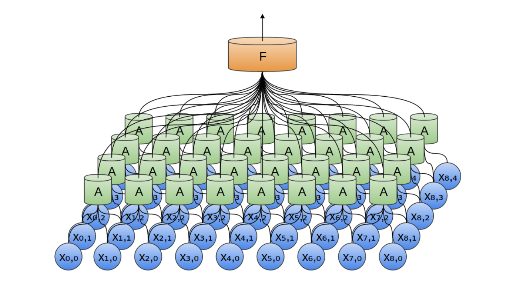
```
\tiny \centering   \href{https://colah.github.io/posts/2014-07-Conv-Nets-Modular/}{Source: Chris Olah's blog post on convolutional neural networks}. \href{https://www.youtube.com/watch?v=YRhxdVk_sIs}{This Youtube video has a good visualization of the convolution process}.
  

# Introduction to computer vision
## Convolutional Neural Networks
```{r, out.width="70%",out.height="70%", fig.align="center"}
include_graphics('../images/cnn_nodes_2.png')
```
\tiny \centering   \href{https://colah.github.io/posts/2014-07-Conv-Nets-Modular/}{Source: Chris Olah's blog post on convolutional neural networks}

# Introduction to computer vision
## Convolutional Neural Networks
```{r, out.width="70%",out.height="70%", fig.align="center"}
include_graphics('../images/cnn_nodes_3.png')
```
\tiny \centering   \href{https://colah.github.io/posts/2014-07-Conv-Nets-Modular/}{Source: Chris Olah's blog post on convolutional neural networks}

# Introduction to computer vision
## Convolutional Neural Networks
```{r, out.width="70%",out.height="70%", fig.align="center"}
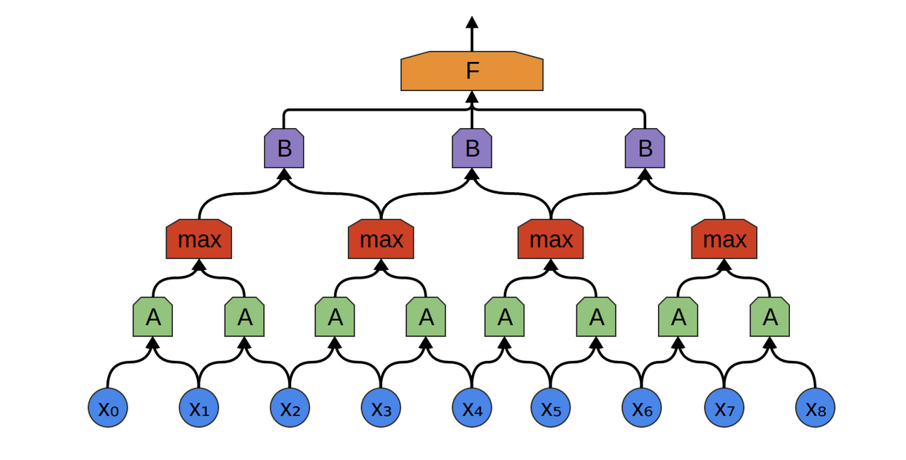
```

\tiny \centering   \href{https://colah.github.io/posts/2014-07-Conv-Nets-Modular/}{Source: Chris Olah's blog post on convolutional neural networks}

# Introduction to computer vision
## Convolutional Neural Networks
```{r, out.width="70%",out.height="70%", fig.align="center"}
include_graphics('../images/cnn_close_up.png')
```

\tiny \centering   \href{https://colah.github.io/posts/2014-07-Conv-Nets-Modular/}{Source: Chris Olah's blog post on convolutional neural networks}. Also see \href{https://colah.github.io/posts/2014-07-Understanding-Convolutions/}{this this post for a mathematical formulation}. 


# Introduction to computer vision
## The 2012 ImageNet Challenge
```{r, out.width="70%",out.height="70%", fig.align="center"}
include_graphics('../images/imagenet_structure.png')
```
\tiny \centering  Krizhevsky, Sutskever, and Hinton 2012.

# Introduction to computer vision
## The 2012 ImageNet Challenge
```{r, out.width="70%",out.height="70%", fig.align="center"}
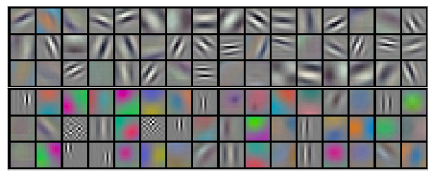
```

# Introduction to computer vision
## The 2012 ImageNet Challenge
```{r, out.width="70%",out.height="70%", fig.align="center"}
include_graphics('../images/activation_functions.png')
```

# Introduction to computer vision
## How neural networks see the world
```{r, out.width="85%",out.height="70%", fig.align="center"}
include_graphics('../images/layer_specialization.png')
```
\tiny \centering  Olah et al. 2017

# Introduction to computer vision
## How neural networks see the world
```{r, out.width="80%",out.height="70%", fig.align="center"}
include_graphics('../images/layer_aggregation.png')
```
\tiny \centering  Olah et al. 2017

# Introduction to computer vision
## How neural networks see the world
```{r, out.width="80%",out.height="70%", fig.align="center"}
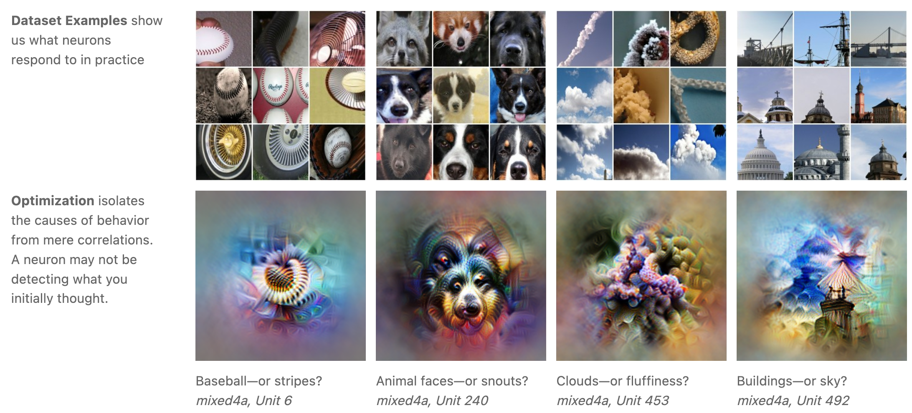
```
\tiny \centering  Olah et al. 2017

# Introduction to computer vision
## Transfer learning
- One of the major breakthroughs in this area of research is *transfer learning*
- A model trained to predict $Y$ can be retrained to predict a new outcome $Z$
- This is often more efficient than training a model to predict $Z$ from scratch, particularly if we lack a sufficient training data
  - e.g. If we want to train a dog detection model we might want to start with a pre-trained cat detection model
    - The model already "knows" how to detect light intensity, edges, and corners
    - The model may also be able to detect fur, tails, and whiskers, etc.
    - This allows the model to easily adapt to the new task
    
# Introduction to computer vision
## Transfer learning
- Most importantly, this makes image recognition a tractable task for social scientists who do not necessarily have access to huge training corpora and advanced compute resources
- We can take an existing pre-trained model and *fine-tune* it to a small corpus of new labeled images
- In practice, this means that we effectively add one or two additional layers to the end of a pre-trained network

# Introduction to computer vision
## Combining text and images
```{r, out.width="85%",out.height="70%", fig.align="center"}
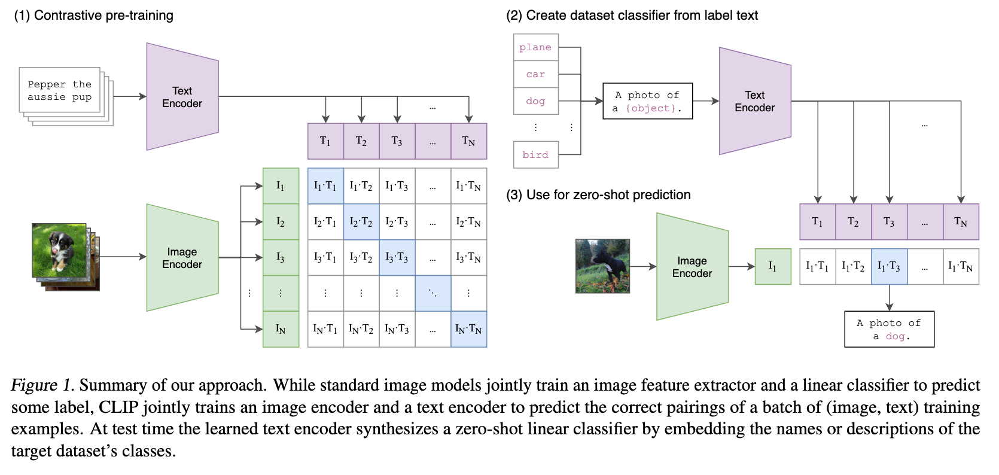
```
\tiny \centering Radford et al. 2021

# Introduction to computer vision
## Multimodal neurons
```{r, out.width="70%",out.height="70%", fig.align="center"}
include_graphics('../images/multimodal_neurons.png')
```
\tiny \centering Goh, Gabriel, Nick Cammarata, Chelsea Voss, Shan Carter, Michael Petrov, Ludwig Schubert, Alec Radford, and Chris Olah. 2021. “Multimodal Neurons in Artificial Neural Networks.” *Distill* 6 (3): e30. https://doi.org/10.23915/distill.00030.

# Introduction to computer vision
## Multimodal neurons
```{r, out.width="70%",out.height="60%", fig.align="center"}
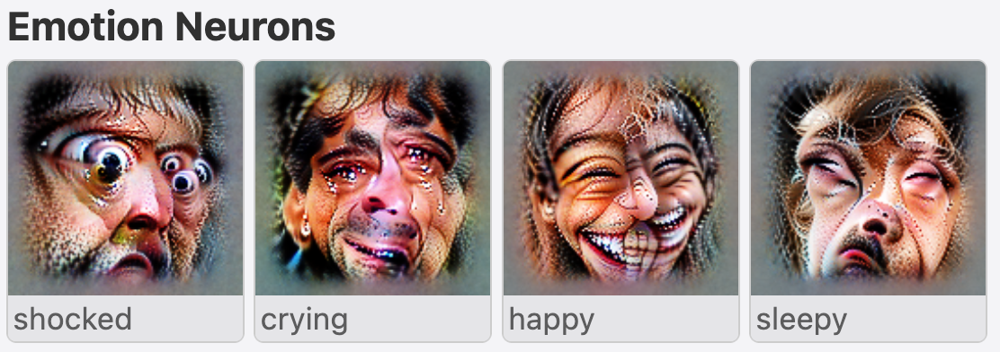
```
\tiny \centering Goh et al. 2021

# Introduction to computer vision
## Multimodal neurons
```{r, out.width="70%",out.height="70%", fig.align="center"}
include_graphics('../images/clip_geographic.png')
```
\tiny \centering Goh et al. 2021

# Introduction to computer vision
## Adversarial examples
```{r, out.width="70%",out.height="70%", fig.align="center"}
include_graphics('../images/adversarial_attacks.png')
```
\tiny \centering Goh et al. 2021

# Introduction to computer vision
## Adversarial examples
```{r, out.width="80%",out.height="70%", fig.align="center"}
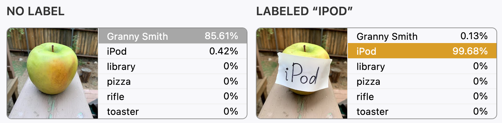
```
\tiny \centering Goh et al. 2021

# Sociological applications
## Examples
- Using satellite imagery to predict poverty
- Using Google Street View to estimate demographics
- Using social media to detect collective action

# Sociological applications
## Using satellite imagery to predict poverty
```{r, out.width="80%",out.height="70%", fig.align="center"}
include_graphics('../images/africa_surveys.png')
```
\tiny \centering  Jean et al. 2016

# Sociological applications
## Using satellite imagery to predict poverty
```{r, out.width="70%",out.height="70%", fig.align="center"}
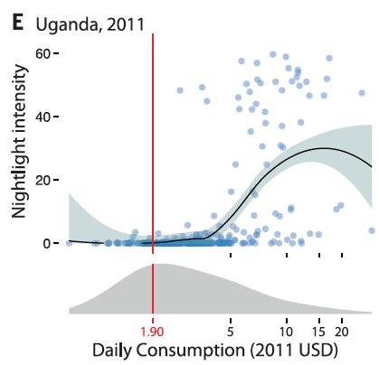
```
\tiny \centering  Jean et al. 2016

# Sociological applications
## Using satellite imagery to predict poverty
```{r, out.width="70%",out.height="70%", fig.align="center"}
include_graphics('../images/cnn_feature_viz_jean.png')
```
\tiny \centering  Jean et al. 2016

# Sociological applications
## Using satellite imagery to predict poverty
```{r, out.width="70%",out.height="70%", fig.align="center"}
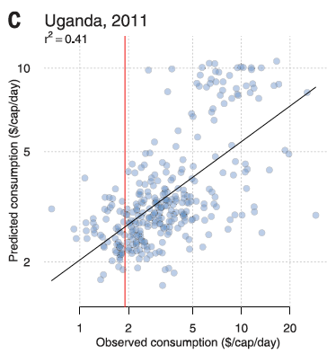
```
\tiny \centering  Jean et al. 2016

# Sociological applications
## Using Google Street View to estimate demographics
```{r, out.width="70%",out.height="70%", fig.align="center"}
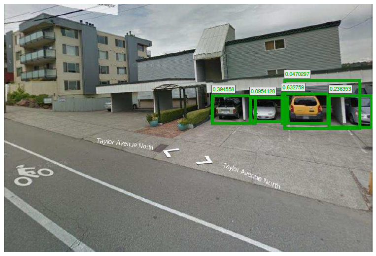
```
\tiny \centering  Gebru et al. 2017

# Sociological applications
## Using Google Street View to estimate demographics
```{r, out.width="70%",out.height="70%", fig.align="center"}
include_graphics('../images/gebru_car_edmunds.png')
```
\tiny \centering  Gebru et al. 2017

# Sociological applications
## Using Google Street View to estimate demographics
```{r, out.width="70%",out.height="70%", fig.align="center"}
include_graphics('../images/gebru_car_type_confusion.png')
```
\tiny \centering  Gebru et al. 2017

# Sociological applications
## Using Google Street View to estimate demographics
```{r, out.width="70%",out.height="70%", fig.align="center"}
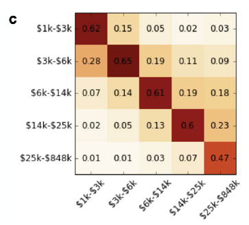
```
\tiny \centering  Gebru et al. 2017


# Sociological applications
## Using Google Street View to estimate demographics
```{r, out.width="75%",out.height="75%", fig.align="center"}
include_graphics('../images/gebru_street_view.png')
```
\tiny \centering  Gebru et al. 2017

# Sociological applications
## Using Google Street View to estimate demographics
- The information from the car detection model is then used in a regression model
  - Demographics from the American Community Survey for a given geographic unit are estimated as a function of 88 variables including average number of cars per image, average car price, percent hybrids, percent foreign made, etc.

# Sociological applications
## Using Google Street View to estimate demographics
```{r, out.width="75%",out.height="75%", fig.align="center"}
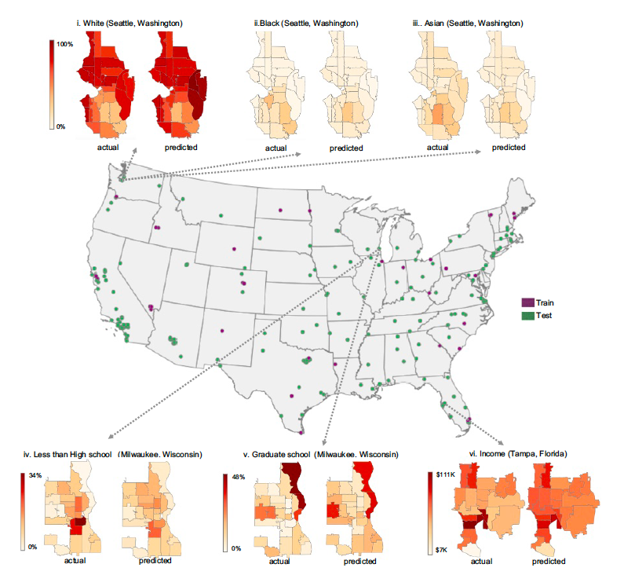
```
\tiny \centering  Gebru et al. 2017

# Sociological applications
## Using Google Street View to estimate demographics
```{r, out.width="70%",out.height="70%", fig.align="center"}
include_graphics('../images/gebru_car_race.png')
```
\tiny \centering  Gebru et al. 2017

# Sociological applications
## Using social media to detect collective action
- Zhang and Pan 2019 use data from Weibo to identify collective action events in China
- They develop an event-detection model that combines both image and text from social media posts
- To detect collective action in images, they use a corpus of relevant social media posts collected by activists to fine-tune a pre-trained image detection model

# Sociological applications
## Using social media to detect collective action
```{r, out.width="70%",out.height="70%", fig.align="center"}
include_graphics('../images/zhang_fine_tuning.png')
```
\tiny \centering  Zhang and Pan 2019

# Sociological applications
## Using social media to detect collective action
```{r, out.width="70%",out.height="70%", fig.align="center"}
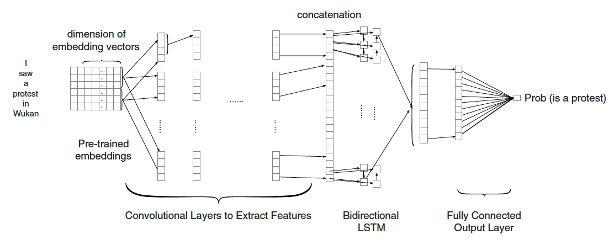
```
\tiny \centering  Zhang and Pan 2019

# Sociological applications
## Using social media to detect collective action
```{r, out.width="80%",out.height="50%", fig.align="center"}
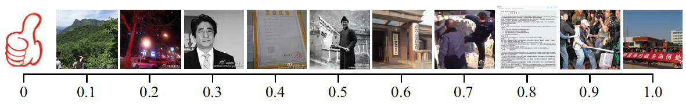
```
\tiny \centering  Zhang and Pan 2019

# Sociological applications
## Using social media to detect collective action
- They develop a simple procedure to classify posts depending on the content:
$$
p=\left\{\begin{array}{ll}
\frac{\left(p_{\text {text }}+\alpha \cdot p_{\text {image }}\right)}{(1+\alpha)} \cdot \beta & \text { if the post has images, } \\
p_{\text {text }} & \text { otherwise. }
\end{array}\right.
$$
- $\alpha$ controls the relative weight of text and images and $\beta$ denotes the extra weight given to posts with both text and images.
- Both parameters are optimized by using cross-validation.

# Sociological applications
## Using social media to detect collective action
```{r, out.width="70%",out.height="70%", fig.align="center"}
include_graphics('../images/zhang_precision_and_recall.png')
```
\tiny \centering  Zhang and Pan 2019

# Sociological applications
## Using social media to detect collective action
```{r, out.width="70%",out.height="70%", fig.align="center"}
include_graphics('../images/zhang_true_positive.png')
```
\tiny \centering  Zhang and Pan 2019

# Sociological applications
## Using social media to detect collective action
```{r, out.width="70%",out.height="70%", fig.align="center"}
include_graphics('../images/zhang_false_positive.png')
```
\tiny \centering  Zhang and Pan 2019

# Sociological applications
## Using social media to detect collective action
- Many false positives contain content relevant to collective action such as corruption, housing demolition, and the police, but do not actually involve collective action
- They therefore train a second-stage classifier to distinguish between collective action and such cases
- This improves the out-of-sample $F_1$ score from 0.69 to 0.84, demonstrating how analysis of model results can enable us to make improvements to classifiers

# Sociological applications
## Using social media to detect collective action
```{r, out.width="70%",out.height="70%", fig.align="center"}
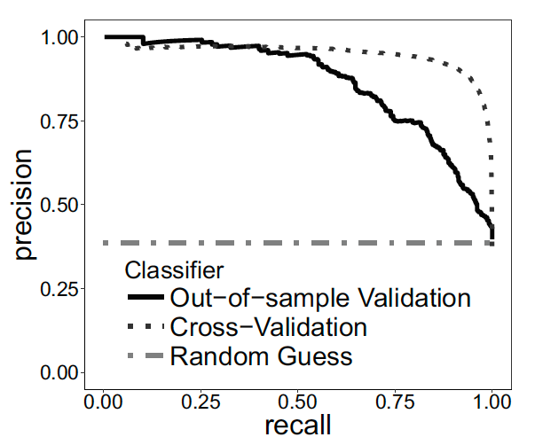
```
\tiny \centering  Zhang and Pan 2019

# Sociological applications
## Using social media to detect collective action
```{r, out.width="70%",out.height="70%", fig.align="center"}
include_graphics('../images/zhang_results.png')
```
\tiny \centering  Zhang and Pan 2019

# Sociological applications
## Discussion
- Discuss other applications of computer vision techniques to social scientific research
  - What other domains could we study using these approaches?

# Using pre-trained image classifiers and object detection models
## Why not R?
- Python is the dominant language used in ML research
  - Well developed package infrastructure (`scikit-learn`, `keras`, `PyTorch`, `Tensorflow`)
  - Tons of resources and replication materials in Python
    - See \href{https://paperswithcode.com/sota}{Papers with Code} for a collection of replication materials, including many state-of-the-art models
- Most R packages are wrappers around existing Python packages
  - \href{https://tensorflow.rstudio.com/}{RStudio now supports TensorFlow and Keras}
- Google Colaboratory notebooks and TensorFlow Hub make it possible to work with large models and datasets
  - It is possible to use an R kernel in a Colab notebook

# Using pre-trained image classifiers and object detection models
## Using pre-trained models from TensorHub
- \href{https://colab.research.google.com/drive/1v9UlGlELgCFVQRLhZNHeiu7zt2GHQ7Fu?usp=sharing}{Click here} to open an example notebook for using a pre-trained image classifier.
- \href{https://colab.research.google.com/drive/1DlKR3bbeigKuCgZ4cMg9QAb_EaBlsQqb?usp=sharing}{Click here} to open an example notebook for fine-tuning a pre-trained image classifier.
- \href{https://colab.research.google.com/drive/1OT1o4lJMcrRsR89lBsem7MQEj9BLy9-g?usp=sharing}{Click here} to open an example notebook for using a pre-trained object detection model.

# Summary
- Computer vision describes a domain of machine learning focuses on image data
- These methods have made huge advances in the past decade due to increased compute power and the availability of large datasets
- Convolutional neural networks are one of the most prominent and widely used approaches 
  - Recent advances incorporate different kinds of data, including images and text
- Transfer learning and fine-tuning make it possible to adapt advanced methods to new tasks with relative ease
- We are beginning to see the sociological applications of these methods

