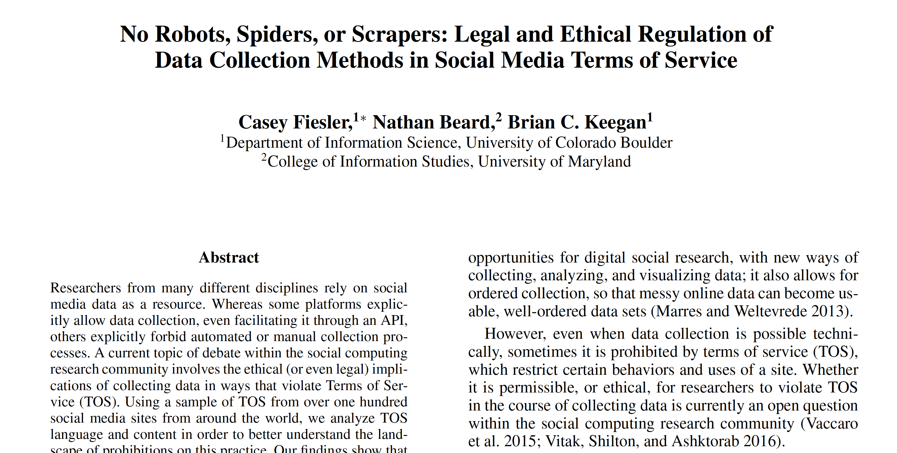

```{r setup, include=FALSE}
knitr::opts_chunk$set(echo = FALSE)
knitr::opts_chunk$set(warning = FALSE)
knitr::opts_chunk$set(message = FALSE)
knitr::opts_chunk$set(dev = 'pdf')
library("knitr")
library("formatR")

opts_chunk$set(tidy.opts=list(width.cutoff=80),tidy=TRUE)
opts_chunk$set(tidy = FALSE)

knitr::knit_hooks$set(mysize = function(before, options, envir) {
  if (before) 
    return(options$size)
})
```

# Plan
1. What is web-scraping?
2. When should I use it?
3. How to scrape a web page using R
4. Crawling websites using R
5. ``selenium`` and browser automation

# What is web-scraping?
## Terminology
- Web-scraping is a method to collect data from websites
  - We use the code underlying a webpage to collect data (**scraping**)
  - The process is then repeated for other pages on the same website in an automated fashion (**crawling**)

# What is web-scraping?
## Challenges
- Different websites have different structures, so a script used to scrape one website will likely have to be changed to scrape another
- Websites can be internally inconsistent, making them difficult to scrape
- Some websites are easier to crawl than others
- Some websites limit or prohibit scraping

# When should I use it?
## Commercial use cases
- Search engines
  - Google scrapes websites to create a searchable index of the internet
- Price comparison
  - Kayak scrape airlines to compare flight prices, other websites do the same for hotels and rental cars
- Recruitment
  - Recruitment companies scrape LinkedIn to get data on workers
  
# When should I use it?
## Social scientific use cases
- Web-scraping is a useful tool to collect data from websites without APIs
  - Large social media platforms and other sites have APIs but smaller websites do not
    - Local newspapers, forums, small businesses, educational institutions, etc.
- Often we want to collect data from a single website
  - e.g. All posts written on a forum
- Sometimes we might want to collect data from many websites
  - e.g. All schools in a school district
  
# When should I use it?
## Ethical and legal considerations
```{r, out.width="70%",out.height="70%", fig.align="center"}

```

# When should I use it?
## Ethical and legal considerations
- Fiesler, Beard, and Keegan (2020) review the legal cases related to web-scraping and analyze website terms of service
  - "In short, it is an unsettled question as to whether it is explicitly illegal (or even a criminal act) to violate TOS."
  - No academic or journalist has ever been prosecuted for violating a website terms of service to collect data for research
- They analyze terms of service of over 100 social media websites
  - Terms of service are ambiguous, inconsistent, and lack context


# When should I use it?
## Best-practices
- Only scrape publicly available data
  - i.e. You can access the page on the web without logging in
- Do not scrape copyright protected data
- Try not to violate website terms of service
- Do not burden the website
  - Limit the number of calls you make (similar to rate-limiting in APIs)
- Avoid using the data in a way that may interfere with business
  - i.e. Don't copy valuable data from a small business and share it on Github

# How to scrape a web page
## Start by looking up ``robots.txt''
```{r, out.width="70%",out.height="70%", fig.align="center"}
include_graphics('../images/robots.png')
```

# How to scrape a web page
## Decoding ``robots.txt``
- **``User-agent``** = the name of the scraper
  - **``*``** = All scrapers
- **``Allow: /path/``** = OK to scrape
- **``Disallow: /path/``** = Not OK to scrape
  - **``Disallow: /``** = Not OK to scrape any pages
- **``Crawl-Delay: N``** = Wait ``N`` miliseconds between each call to the website 

# How to scrape a web page
## Terminology
- A web-page is loaded using a **URL** (Uniform Resource Locator)
- The underlying code we are interested in is usually **HTML** (Hypertext Markup Language)
- Many websites use **CSS** (Cascading Style Sheets) to structure HTML
  - This will help us to find what we are interested in
    - See https://flukeout.github.io/ for an interactive tutorial on using CSS selectors
    - Chrome Plugin to help find CSS elements: https://selectorgadget.com/

# How to scrape a web page
## Inspecting HTML
- Open up a website and right click on any text or image on the screen
  - You should see an option ``Inspect Element``
  - This will allow you to see the code used to generate the page
  
# How to scrape a web page
```{r, out.width="70%",out.height="70%", fig.align="center"}
include_graphics('../images/inspect_google.png')
```

# How to scrape a web page
## Using ``rvest`` to scrape HTML
```{r, echo=TRUE, mysize=TRUE, size='\\footnotesize', tidy=FALSE}
library(rvest)
library(dplyr)
library(stringr)
```

# How to scrape a web page
```{r, out.width="70%",out.height="70%", fig.align="center"}
include_graphics('../images/main_page.png')
```

# How to scrape a web page
```{r, out.width="70%",out.height="70%", fig.align="center"}
include_graphics('../images/scrape_page.png')
```

# How to scrape a web page
## Using ``rvest`` to scrape HTML
```{r, echo=TRUE, mysize=TRUE, size='\\footnotesize', tidy=FALSE}
url <- "https://thecatsite.com/threads/advice-on-cat-introductions-feeling-a-bit-lost.422848/"
thread <- read_html(url)
```


# How to scrape a web page
## Collecting messages
First, we parse the HTML to obtain the text of each message on the page. Here we use the CSS selector ``.message-body``, which selects all elements with class ``message-body``. The `html_nodes` function in `rvest` allows us to retrieve these nodes.
```{r, echo=TRUE, tidy=FALSE, mysize=TRUE, size='\\footnotesize', tidy=FALSE}
message.data <- thread %>% html_nodes(".message-body")
message.data[1:3]
```

# How to scrape a web page
## Collecting messages
Next we use `html_text()` to extract the text from the HTML.
```{r, echo=TRUE, tidy=FALSE, mysize=TRUE, size='\\footnotesize', tidy=FALSE}
messages <- thread %>% html_nodes(".message-body") %>% 
  html_text() %>% str_trim() 
```


# How to scrape a web page
## Collecting messages
As expected, there are twenty messages. We can verify the content is correct by printing one out.
```{r, echo=TRUE, tidy=FALSE, mysize=TRUE, size='\\footnotesize', tidy=FALSE}
print(length(messages))
print(substr(messages[[1]], 1, 250))
```


# How to scrape a web page
## Getting user names
Next we collect the name of each user using the same logic. User information is found by parsing the ``.message-userDetails`` node. 
```{r, echo=TRUE, mysize=TRUE, size='\\footnotesize', tidy=FALSE}
users <- thread %>% html_nodes(".message-userDetails") %>%
  html_text() %>% str_trim()
print(length(users))
users[[1]]
```


# How to scrape a web page
## Getting user names
Let's add some more elements to the pipe to extract the user name from the string. Note how the elements in the string returned in the previous chunk are separated by the newline symbol (`\n`).
```{r, echo=TRUE, mysize=TRUE, size='\\footnotesize', tidy=FALSE}
users <- thread %>% html_nodes(".message-userDetails") %>%
  html_text() %>% str_trim() %>% str_split('\n') %>% pluck(1)
users[[1]]
class(users)
```

# How to scrape a web page
## Collecting timestamps
Finally, we also want to get the time-stamp of each message. While the forum only displays dates, we can actually get the full timestamp. What's the problem here?
```{r, echo=TRUE, mysize=TRUE, size='\\footnotesize', tidy=FALSE}
dates <- thread %>% html_nodes("time.u-dt")
print(dates[1])
length(dates)
```


# How to scrape a web page
## Collecting timestamps
I went back to the HTML and found this CSS selector ``.u-concealed .u-dt`` is selected instead. It returns the datetime for each post in the thread, along with the date time at the top indicating when the thread was created.
```{r, echo=TRUE, mysize=TRUE, size='\\footnotesize', tidy=FALSE}
dates <- thread %>% html_nodes(".u-concealed .u-dt")
length(dates)
dates <- dates[-1]
dates[1]
```

# How to scrape a web page
## Collecting timestamps
Each HTMl node contains several different attributes related to the time. In this case we can select the `datetime` attribute using the `html_attr` function.
```{r, echo=TRUE, mysize=TRUE, size='\\footnotesize', tidy=FALSE}
dates <- thread %>% html_nodes(".u-concealed .u-dt") %>% html_attr("datetime")
dates[1]
```

# How to scrape a web page
## Collecting timestamps
Finally, its often useful to clean up timestamps. We can do this using the `lubridate` package. In this case we extract the year, month, day, hour, minutes, and seconds, converted to EST. The result is a special type of object used to represent dates and times.
```{r, echo=TRUE, mysize=TRUE, size='\\footnotesize', tidy=FALSE}
library(lubridate)
dates <- dates %>% ymd_hms(tz = "EST")
dates[1]
class(dates)
```

# How to scrape a web page
## *Exercise*
Write code to get the date each user joined the forum. This should return 20 elements on each page. Use `lubridate` to parse the object.
```{r, echo=TRUE, mysize=TRUE, size='\\footnotesize', tidy=FALSE, eval=FALSE}
joined <- thread %>% # your solution here

joined[1]
length(joined)
class(joined)
```

# How to scrape a web page
## Putting it all together
```{r, echo=TRUE, mysize=TRUE, size='\\footnotesize', tidy=FALSE}
class(users)
length(users)
class(messages)
length(messages)
class(dates)
length(dates)
```

# How to scrape a web page
## Putting it all together
```{r, echo=TRUE, mysize=TRUE, size='\\footnotesize', tidy=FALSE}
data <- as_tibble(cbind(messages, unlist(users), dates[-1]))
colnames(data) <- c("message", "user", "timestamp")
head(data)
```

# How to scrape a web page
## Creating a function to collect and store data
```{r, echo=TRUE, mysize=TRUE, size='\\footnotesize', tidy=FALSE}
get.posts <- function(thread) {
  messages <- thread %>% html_nodes(".message-body") %>% 
    html_text() %>% str_trim()
  users <- thread %>% html_nodes(".message-userDetails") %>%
    html_text() %>% str_trim() %>% str_split('\n') %>% pluck(1)
  timestamps <- thread %>% html_nodes(".u-concealed .u-dt") %>%
    html_attr("datetime") %>% ymd_hms(tz="EST")
  timestamps <- timestamps[-1] # remove first timestamp
  data <- as_tibble(cbind(messages, unlist(users), timestamps))
  colnames(data) <- c("message","user", "timestamp")
  return(data)
}
```

# How to scrape a web page
## Using the function
We can now easily run all the code to extract information using a single function call:
```{r, echo=TRUE, mysize=TRUE, size='\\footnotesize', tidy=FALSE}
results <- get.posts(thread)
head(results)
```

# How to scrape a web page
## Pagination
The next step is to figure out how we can navigate the different pages of the thread. Inspection of the HTML shows the CSS element `pageNav-jump` contains the relevant information.
```{r, echo=TRUE, mysize=TRUE, size='\\footnotesize', tidy=FALSE}
thread %>% html_nodes(".pageNav-jump")
```

# How to scrape a web page
## Pagination
In this case I want both the links *and* the descriptions. 
```{r, echo=TRUE, mysize=TRUE, size='\\footnotesize', tidy=FALSE}
links <- thread %>% html_nodes(".pageNav-jump") %>%
  html_attr("href")
desc <- thread %>% html_nodes(".pageNav-jump") %>%
  html_text()
pagination.info <- data.frame(links, desc) %>% 
  filter(str_detect(desc, "Next")) %>% distinct()
head(pagination.info)
```

# How to scrape a web page
## Pagination
We can then use the base URL to get the link to the next page.
```{r, echo=TRUE, mysize=TRUE, size='\\footnotesize', tidy=FALSE}
base <- "https://thecatsite.com"
next.page <- paste(base, pagination.info$links, sep = '')
print(next.page)
```

# How to scrape a web page
## Pagination
Let's verify this works by using the `get.posts` function.
```{r, echo=TRUE, mysize=TRUE, size='\\footnotesize', tidy=FALSE}
results <- get.posts(read_html(next.page))
results[1:5,]
```

# How to scrape a web page
## Pagination function
```{r, echo=TRUE, mysize=TRUE, size='\\footnotesize', tidy=FALSE}
get.next.page <- function(thread){
  links <- thread %>% html_nodes(".pageNav-jump") %>% 
    html_attr("href")
  desc <- thread %>% html_nodes(".pageNav-jump") %>% 
    html_text()
  pagination.info <- data.frame(links, desc) %>% 
    filter(str_detect(desc, "Next")) %>% distinct()
  base <- "https://thecatsite.com"
  next.page <- paste(base, pagination.info$links, sep = '')
  return(next.page)
}
get.next.page(thread)
```

# How to scrape a web page
## Testing the pagination function
We can easily use this function to paginate. In this case we use `get.next.page` to get the link to page 2, read the HTML for page 2, then use `get.next.page` to extract the link to page 3.
```{r, echo=TRUE, mysize=TRUE, size='\\footnotesize', tidy=FALSE}
thread.2 <- read_html(get.next.page(thread))
page.3 <- get.next.page(thread.2)
page.3
```

# How to scrape a web page
## Testing the pagination function
What happens when we run out of pages? In this case there is no link to the next page. The `get.next.page` function does not produce an error, but only returns the base URL.
```{r, echo=TRUE, mysize=TRUE, size='\\footnotesize', tidy=FALSE}
get.next.page(read_html("https://thecatsite.com/threads/advice-on-cat-introductions-feeling-a-bit-lost.422848/page-6"))
```

# How to scrape a web page
## Improving the function
```{r, echo=TRUE, mysize=TRUE, size='\\footnotesize', tidy=FALSE}
get.next.page <- function(thread){
  links <- thread %>% html_nodes(".pageNav-jump") %>% 
    html_attr("href")
  desc <- thread %>% html_nodes(".pageNav-jump") %>% 
    html_text()
  pagination.info <- data.frame(links, desc) %>% 
    filter(str_detect(desc, "Next")) %>% distinct()
  if (dim(pagination.info)[1] == 1) {
    base <- "https://thecatsite.com"
    next.page <- paste(base, pagination.info$links, sep = '')
  return(next.page)
    } else {
    return("Final page")
  }
}
```

# How to scrape a web page
## Testing the pagination function
We now get this message when we try to paginate on the final page.
```{r, echo=TRUE, mysize=TRUE, size='\\footnotesize', tidy=FALSE}
get.next.page(read_html("https://thecatsite.com/threads/advice-on-cat-introductions-feeling-a-bit-lost.422848/page-6"))
```

# How to scrape a web page
## Paginate and scrape
```{r, echo=TRUE, mysize=TRUE, size='\\footnotesize', tidy=FALSE}
paginate.and.scrape <- function(url){
  thread <- read_html(url)
  posts <- get.posts(thread)
  next.page <- get.next.page(thread)
  while (!str_detect(next.page, "Final page"))
  {
    thread <- read_html(next.page)
    posts <- rbind(posts, get.posts(thread))
    next.page <- get.next.page(thread)
    Sys.sleep(1) # wait 1 second
  }
  return(posts)
}
```

# How to scrape a web page
## Paginate and scrape
```{r, echo=TRUE, mysize=TRUE, size='\\footnotesize', tidy=FALSE}
full.thread <- paginate.and.scrape(url)
dim(full.thread)
print(head(full.thread))
```

# How to scrape a web page
## Crawling a website
- Now we have a function we can use to paginate and scrape the data from threads on the website
- The next goal is to write a crawler to traverse the website and retrieve information from all of the threads we are interested in.
- Fortunately, these threads are organized in a similar way
  - Each page contains 20 threads and links to the next page

# How to scrape a web page
## Crawling a website
```{r, echo=TRUE, mysize=TRUE, size='\\footnotesize', tidy=FALSE}
get.threads <- function(url) {
  f <- read_html(url)
  title <- f %>% html_nodes(".structItem-title") %>% 
    html_text() %>% str_trim()
  link <- f %>% html_nodes(".structItem-title a") %>% 
    html_attr("href")  %>% str_trim()
  link <- data.frame(link)
  link <- link %>% filter(str_detect(link, "/threads/"))
  threads <- data.frame(title, link)
  return(threads)
}
```

# How to scrape a web page
## Crawling a website
```{r, echo=TRUE, mysize=TRUE, size='\\footnotesize', tidy=FALSE}
forum.url <- "https://thecatsite.com/forums/cat-behavior.5/"

threads <- get.threads(forum.url)
```

# How to scrape a web page
## Crawling a website
```{r, echo=TRUE, mysize=TRUE, size='\\footnotesize', tidy=FALSE}
print(threads$title)
```

# How to scrape a web page
## Crawling a website
```{r, echo=TRUE, mysize=TRUE, size='\\footnotesize', tidy=FALSE}
print(threads$link)
```


# How to scrape a web page
## Crawling a website
**Exercise**: Write code to iterate over the first 5 pages of threads. You will need to use `get.threads`, `paginate.and.scrape`, and `get.next.page`. Store the results as a tibble in an object called `results`. Make sure to also retain the name of each thread. *Note that this may take a while to run. You should test it on a small subset to verify it works*.
```{r, echo=TRUE, mysize=TRUE, size='\\footnotesize', tidy=FALSE, eval=FALSE}
# Complete code here
```

# How to scrape a web page
## Storing the results
The results should consist of a few thousand messages and associated metadata. Save the results of this crawl to as a CSV file.
```{r, echo=TRUE, mysize=TRUE, size='\\footnotesize', tidy=FALSE, eval=FALSE}
library(readr)
write_csv(results, "cat_crawl.csv")
```

# How to scrape a web page
## Data storage
- If you try to collect all the data you need before saving it, you run the risk of data loss if you script crashes
  - This risk increases as you collect more data
    - More memory on your computer is being used
    - Increased likelihood of encountering anomalies that cause errors
- Reasonable solutions
  - Continuously save results to disk (e.g. concatenate each thread to a CSV)
  - Store results in chunks (e.g. each thread in a new CSV)

# How to scrape a web page
## Data storage 
- A more robust solution
  - Write output to a relational database
    - This helps to organize the data and makes it easier to query and manage, particularly with large datasets
     - I recommend PostgreSQL, a free open-source, SQL-compatible relational database

# How to scrape a web page
## Data storage 
- If collecting a lot of data, I recommend use a server to run the code and to store scraped data
- Requirements
  - Access to a server ($)
    - But most universities have free computing clusters
  - Command line knowledge
  - Database knowledge
- It is beyond the scope of this class to cover this material, but I highly recommend you develop this infrastructure if you continue to work in this area
    
# How to scrape a web page
## Logging
- Log the progress of your webscraper
  - Simple option:
    - Print statements in code
  - Better option:
    - Use a log file
  - To keep yourself updated:
    - Use a Slack App to send yourself messages

# How to scrape a web page
## Javascript and browser automation
- Many websites use Javascript, which cause problems for web-scrapers as it cannot directly be parsed to HTML
- We can get around this by doing the following
  - Automatically to open a browser (e.g. Google Chrome)
  - Load a website in the browser
  - Read the HTML from the browser into R
- We can also use browser automation to click buttons, fill in forms, or enter login info
  

# How to scrape a web page
## Selenium
- Selenium WebDriver and the package ``RSelenium`` (https://github.com/ropensci/RSelenium) is the most popular approach
- **However**, ``RSelenium`` requires a complicated set up using a Docker container
  - This is a little technical and I've had trouble getting it to work
  - It may be easier to use `selenium` in Python then read the data into R
    - https://python-bloggers.com/2020/07/rvspython-3-setting-up-selenium-limitations-with-the-rselenium-package-getting-past-them/
  
# How to scrape a web page
## Using reticulate to run selenium in Python
This Python code uses selenium to open up a Chrome browser, visit a website, and collect the HTML. It then closes the browser.
```{python, echo=TRUE, eval=FALSE, size='\\footnotesize', tidy=FALSE}
from selenium import webdriver
driver = webdriver.Chrome()
driver.get('https://www.sociology.rutgers.edu')
html = driver.page_source
driver.close()
```
\tiny This will only work if the Chrome driver has been downloaded and is in your PATH. See https://chromedriver.chromium.org/getting-started

# How to scrape a web page
## Using reticulate to run selenium in Python
I saved the code in the previous chunk as a file called `get_html.py`. We can use `reticulate` to run the Python code then pass objects from Python to R. In this case we use Python to run selenium and get the HTML, then read it into R using `rvest`.
```{r, echo=TRUE, mysize=TRUE, size='\\footnotesize', tidy=FALSE, eval=FALSE}
library(reticulate)

#py_install("selenium") # uncomment to install selenium.py
source_python('get_html.py') # run python script

html.text <- read_html(py$html) %>% html_text()
```

# Questions


  

<!-- Next we want to paginate through the whole forum-->