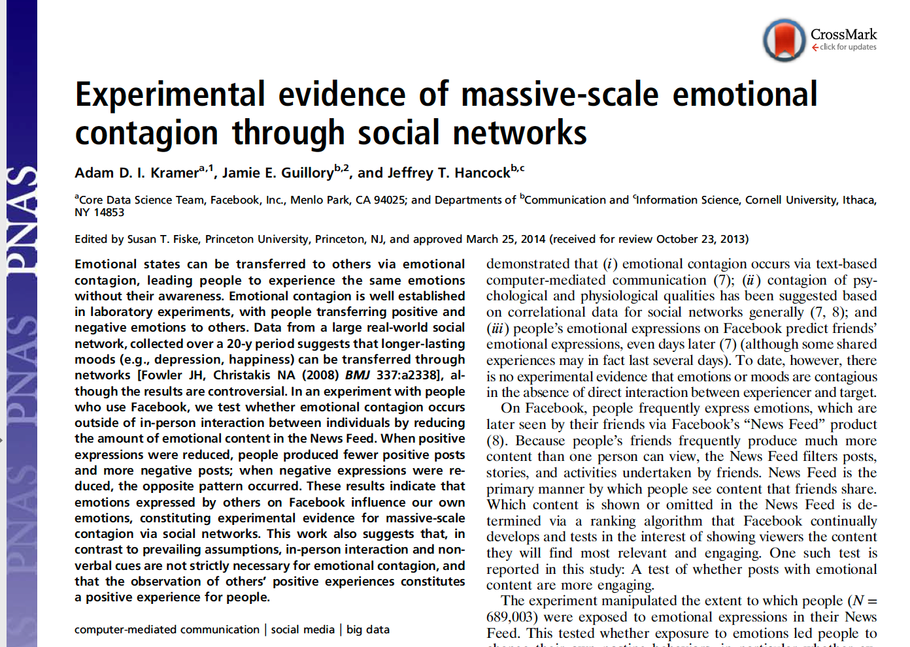
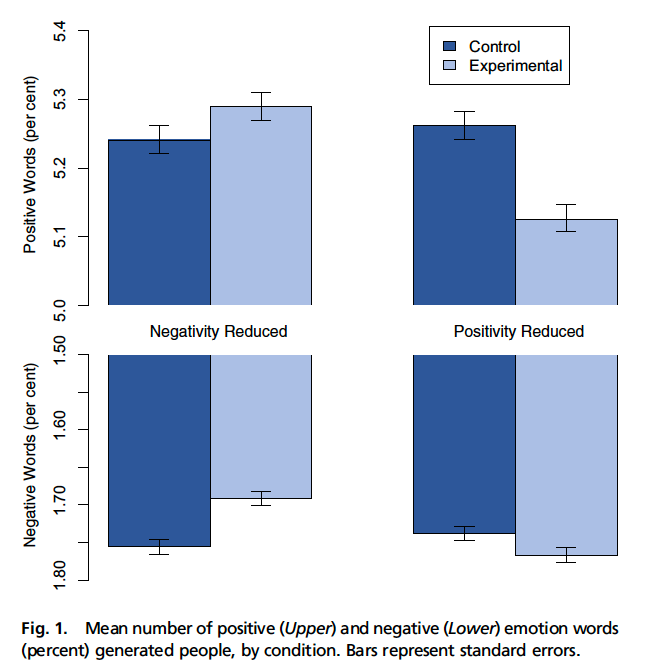
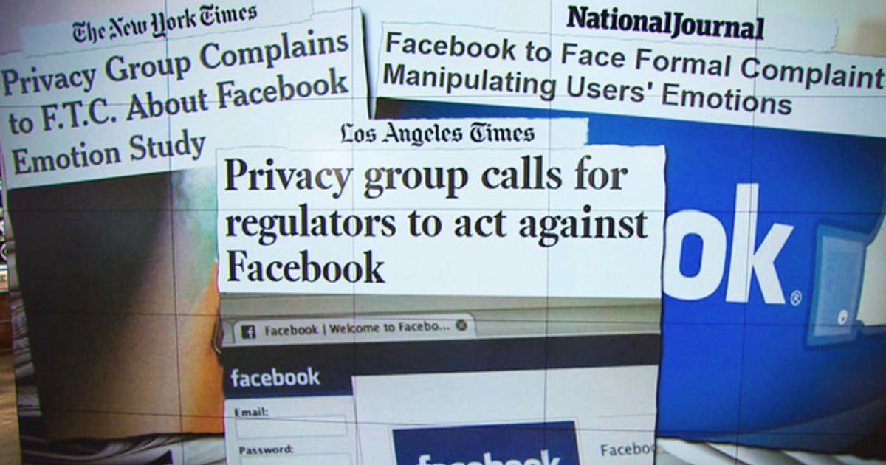
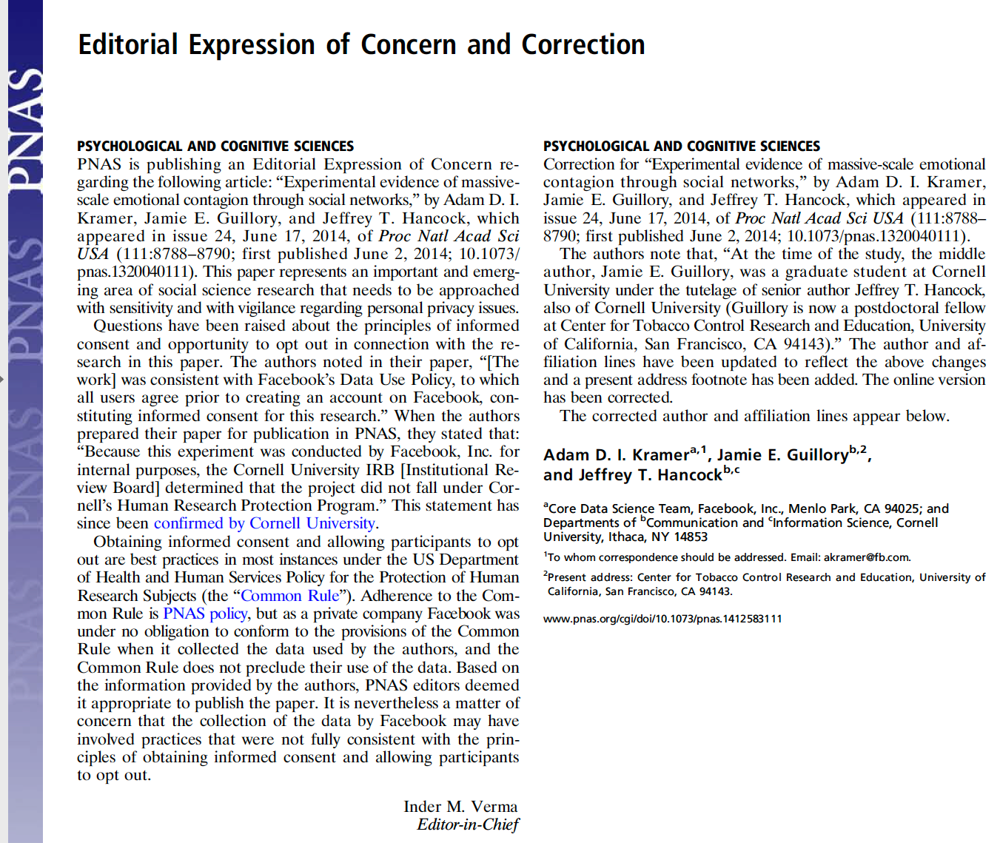
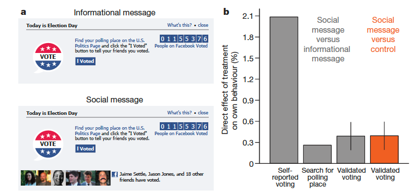
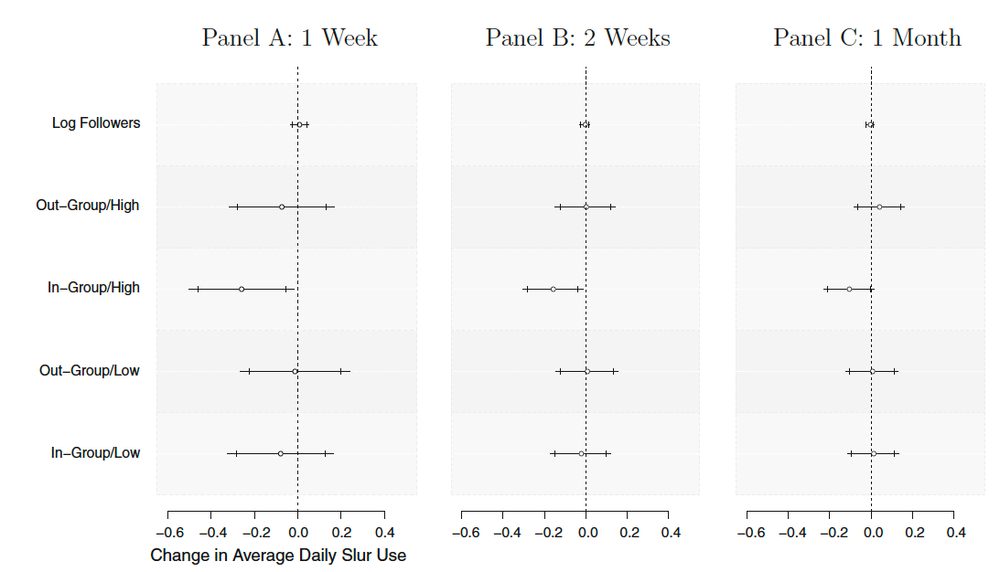
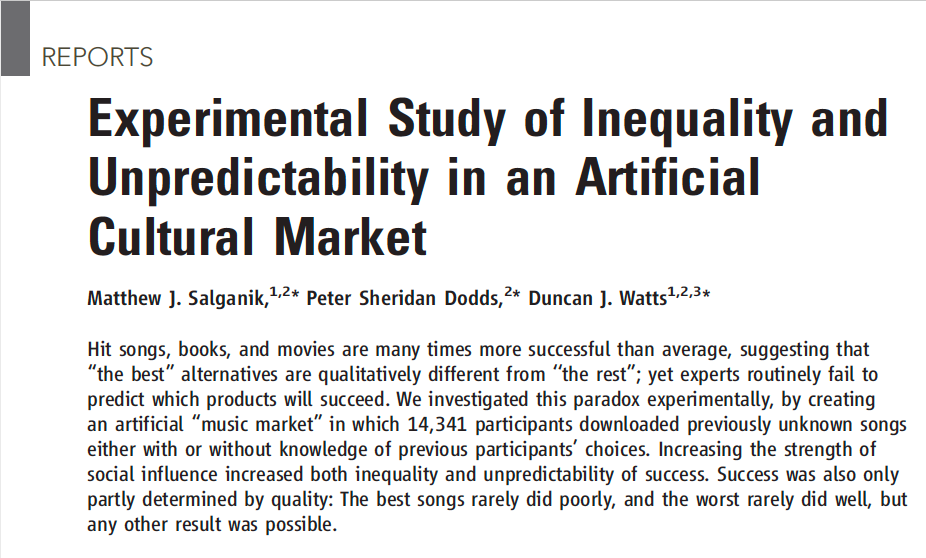
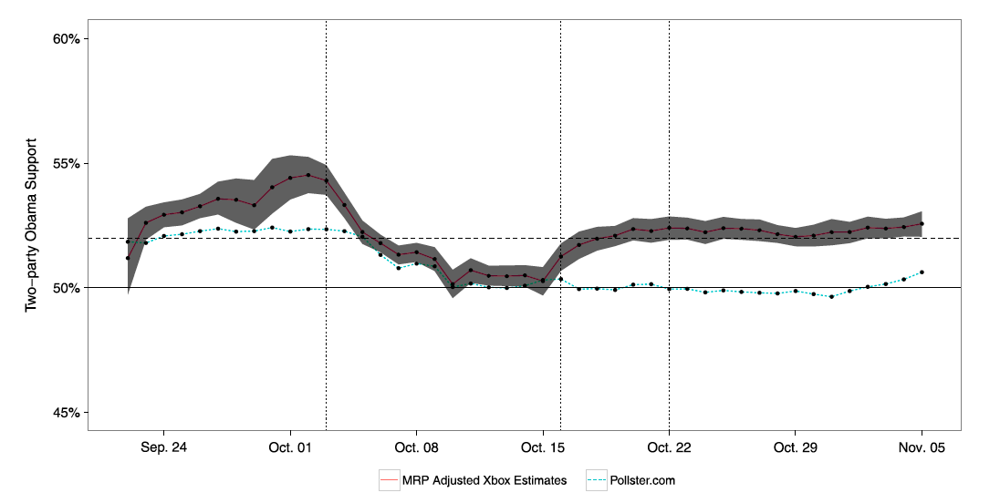
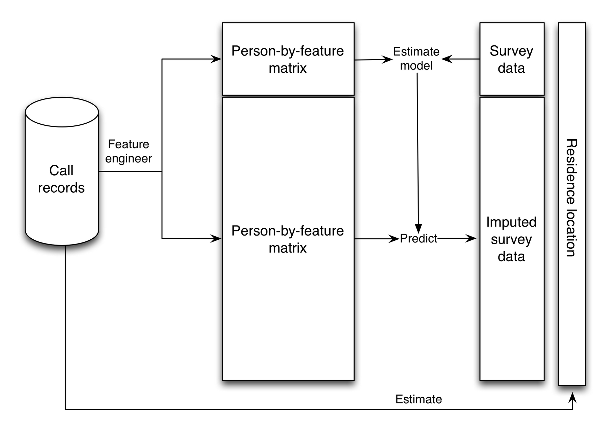

```{r setup, include=FALSE}
knitr::opts_chunk$set(echo = FALSE)
knitr::opts_chunk$set(warning = FALSE)
knitr::opts_chunk$set(message = FALSE)
knitr::opts_chunk$set(dev = 'pdf')
library("knitr")
library("formatR")

opts_chunk$set(tidy.opts=list(width.cutoff=80),tidy=TRUE)
opts_chunk$set(tidy = FALSE)

knitr::knit_hooks$set(mysize = function(before, options, envir) {
  if (before) 
    return(options$size)
})
```

# Plan
1. Course updates
2. Online experiments
3. Online surveys

# Course updates
- Homework 2 released
  - Fill in form if you need Twitter credentials 
    - And send me a message so I can add you to the account
  - Due 3/5 at 5pm EST
  
# Course updates
- Project proposal due 3/2 at 5pm
  - Submission via a Google Form (To be shared on Slack)
  - Schedule meeting to discuss your project idea before submitting
- 3-5 pages, double-spaced
  - Outline/motivation, brief lit review
  - Data and collection strategy
  - Methodology
  - References

# Online experiments
## Motivation for online experiments
- Lab experiments provide control but little realism (low external validity)
  - e.g. Undergraduate students do not represent wider populations
- Field experiments provided realism but little control (low internal validity)
  - e.g. Many factors may affect internal validity
- Digital field experiments can provided both, at scale
  
# Online experiments
## Methods: Internal experiments
- Companies and other actors experiment internally
  - A/B tests used to test different user-interface and product differences
  - Some now use complex, machine-learning driven "adaptive" experimentation systems to conduct test thousands of different conditions.*
- The vast majority of these experiments are private, but some are published by researchers
  - Kramer, Guillory, and Hancock. 2014. "Emotional contagion" study.
- Researchers recently made an entire archive of thousands of experiments available, see the \href{https://upworthy.natematias.com/}{Upworthy Research Archive}

\tiny * \href{https://doi.org/10.1111/ajps.12597.}{See Offer‐Westort, Molly, Alexander Coppock, and Donald P. Green. 2021. “Adaptive Experimental Design: Prospects and Applications in Political Science.” \textit{American Journal of Political Science}.} 
  

# Online experiments
## The Emotional Contagion Study
```{r, out.width="70%",out.height="70%", fig.align="center"}

```

# Online experiments
## Design and results
```{r, out.width="70%",out.height="70%", fig.align="center"}

```

<!--
# Online experiments
## The Emotional Contagion Study
- Opponents
  - Experimenting without clear consent
  - Emotional manipulation is creepy and potentially harmful
- Supporters
  - We give consent by accepting terms of service
  - FB is experimenting on us regardless, better we know about it
  - Manipulation and effects are tiny
-->

# Online experiments
## Reactions
```{r, out.width="70%",out.height="70%", fig.align="center"}

```
\tiny https://www.cbsnews.com/news/controversial-facebook-emotion-study-journal-responds/

# Online experiments
## Reactions
```{r, out.width="70%",out.height="70%", fig.align="center"}

```

# Online experiments
## Facebook and voter turnout
```{r, out.width="70%",out.height="70%", fig.align="center"}

```
\tiny Bond, Robert M., Christopher J. Fariss, Jason J. Jones, Adam D. I. Kramer, Cameron Marlow, Jaime E. Settle, and James H. Fowler. 2012. “A 61-Million-Person Experiment in Social Influence and Political Mobilization.” *Nature* 489 (7415): 295–98. https://doi.org/10.1038/nature11421.

<!--Lack of backlash. A positive cause (voting) and a positive outcome (increases). But what if it had suppressed turnout? 

There was little backlash against FB at the time, despite this demonstration of the power of the platform to influence political decisions, something we have paid more attention to since 2016
-->

# Online experiments
## Methods: Using existing environments
- Researchers can use platforms to create their own experiments
  - e.g. Doleac and Stein (2013) used different pictures on Craigslist to measure discrimination
  - e.g. van de Rijt et al. (2014) randomly donated to Kickstarters, upvoted reviews, awarded Wikipedia contributers, and signed petitions to study the Matthew Effect
  - e.g. Munger (2017) used a Twitter "bot" to measure the effect of sanctions on racial harassment

# Online experiments
## Countering hate speech on Twitter
```{r, out.width="70%",out.height="70%", fig.align="center"}
include_graphics('../images/munger_title.png')
```

# Online experiments
## Design and experimental manipulation
```{r, out.width="70%",out.height="70%", fig.align="center"}
include_graphics('../images/munger_design.png')
```

# Online experiments
## Hypotheses
```{r, out.width="70%",out.height="50%", fig.align="center"}
include_graphics('../images/munger_hypotheses.png')
```

# Online experiments
## Results
```{r, out.width="70%",out.height="70%", fig.align="center"}

```


# Online experiments
## Methods: Digital labs
- Create a virtual environment, fully controlled by the researcher
- High-cost (fixed costs associated with developing a platform)
- But high-rewards
- Zero variable cost experiments
  - Nobody wants to do a boring experiment for free; incentivize participation
  
# Online experiments
## The Music Lab Study
```{r, out.width="70%",out.height="70%", fig.align="center"}

```

# Online experiments
## The Music Lab Study
```{r, out.width="70%",out.height="70%", fig.align="center"}
include_graphics('../images/music_lab_design.png')
```

# Online experiments
## The Music Lab Study
```{r, out.width="70%",out.height="70%", fig.align="center"}
include_graphics('../images/music_lab_2.png')
```

  
# Online experiments
## Ethics
- Digital experimentation forces us to pay more attention to ethics
- Salganik proposes the "three R's"
  - *Replace* experiments with less invasive methods, where possible.
  - *Refine* treatment to reduce potential harm.
  - *Reduce* number of participants as much as possible.

# Online surveys
## Three eras of survey sampling
- Area probability sampling
  - Face-to-face interviews
- Random digit dialling
  - Phone interviews
- Non-probability sampling
  - Online surveys
    - Linked "big data"
    
# Online surveys
## Issues with online sampling
- No sampling frame
- Non-representative populations
- Selection bias (i.e. opt-in surveys)
- Violations of IID assumption violations (e.g. snowball sampling)

# Online surveys
## Forecasting elections with non-representative polls
```{r, out.width="70%",out.height="70%", fig.align="center"}
include_graphics('../images/wang_title.png')
```

# Online surveys
## Survey design
```{r, out.width="70%",out.height="70%", fig.align="center"}
include_graphics('../images/wang_survey.png')
```

# Online surveys
## Polls before adjustment
```{r, out.width="70%",out.height="70%", fig.align="center"}
  include_graphics('../images/wang_poll_before.png')
```

# Online surveys
## Polls after adjustment
```{r, out.width="70%",out.height="70%", fig.align="center"}
  
```
\tiny \textit{Multilevel regression and post-stratification.} See Salganik 130-6 for mathematical intuition; Monica Alexander has a great MRP \href{https://www.monicaalexander.com/posts/2019-08-07-mrp/}{primer} with R code. 

# Online surveys
## Demographics of Xbox users versus voters
```{r, out.width="70%",out.height="70%", fig.align="center"}
  include_graphics('../images/wang_demographics_before.png')
```

# Online surveys
## Population sub-group estimates
```{r, out.width="70%",out.height="70%", fig.align="center"}
  include_graphics('../images/wang_demographics_adjusted.png')
```

# Online surveys
## Errors
```{r, out.width="70%",out.height="70%", fig.align="center"}
  include_graphics('../images/wang_errors.png')
```

# Online surveys
## State-level estimates
```{r, out.width="70%",out.height="70%", fig.align="center"}
  include_graphics('../images/wang_state_level.png')
```

# Online surveys
## Working with non-probability samples
- Cheaper than fielding nationally-representative polls 
- But more difficult to work with than conventional survey  data
  - New statistical procedures and data sources non-probability sampling viable
    - Although MRP and other techniques have not been widely adopted by sociologists

<!-- Future: Consider including MRP demo -->

# Online surveys
## Record linkage / "enriched asking"
```{r, out.width="70%",out.height="70%", fig.align="center"}
  include_graphics('../images/enriched.png')
```

# Online surveys
## Enriched asking: voter behavior
```{r, out.width="70%",out.height="70%", fig.align="center"}
  include_graphics('../images/enriched_example.png')
```


# Online surveys
## Big data imputation / "amplified asking"
```{r, out.width="70%",out.height="70%", fig.align="center"}
  include_graphics('../images/amplified.png')
```

# Online surveys
## Amplified asking: Mapping poverty in Rwanda
```{r, out.width="70%",out.height="70%", fig.align="center"}
  
```

# Final thoughts
- New technologies and data sources allow us to reinvent existing methods
  - Innovative work combines social scientific approaches, statistics, and programming in new ways
- Digital experiments and surveys open up many opportunities for social scientific research
  - These methods come with more challenges and require different skills to conventional methods
  - We must think more about ethics, related to informed consent, affects on study participants, and implications of partnerships with other organizations

# Questions
