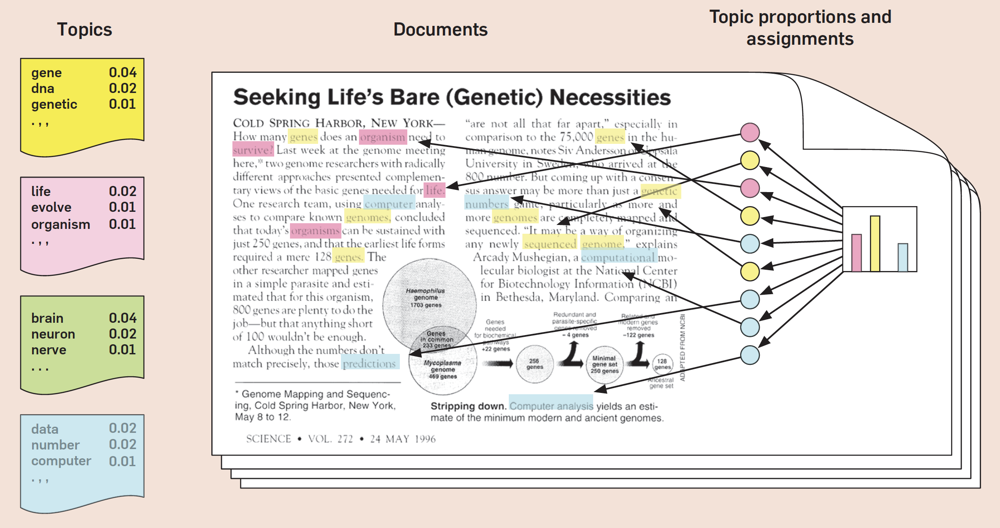
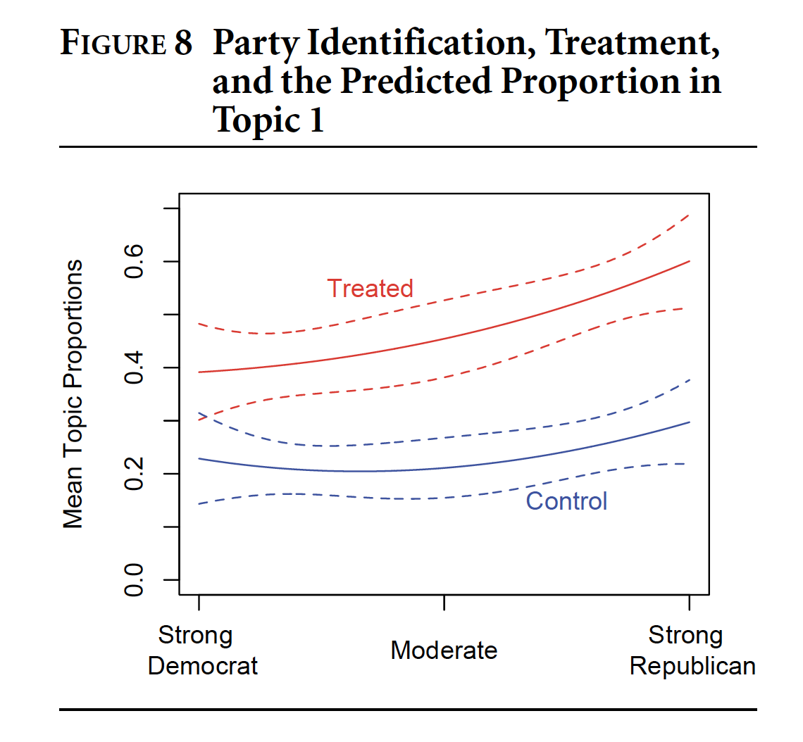

```{r setup, include=FALSE}
knitr::opts_chunk$set(echo = FALSE)
knitr::opts_chunk$set(warning = FALSE)
knitr::opts_chunk$set(message = FALSE)
knitr::opts_chunk$set(dev = 'pdf')
library("knitr")
library("formatR")

opts_chunk$set(tidy.opts=list(width.cutoff=80),tidy=TRUE)
opts_chunk$set(tidy = FALSE)

knitr::knit_hooks$set(mysize = function(before, options, envir) {
  if (before) 
    return(options$size)
})
```

# Plan
1. Course updates
2. Introduction to topic modeling
3. Latent Dirichlet Allocation (LDA)
4. Structural Topic Modeling (STM)

<!--TODO: This lecture does not render to PDF due to errors when compiling. PDF only includes non-code slides-->

# Course updates
## Feedback on proposals and homework 2
- Comments on proposals sent via Slack
- Homework 2 comments by the end of the week.

# Course updates
## Homework 3
- Homework 3 on NLP will be released by the end of the week.
  - Tentative due date is 4/2 at 5pm (you will have one week to complete it)

# Course updates
## Progress on projects
- Initial data collection due 4/9 at 5pm.
  - Preliminary analysis of some or all of the data you will use in your project; consider this as a draft of the Data section of your manuscript
    - Description of the data collection process
    - Preliminary data analysis
    - Include at least 1 summary table and 1 visualization
- Submit the following
  - A link to a Github repository (add me as a collaborator if it is private)
    - Code used to collect and analyze data (ideally in RMarkdown)
    - A rendered version of the RMarkdown document (PDF or HTML)
  

# Introduction to topic modeling
## What is topic modeling?
- A corpus of documents contains a set of latent "themes" or "topics"
- A topic model is a probabilistic algorithm is designed to inductively create a "model" of these latent topics
- This gives us an overview of the content of an entire corpus and the ability to characterize individual documents

# Introduction to topic modeling
## Topic modeling and sociology (Mohr and Bogdanov 2013)
- Topic modeling is a "lens" to allow reading of a corpus "in a different light and at a different scale" to traditional content analsyis.
  - Often we want to conduct an automated coding of a large corpus, but it can also be helpful for a "close reading" of a smaller corpus
  
# Introduction to topic modeling
## Topic modeling and sociology (Mohr and Bogdanov 2013)  
- The approach still requires interpretation, but produces "a fundamental shift in the locus of methodological subjectivity", "from pre-counting to post-counting" (561).
  - Traditional content analysis requires us to develop our categories of analysis before coding a corpus, whereas the interpretative phase of LDA occurs after we have trained a model
  - "topic models do not remove the scholarly or the hermeneutic work from the project of analyzing a textual corpus, topic models simply move the bulk of this labor over to the other side of the data modeling procedure."

# Introduction to topic modeling
## Topic modeling and sociology (DiMaggio, Nag, and Blei 2013)
- Topic modeling is "an inductive relational approach to the study of culture"
  - It is *inductive* because the topics are "discovered" from the text
  - It is *relational* because meaning emerges out of relationships between words
- Topic modeling provides a high level of "substantive interpretability"
- The approach can discover different theoretical properties of language of interest to sociologists of culture
  - Framing
  - Polysemy
  - Heteroglossia

# Introduction to topic modeling
## Topic modeling and sociology (DiMaggio, Nag, and Blei 2013)
"Topic modeling will not be a panacea for sociologists of culture. But it is a powerful tool for
helping us understand and explore large archives of texts. Used properly by subject-area experts
with appropriate validation, topic models can be valuable complements to other interpretive
approaches, offering new ways to operationalize key concepts and to make sense of large textual
corpora." 
  
# Introduction to topic modeling
## Topic modeling and sociology (Karell and Freedman 2019)
- Karell and Freedman use topic modeling to study the rhetoric of militant groups in Afghanistan
  - They characterize the process as *computational abduction* and describe "a recursive movement between the computational results, a close reading of selected corpus material, further literature on social movements, and additional theories that engendered a novel conceptualization of radical rhetorics."
  - The topic model results are then used to characterize the discourse of different groups. They then study how this discourse varies according to alliances and events.

# Latent Dirichlet Allocation
## Naming
- We observe the documents but the topics are **latent**
- The model is based on a probability distribution called the **Dirichlet** distribution
- Using this model we **allocate** words to topics

# Latent Dirichlet Allocation
## Intuition
- A **topic** is a distribution over a vocabulary
  - Each word in the vocabulary has a probability of belonging to the topic
- Let's say we train an LDA on a newspaper corpus
  - We find a topic that seems to capture information about *sports*
    - The words "football" and "goal" have a high probability 
    - The words "literary" and "helicopter" have a low probability
  - This topic can be represented as a distribution over all words in the vocabulary
    - $Topic\ distribution_k = [ football : 0.34, goal : 0.23, ..., literary : 0.0001, helicopter: 0.0002, ...]$

# Latent Dirichlet Allocation
## Intuition
- A **document** is a distribution over topics
  - *All* documents contain *all* topics, but in different proportions
- Let's say we take an article about a new player a football team hired and look at the topics based on the newspaper model
  - The highest probability topic might be *sports*, but the article also disusses contract and the position of the player in the labor market
    - Thus the document may also contain the topics *finance* and *labor*.
  - The article is irrelevant to other issues in discussed in newspapers, so has a low probability of containing the topic *national security* or *arts*.
  - $Topic\ proportions_d = [ sports : 0.63, finance : 0.25, labor : 0.12, ..., national\ security : 0.001, arts: 0.002, ...]$
  
# Latent Dirichlet Allocation
```{r, out.width="70%",out.height="70%", fig.align="center"}

``` 
\tiny Blei, David M. 2012. “Probabilistic Topic Models.” Communications of the ACM 55 (4): 77. https://doi.org/10.1145/2133806.2133826.

# Latent Dirichlet Allocation
```{r, out.width="70%",out.height="60%", fig.align="center"}
include_graphics('../images/blei_topics.png')
``` 
\tiny Blei, David M. 2012. “Probabilistic Topic Models.” Communications of the ACM 55 (4): 77. https://doi.org/10.1145/2133806.2133826.

# Latent Dirichlet Allocation
## Intuition
- Topic modeling is a *generative* process
  - The goal is to create a plausible model that can mimic the hidden structure and *generate* the observed documents
  - ""The utility of topic models stems from the property that the inferred hidden structure resembles the thematic structure of the collection." Blei, 2012.


# Latent Dirichlet Allocation
## Mathematical formulation
- There are four components that we need to compute the LDA over a corpus of documents
  - Topics $\beta_{1:K}$, where $\beta_{k}$ is a distribution over the vocabulary
  - Topic proportions $\theta_{1: D}$, where $\theta_{d,k}$ is proportion for topic $k$ in document $d$
  - Topic assignments $z_{1: D}$, where $z_{d,n}$ is topic assignment of $n^{th}$ word in document $d$.
  - Observed words $w_{1: D}$, where $w_{d,n}$ is the $n^{th}$ word in document $d$.
  
# Latent Dirichlet Allocation
## Mathematical formulation
- The relationship between these variables is expressed as a joint-distribution:
$$
\begin{array}{l}
p\left(\beta_{1: K}, \theta_{1: D}, z_{1: D}, w_{1: D}\right) \\
=\prod_{i=1}^{K} p\left(\beta_{i}\right) \prod_{d=1}^{D} p\left(\theta_{d}\right) \\
\quad\left(\prod_{n=1}^{N} p\left(z_{d, n} \mid \theta_{d}\right) p\left(w_{d, n} \mid \beta_{1: K}, z_{d, n}\right)\right)
\end{array}
$$

# Latent Dirichlet Allocation
## Algorithm
- We use this formula to compute the *posterior distribution* of the variables
- This is a computationally-intensive process and requires some probabilistic short-cuts
  - *Sampling-based* methods approximate the posterior distribution by random sampling 
  - *Variational* methods find an approximation of the posterior distribution that fits well


```{r, eval=TRUE, echo=FALSE, tidy=FALSE, mysize=TRUE, size='\\footnotesize'}
load("lecture9.RData")
library(tidyverse)
library(tidytext)
library(topicmodels)
library(stm)
library(ggplot2)
library(lubridate)
```


# Training an LDA topic model in R
## Loading the corpus
Loading a corpus of most recent 1000 tweets by the New York Times and the Wall Street Journal. What do you notice about the file? Are there any problems with the way the data have been stored?
```{r,eval=FALSE, echo=TRUE, tidy=FALSE, mysize=TRUE, size='\\footnotesize'}
library(tidyverse)
data <- as_tibble(read_tsv("../data/nytimes_wsj_2000_statuses_march222021.tsv"))
head(data)
```

# Latent Dirichlet Allocation
## Preprocessing
Removing hashtags, mentions and URLs using a regular expression. I initially left in hashtags and mentions but found that they tended to dominate some topics since different newspapers frequently used the same hashtags.
```{r, eval=FALSE, echo=TRUE, tidy=FALSE, mysize=TRUE, size='\\footnotesize'}
data <- data %>% 
    mutate(text = gsub("#[A-Za-z0-9]+|@[A-Za-z0-9]", "", text)) %>%
    mutate(text = gsub("(http[^ ]*)|(www.[^ ]*)", "", text))
```

# Latent Dirichlet Allocation
## Preprocessing
```{r, eval=FALSE,echo=TRUE, tidy=FALSE, mysize=TRUE, size='\\footnotesize'}
library(tidytext)
data(stop_words)
word.counts <- data %>% unnest_tokens(word, text, strip_punct = TRUE) %>%
  anti_join(stop_words) %>%
  count(status_id, word)

doc.freq <- word.counts %>% 
  mutate(n = pmax(pmin(n, 1), 0)) %>%
  group_by(word) %>%
  summarize(df = sum(n))

words <- left_join(word.counts, doc.freq)
```


# Latent Dirichlet Allocation
## Constructing a DTM
```{r, eval=FALSE,echo=TRUE, tidy=FALSE, mysize=TRUE, size='\\footnotesize'}
DTM <- words %>% filter(df >= 5) %>%
  cast_dtm(status_id, word, n)
```

# Latent Dirichlet Allocation
## Training an LDA model using `topicmodels`
We can pass the DTM to the `LDA` function to train a topic model with 40 topics.
```{r, eval=FALSE, echo=TRUE, tidy=FALSE, mysize=TRUE, size='\\footnotesize'}
library(topicmodels)
news_model<- LDA(DTM, k=40, control = list(seed = 10980))
```
\tiny LDA analysis based on code from https://www.tidytextmining.com/topicmodeling.html and https://cbail.github.io/SICSS_Topic_Modeling.html.

# Latent Dirichlet Allocation
## Analyzing topics
We can use the `tidy` function to pull the $\Beta$ matrix from the model. Each row $\Beta_{k,w}$ corresponds to the probability of word $w$ in topic $k$. In this case we can see the probabilities of the term "vaccine" in topics 1-5.
```{r,eval=FALSE, echo=TRUE, mysize=TRUE, size='\\footnotesize'}
topics <- tidy(news_model, matrix = "beta")
topics %>% filter(term == "vaccine") %>% head(5) %>% select(topic, beta)
```

# Latent Dirichlet Allocation
## Analyzing topics
```{r, eval=FALSE,echo=FALSE, tidy=FALSE, mysize=TRUE, size='\\footnotesize'}
library(ggplot2)

top_terms <- 
  topics %>%
  group_by(topic) %>%
  top_n(10, beta) %>%
  ungroup() %>%
  arrange(topic, -beta)

top_terms %>% filter(topic <= 9) %>% # Only first 12 topics
  mutate(term = reorder(term, beta)) %>%
  ggplot(aes(term, beta, fill = factor(topic))) +
  geom_col(show.legend = FALSE) +
  facet_wrap(~ topic, scales = "free") +
  coord_flip() + labs(y="Beta", x="Term", caption="Top 10 highest words for each topic")
```
# Latent Dirichlet Allocation
## Analyzing topics
```{r, eval=FALSE,echo=FALSE, tidy=FALSE, mysize=TRUE, size='\\footnotesize'}
top_terms %>% filter(topic > 9 & topic < 19) %>% # Only first 12 topics
  mutate(term = reorder(term, beta)) %>%
  ggplot(aes(term, beta, fill = factor(topic))) +
  geom_col(show.legend = FALSE) +
  facet_wrap(~ topic, scales = "free") +
  coord_flip() + labs(y="Beta", x="Term", caption="Top 10 highest words for each topic")
```
# Latent Dirichlet Allocation
## Analyzing documents
We can extract the document-topic proportions. Each row corresponds to the proportion of topic $i$ in document $j$.
```{r, eval=FALSE,echo=FALSE, mysize=TRUE, size='\\footnotesize'}
documents <- broom::tidy(news_model, matrix = "gamma")
head(documents)
```
\tiny Note the notation change. This matrix is called *gamma* ($\gamma$) here but was referenced as *theta* ($\theta$) in the equation above. Unfortunately this kind of thing happens a lot as notation is used inconsistently.

# Latent Dirichlet Allocation
## Analyzing documents
We can find the documents with the highest amounts of particular topics by ordering them by gamma and filtering by topic.
```{r, eval=FALSE,echo=FALSE, tidy=FALSE, mysize=TRUE, size='\\footnotesize'}
top.5.docs <- documents %>% arrange(desc(gamma)) %>% filter(topic == 14) %>% head(5) 
data %>% filter(status_id %in% top.5.docs$document) %>% select(text)
```


# Latent Dirichlet Allocation
## Exercise
- Each group will analyze 8 topics. 
  - Modify the code above to look at top words and documents in each topic.
  - For each topic:
    - Can you come up with a short name and description of the topic?
    - Does the topic capture something meaningful about the documents?
    - Is there anything else you notice about the topic?
- Add your findings to the shared Google Sheet

<!--TODO: Compare topic proportions across WSJ and NYT-->

# Latent Dirichlet Allocation
## Interpreting the results
"Producing an interpretable solution is the beginning, not the end, of an analysis. The solution
constructs meaningful categories and generates corpus-level measures (e.g., the percentage of
documents in which a given topic is highly represented) and document-level measures (e.g., the
percentage of words in each document assigned to each topic) based on these categories. It
remains for the analyst to use this information to address the analytic questions that motivated the
research. The analyst must also validate the solution by demonstrating that the model is sound
and that his or her interpretation is plausible" (DiMaggio et al. 2013: 586).

# Latent Dirichlet Allocation
## Validation
- "there is no statistical test for the optimal number of topics or for the quality of a solution" (DiMaggio, Nag, and Blei 2013: 582)
- They suggest three forms of validation
  - *Statistical*: Calculating various measures of fit
  - *Semantic*: Hand-coding / close reading of documents
  - *Predictive*: Do events change the prevalence of topics?
- Not all topics will be meaningful, some capture residual "junk" and can be ignored (Karell and Freedman 2019)

# Latent Dirichlet Allocation
## How does it differ from NLP approaches covered so far?
- Document representation
  -  A document is represented as a probability distribution over topics, not just a bag-of-words or an embedding
    - Closest approach is *latent semantic analysis*, where a document is a set of weights over latent dimensions. Indeed, LDA was developed as an extension of LSA.
- Document retrieval
  - We can select documents by topic content rather than keywords
  - Words can be shared by multiple topics, unlike conventional keyword detection
- Document comparisons
  - We can compare documents based on topic content rather than text similarity

# Latent Dirichlet Allocation
## Extensions of LDA
- LDA is considered the "vanilla" topic model. Subsequent approaches have relaxed some of the assumptions of LDA (Blei, 2012):
  - *Assumption 1*: Documents are treated as bags-of-words
    - Language models can be incorporated to better account for linguistic structure
  - *Assumption 2*: Document order does not matter
    - Dynamic topic models account for how topics can change over time
  - *Assumption 3*: The number of topics, $K$, is known
    - Bayesian non-parametric topic models discover $K$ during the inference procedure
- *Structural topic modeling* (STM) has recently become a popular extension of LDA

# Structural Topic Modeling
## Background
- LDA assumes  *topic prevalence* (frequency topic is mentioned) and *topic content* (the words used to discuss a topic) are constant across documents
  - e.g. In the previous example, we assume that *NYT* and *WSJ* devote equal coverage to topics and discuss topics in the same way.
- STM extends LDA by "allowing for the inclusion of covariates of interest into the prior distributions for document-topic proportions and topic-word distributions" (Roberts et al. 2014).
  - This allows analysis of how topics vary according to other factors, for example the treatment in a survey experiment may alter open responses.


# Structural Topic Modeling
## Analyzing open-ended survey responses using an STM
```{r, out.width="70%",out.height="60%", fig.align="center"}
include_graphics('../images/roberts_treatment.png')
``` 

# Structural Topic Modeling
## Analyzing open-ended survey responses using an STM
```{r, out.width="70%",out.height="60%", fig.align="center"}

``` 


# Structural Topic Modeling
## Running an STM
The first step is to select the relevant metadata. In this case we are going to use the screen_name and the day of the month, since all data are from March 2021.
```{r, eval=FALSE,echo=TRUE, tidy=FALSE, mysize=TRUE, size='\\footnotesize'}
library(lubridate)
min(data$created_at)
max(data$created_at)
data$day <- data$created_at %>% day()
meta <- data %>% select(screen_name, day)
```

# Structural Topic Modeling
## Running an STM
The `stm` library has its own set of functions for processing data. `textProcessor` takes a corpus, plus metadata, and conducts pre-processing tasks. `prepDocuments` then converts the documents into the appropriate format.
```{r, eval=FALSE, echo=TRUE, tidy=FALSE, mysize=TRUE, size='\\footnotesize'}
library(stm)
meta <- data %>% select(screen_name, day)
processed.docs <- textProcessor(data$text, metadata = meta)
output <- prepDocuments(processed.docs$documents, processed.docs$vocab, processed.docs$meta, lower.thresh = 5)
```
 
# Structural Topic Modeling
## Finding $\K$
The STM package can calculate some heuristics for finding the "best" value of $\K$. This can take a while as it must run each of the models specified in the vector passed to the `K` parameter.
```{r, eval=FALSE,  echo=TRUE, tidy=FALSE, mysize=TRUE, size='\\footnotesize'}
library(parallel)
search.results <- searchK(output$documents, output$vocab,
                   K = c(10,20,30,40,60,80,100),
                   data = output$meta,
                   proportion=0.1, # proportion of docs held-out
                   cores=detectCores() # use maximum number of available cores
) 
```
\tiny See https://juliasilge.com/blog/evaluating-stm/ for an alternative approach that enables some more post-estimation evaluation.

# Structural Topic Modeling
## Selecting $\K$
```{r, eval=FALSE, echo=TRUE, tidy=FALSE, mysize=TRUE, size='\\footnotesize'}
plot(search.results)
```
\tiny See Mimno, David, Hanna M Wallach, Edmund Talley, Miriam Leenders, and Andrew McCallum. 2011. “Optimizing Semantic Coherence in Topic Models.” In Proceedings of the 2011 Conference on Empirical Methods in Natural Language Processing, 262–72. ACL for discussion of the semantic coherence measure.

# Structural Topic Modeling
Fitting a model with `k=40`. The `screen_name` field is used as a covariate for both prevalence and content. This means that we allow both the prevalence and content of topics to vary depending on whether the tweet was from the *NYT* or the *WSJ*.
```{r, eval= FALSE, echo=TRUE, tidy=FALSE, mysize=TRUE, size='\\footnotesize'}
K=40
fit <- stm(documents = output$documents, vocab = output$vocab, K=K,
           data = output$meta, 
           prevalence = ~ screen_name + s(day), # s takes a non-linear function
           content = ~ screen_name, # content can only contain one variable
           verbose = TRUE
           )
```

# Structural Topic Modeling
## Plotting the results
We can directly plot the proportions to show how frequent different topics are. Here are the first 20.
```{r,  eval=FALSE, echo=TRUE, tidy=FALSE}
plot(fit, type = "summary", topics = 1:20)
```
  
# Structural Topic Modeling
## Inspecting topics
```{r, eval=FALSE, echo=TRUE, tidy=FALSE, mysize=TRUE, size='\\footnotesize'}
labelTopics(fit, topics=16, n=10)
```
  
# Structural Topic Modeling
## Inspecting topics
We can use `findThoughts` to identify documents with a high weight in a given topic.
```{r, eval=FALSE, echo=TRUE, tidy=FALSE, mysize=TRUE, size='\\footnotesize'}
t=16
thoughts <- findThoughts(fit, texts = as.character(data[as.numeric(rownames(output$meta)),]$text), topic=t, n = 5)
for (i in unlist(thoughts$docs)) {
      print(i)
}
```
  
# Structural Topic Modeling
## Estimating relationship between topic prevalence and metadata
```{r, eval=FALSE, echo=TRUE, tidy=FALSE, mysize=TRUE, size='\\footnotesize'}
prep <- estimateEffect(~ screen_name + day, fit, meta = output$meta)
summary(prep, topics = c(1,8,16)) # show results for topics 1, 8, and 16
```

# Structural Topic Modeling
## Topic prevalence by publication
We can see how different topics vary in prevalence according to the publication. In this case topic 8 has a statistically significant association with the WSJ, whereas there is no significant difference between 1 and 16. 
```{r, eval=FALSE, echo=FALSE, tidy=FALSE, mysize=TRUE, size='\\footnotesize'}
topic.nums <- c(1,8,16)
plot(prep, covariate = "screen_name", topics = topic.nums, model = fit, 
     method = "difference", cov.value1 = "nytimes", cov.value2 = "WSJ",
     xlab = "More WSJ ... More NYT",
     labeltype = "custom", custom.labels = topic.nums)
```

# Structural Topic Modeling
## Prevalence over time
We can use the `day` variable to track how prevalence changes over time. In this case, topic 16 appears to be about the Oprah royal couple interview and topic 18 is the Atlanta shootings.
```{r, eval=FALSE, echo=FALSE, tidy=FALSE, mysize=TRUE, size='\\footnotesize'}
plot(prep, "day", method = "continuous", topics = c(16,18), model = fit, xaxt = "n", xlab = "Day in March 2021", 
     labeltype = "custom", custom.labels = c("Royal family", "Atlanta shooting"))
```

# Structural Topic Modeling
## Prevalence over time
The previous graphic shows a general trend. To better understand this process, we can re-estimate the effects with a spline on day to account for non-linearity.
```{r, eval=FALSE, echo=FALSE, tidy=FALSE, mysize=TRUE, size='\\footnotesize'}
prep.nl <- estimateEffect(~ screen_name + s(day), fit, meta = output$meta)
plot(prep.nl, "day", method = "continuous", topics = c(16,18), model = fit, xaxt = "n", xlab = "Day in March 2021", 
     labeltype = "custom", custom.labels = c("Royal family", "Atlanta shooting"))
```

# Structural Topic Modeling
## Content by publication
We can also see how the topic content varies according to the publication, although I can't figure out how to get this plot to render well here!
```{r, eval=FALSE, echo=FALSE, tidy=FALSE, mysize=TRUE, size='\\footnotesize'}
plot(fit, type="perspectives", topics=16)
```

# Structural Topic Modeling
## Content by publication
In this case we see that the WSJ tends to emphasize the gender of the victims, whereas the NYT focuses more on race (although not by as much).
```{r, eval=FALSE, echo=FALSE, tidy=FALSE, mysize=TRUE, size='\\footnotesize'}
plot(fit, type="perspectives", topics=18)
```

# Structural Topic Modeling
## Topic correlations
We can also measure the correlations between different topics. Here links only exist if the correlation exceeds a threshold.
```{r, eval=FALSE, echo=FALSE, tidy=FALSE, mysize=TRUE, size='\\footnotesize'}
corrs <- topicCorr(fit)
plot(corrs)
```

```{r, eval=FALSE, echo=FALSE, tidy=FALSE, mysize=TRUE, size='\\footnotesize'}
#save.image(file = "lecture9.RData")
```

# Structural Topic Modeling
- Resources
  - The STM \href{https://www.structuraltopicmodel.com/}{website} contains information on various tools and research papers that use the approach
    - There are several packages including `stmBrowser`, `stmCorrViz` and `stminsights` that enable more interactive visualization.
  - The \href{https://raw.githubusercontent.com/bstewart/stm/master/vignettes/stmVignette.pdf}{vignette} provides a closer description of the methodology and a hands-on guide to using the `stm` package.

# Summary
- Topic modeling is an inductive approach for the summary of large text corpora
  - Analysis of topic models involves the interpretation of topics
  - A key challenge is selecting an appropriate number of topics
- LDA algorithm summarize as corpus into $K$ topics
  - Each document is composed of a mixture of topics
  - Each topic is a mixture of words
- STM improves on LDA by allowing topic prevalence and content to vary by covariates
  - This is particularly useful for social scientific applications


